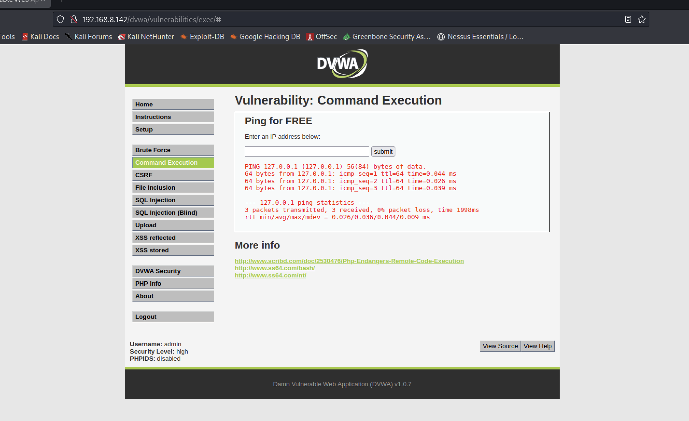

# Command Injection

The aim of this attack is to introduce commands that can be executed directly on the operating system where the application is running. If an attacker manages to pass those same commands to through the Web application, they will be executed on the OS with the same permissions that the Web server process (Apache) has.

The "normal" usage on the webpage is to put an IP address or a DNS:

    127.0.0.1
    www.google.com

with results similar to the ones you can see on the following image.

However, if an attacker tries to pass other types of commands than simply an IP address?

    127.0.0.1 && ls -la /var/www/html/dvwa
    127.0.0.1 && cat /etc/passwd
    127.0.0.1 && ls -la /root

So, an attacker might be able to run any command at the OS level.