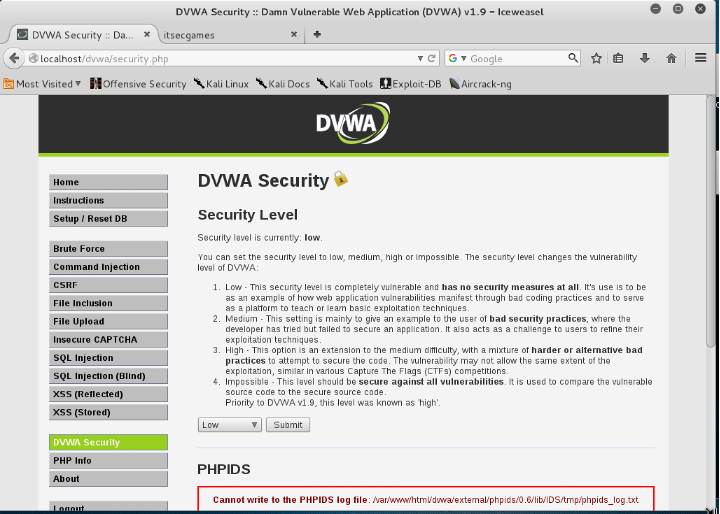

# Setup

## Install DVWA

After installing and configuring the Apache web server and MySQL database server, it is necessary to install DVWA.

Installation is simple, just unzip the ZIP file containing the application and copy them to the appropriate directory on the Apache Web server. If you choose, you can also use the Linux distribution, called Metasploitable 2, where DVWA (along with other applications) is already installed.

When invoked for the first time it is necessary to install the DVWA database, in MySQL. It may be necessary to edit the config.inc.php file which will be in the "config" folder and configure the username and password to access the MySQL database server.

Default username and password in DVWA are as follows:
- Login: `admin`
- Password: `password`

## DVWA Security

Put the security mode (DVWA Security) of the Web application - DVWA - in "low" mode. This is done only for the sake of simplicity of the very attacks that can be carried out against the application. The higher the security level, the more complex the attacks to be carried out will become.

For the intended effect it is enough. It serves to demonstrate the most basic attacks with little resistance from the application itself. However, it is important to understand the variations between the different security levels to improve the techniques applied. However, the techniques to be applied will be the same, varying only some minor aspects of them.
