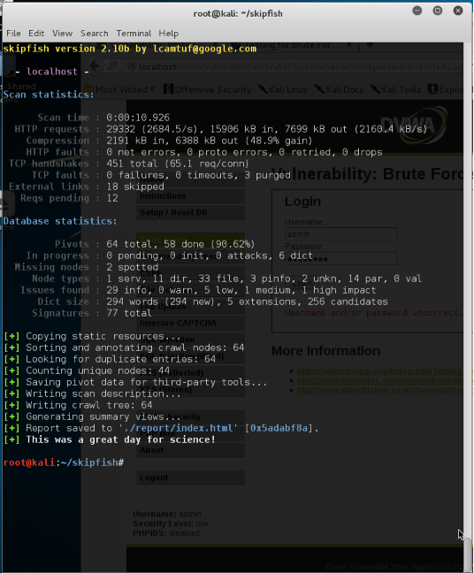
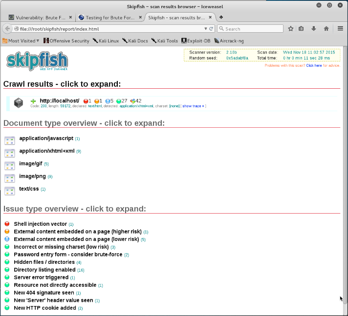

# Automatic Vulnerability Analysis <!-- omit in toc -->
## Index <!-- omit in toc -->
- [Introduction](#introduction)
- [nikto](#nikto)
- [W3AF](#w3af)
- [Skipfish](#skipfish)

## Introduction

Let's take advantage of the fact that we have a purposely vulnerable Web application to test some automatic vulnerability analysis tools and see what they can effectively detect.

## nikto

We can test Nikto using the following command to run tests on the DVWA application.

    nikto --host http://127.0.0.1/dvwa

At the end we can observe the results on the console.

    - Nikto v2.1.6
    ---------------------------------------------------------------------------
    + Target IP:          192.168.8.142
    + Target Hostname:    192.168.8.142
    + Target Port:        80
    + Start Time:         2022-11-14 18:26:04 (GMT0)
    ---------------------------------------------------------------------------
    + Server: Apache/2.2.8 (Ubuntu) DAV/2
    + Cookie PHPSESSID created without the httponly flag
    + Cookie security created without the httponly flag
    + Retrieved x-powered-by header: PHP/5.2.4-2ubuntu5.10
    + The anti-clickjacking X-Frame-Options header is not present.
    + The X-XSS-Protection header is not defined. This header can hint to the user agent to protect against some forms of XSS
    + The X-Content-Type-Options header is not set. This could allow the user agent to render the content of the site in a different fashion to the MIME type
    + Root page / redirects to: login.php
    + No CGI Directories found (use '-C all' to force check all possible dirs)
    + Server may leak inodes via ETags, header found with file /dvwa/robots.txt, inode: 93164, size: 26, mtime: Tue Mar 16 05:56:22 2010
    + Apache/2.2.8 appears to be outdated (current is at least Apache/2.4.37). Apache 2.2.34 is the EOL for the 2.x branch.
    + Uncommon header 'tcn' found, with contents: list
    + Apache mod_negotiation is enabled with MultiViews, which allows attackers to easily brute force file names. See http://www.wisec.it/sectou.php?id=4698ebdc59d15. The following alternatives for 'index' were found: index.php
    + Allowed HTTP Methods: GET, HEAD, POST, OPTIONS, TRACE 
    + OSVDB-877: HTTP TRACE method is active, suggesting the host is vulnerable to XST
    + OSVDB-3268: /dvwa/config/: Directory indexing found.
    + /dvwa/config/: Configuration information may be available remotely.
    + OSVDB-12184: /dvwa/?=PHPB8B5F2A0-3C92-11d3-A3A9-4C7B08C10000: PHP reveals potentially sensitive information via certain HTTP requests that contain specific QUERY strings.
    + OSVDB-12184: /dvwa/?=PHPE9568F36-D428-11d2-A769-00AA001ACF42: PHP reveals potentially sensitive information via certain HTTP requests that contain specific QUERY strings.
    + OSVDB-12184: /dvwa/?=PHPE9568F34-D428-11d2-A769-00AA001ACF42: PHP reveals potentially sensitive information via certain HTTP requests that contain specific QUERY strings.
    + OSVDB-12184: /dvwa/?=PHPE9568F35-D428-11d2-A769-00AA001ACF42: PHP reveals potentially sensitive information via certain HTTP requests that contain specific QUERY strings.
    + OSVDB-3092: /dvwa/login/: This might be interesting...
    + OSVDB-3268: /dvwa/docs/: Directory indexing found.
    + OSVDB-3092: /dvwa/CHANGELOG.txt: A changelog was found.
    + /dvwa/login.php: Admin login page/section found.
    + /dvwa/?-s: PHP allows retrieval of the source code via the -s parameter, and may allow command execution. See http://www.kb.cert.org/vuls/id/520827
    + /dvwa/login.php?-s: PHP allows retrieval of the source code via the -s parameter, and may allow command execution. See http://www.kb.cert.org/vuls/id/520827
    + /dvwa/CHANGELOG.txt: Version number implies that there is a SQL Injection in Drupal 7, can be used for authentication bypass (Drupageddon: see https://www.sektioneins.de/advisories/advisory-012014-drupal-pre-auth-sql-injection-vulnerability.html).
    + 7914 requests: 0 error(s) and 25 item(s) reported on remote host
    + End Time:           2022-11-14 18:26:16 (GMT0) (12 seconds)
    ---------------------------------------------------------------------------
    + 1 host(s) tested

## W3AF

**Quick note**: looks like this tool is no longer supported by Kali Linux.

To run the W3af tool it is preferable to use the console version (it is faster). To make a test, we can use a pre-configured profile or use a custom audit. In this case we will perform an automatic audit using the `OWASP_TOP10` profile, which allows detecting the most common vulnerabilities in Web applications.

    w3af_console
    w3af>> profiles
    w3af/profiles>>> use OWASP_TOP10
    w3af/profiles>>back
    w3af>> plugins
    w3af/plugins>> output
    w3af/plugins>>> output console,html_file
    w3af/plugins>>> output
    |-----------------------------------------------------------------------------------------------------------|
    | Plugin name | Status | Conf | Description |
    |-----------------------------------------------------------------------------------------------------------|
    | console | Enabled | Yes | Print messages to the console. | |
    | | | csv_file | | | Yes | Export identified vulnerabilities to a CSV file.
    | | | email_report | | | Yes | Email report to specified addresses.
    | | export_requests | | | Yes | Export the fuzzable requests found during crawl to a file. | | |
    | | | html_file | Enabled | Yes | Generate HTML report with identified vulnerabilities and log messages.
    | | text_file | | Yes | Prints all messages to a text file.
    | | xml_file | | | Yes | Prints all messages to a xml file. | |
    |-----------------------------------------------------------------------------------------------------------| 
    w3af/plugins>> output config html_file
    w3af/plugins/output/config:html_file>> view
    w3af/plugins/output/config:html_file>> set verbose true
    w3af/plugins/output/config:html_file>>back
    The configuration has been saved.
    w3af/plugins>>>>back
    w3af>>> target
    w3af/config:target>>> set target http://localhost/dvwa
    w3af/config:target>>>>>>back
    The configuration has been saved.
    w3af>>> start
At the end it is possible to find in the "home" directory a file with the results of the audit performed.

## Skipfish

This tool is developed by Google and is used to perform automatic tests of web applications looking for vulnerabilities. In this case, we will use Skipfish to search for vulnerabilities in the DVWA Web application.

For that, we use the console and write:

    skipfish -o ./report http://localhost/dvwa/

The result of this command is that the tool will scan the Web application at the given URL, and will produce a report that will be saved in a given output directory.

 
At the end it is possible to view the report that has been produced by the tool and which is located in the output directory of the scanner, which was indicated in the command.
 

It is important to understand and remember that, just like any other automatic tool, these vulnerability scanners identify problems which must then be confirmed manually (and this manual confirmation is the most important).