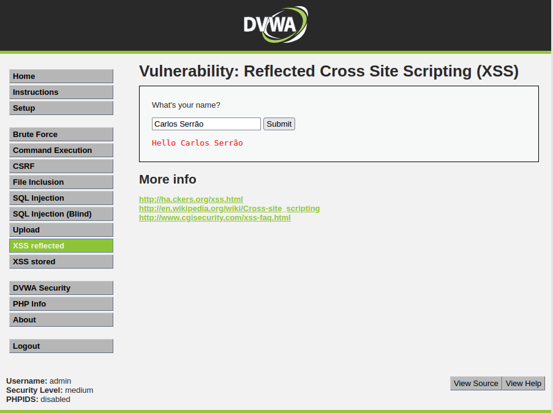
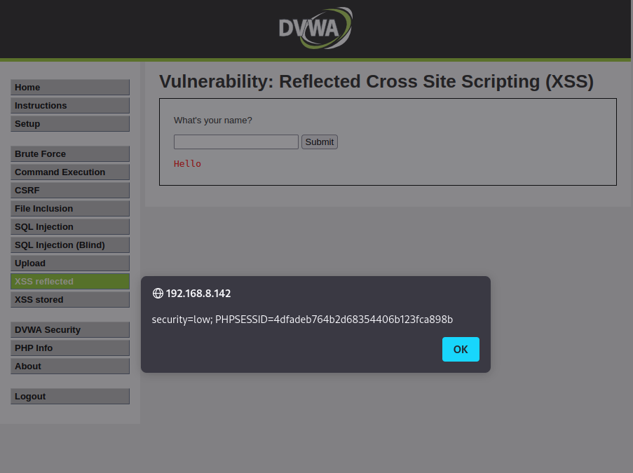

# XSS Reflected

In this type of vulnerability, the attacker will seek to exploit the possibility of sending a Javascript command to the application, causing it to be executed and produce effects on the server where the application is hosted.

In the specific case of this example, the DVWA presents a page where the name of a user is requested. After the introduction, it then writes a message on the page with the name entered by the user.

Thus, after entering the name, and after pressing the submit button, a page is displayed showing a message with the user's name.
 

But what happens when a possibly malicious user, instead of entering a name, can enter a Javascript command, thus leading to the execution of an XSS (**Cross-Site Scripting**) attack.

In this case, the Javascript command that will be entered is as follows:

    

With this, when the script is submitted, it is sent back to the web browser and is executed, with the result that a popup window is shown with an "**xssed**" message.

In the same way that it is possible to execute Javascript commands in an application so that they are then reflected to the client's browser.

 
Next we will test a new type of Javascript payload to print the cookie that is being sent to a Web browser.

    

As we can see in the following image, the result is a popup window where the cookie being sent to the client is printed out.
 
