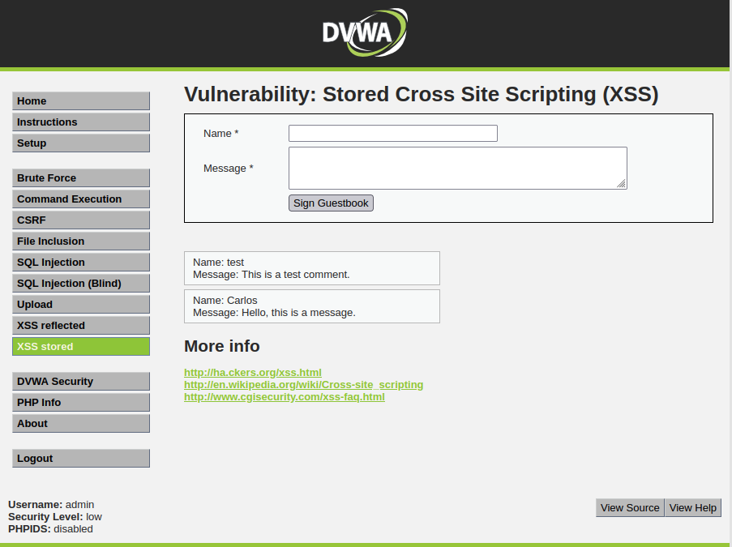
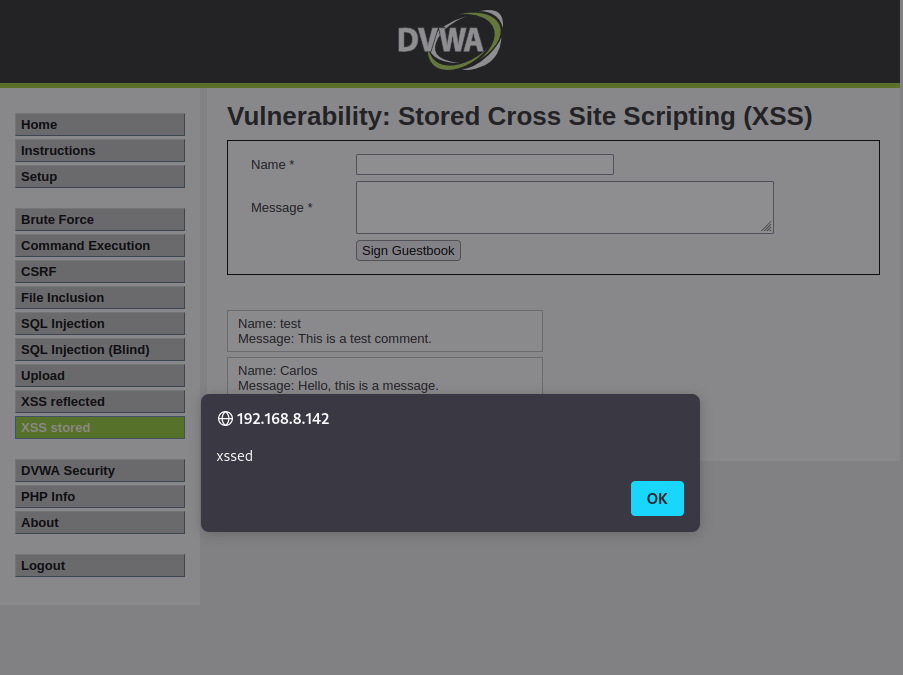

# XSS Stored

This type of XSS vulnerability is different from the previous variant since it leads to/allows the Javascript payload that is being sent to the vulnerable application to persist in the same, for example through storage in a database.

In this example, in DVWA, there is a functionality that implements a system that allows leaving messages to be later displayed to other users. These messages are stored in a database and are later presented to the users.

In one of the messages to be left in the system, instead of entering normal text, an attacker can enter Javascript code, which will be stored in the application's database.

    

Injection of a Javascript attack on a form, causing it to be stored and persisted on the site (in the database).

As this Javascript payload is stored in the database, the next time someone browses the web page where the messages are displayed, the Javascript payload entered is immediately executed.
 

The next time someone visits the page the script is immediately executed (because it is stored in the database).

Thus, it is possible to see that this type of vulnerability can be used to send some types of Javascript payload, even more complex ones, such as adding elements in the DOM of the page, or redirecting the user to other sites, among many others.
