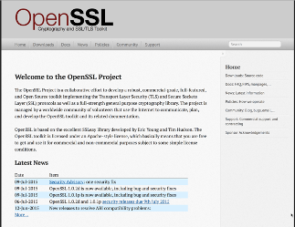

# Introduction to OpenSSL/LibreSSL <!-- omit in toc -->

## Index <!-- omit in toc -->

- [Introduction](#introduction)
- [Setup](#setup)
- [Basic commands](#basic-commands)
  - [Check the OpenSSL version](#check-the-openssl-version)
- [OpenSSL interactive console access](#openssl-interactive-console-access)
- [Check the options for a particular command](#check-the-options-for-a-particular-command)

## Introduction

This document aims to demonstrate the use of cryptographic mechanisms based on the OpenSSL/LibreSSL library. This library has the ability to work with cryptographic mechanisms such as symmetric cryptography, asymmetric cryptography, generation of message authentication codes as well as work with digital certificates and more.

To run these labs the following requirements are needed:

- OpenSSL/LibreSSL.

The goal of these labs is to demonstrate the use of the OpenSSL library to provide a range of cryptographic functionality.

The examples presented here only demonstrate just a small sample of the full capabilities of OpenSSL.

## Setup

There is nothing very relevant to do in terms of setup. You just need to install the OpenSSL library - if you use the Kali Linux distribution (or any other Linux distribution, such as Ubuntu, Debian or Parrot OS), it may already be installed by default.

On Windows, OpenSSL can be installed using for example the Cygwin software package. On MacOS, OpenSSL is installed by default, but if you need to use a newer version of it, you can use the Brew  tool (https://brew.sh).

For Windows there are also other options that you can use. So, the main alternatives for installing OpenSSL on Windows 10/11, are as follows (from the simplest to the most complicated):
1. Use Chocolatey (https://chocolatey.org/) to install OpenSSL on Windows 10 with Powershell, or directly install the OpenSSL binary from the web site;
2. Use Windows Subsystem for Linux (WSL), which allows you to run Linux applications on Windows 10/11 - in practice it is like installing Linux on top of Windows 10/11;
3. Use a Linux distribution, inside a virtualization tool like VMware (https://www.vmware.com/) or VirtualBox (https://www.virtualbox.org/), on top of Windows 10/11;
4. Any other, which may involve the use of containers such as Docker (https://www.docker.com/).

Regarding option 1, it is described in the following links:
- https://adamtheautomator.com/openssl-windows-10/ 
- https://slproweb.com/products/Win32OpenSSL.html ; https://medium.com/swlh/installing-openssl-on-windows-10-and-updating-path-80992e26f6a1 

Regarding option 2, it is explained in the following links: 
- https://www.windowscentral.com/install-windows-subsystem-linux-windows-10 
- https://docs.microsoft.com/en-us/windows/wsl/install 

Regarding option 3, it consists of:
- Download a Linux distribution, such as Ubuntu (https://ubuntu.com/download/desktop/thank-you?version=20.04.3&architecture=amd64) 
- Download and install either VMware Workstation Player (https://www.vmware.com/products/workstation-player.html) or VirtualBox  (https://www.virtualbox.org/) on Windows 10/11. This site even has already prepared Ubuntu images to be installed in both virtualization environments;
- Install the Linux distribution in the selected virtualization environment.

## Basic commands

Here we will just list some of the basic commands for working with OpenSSL.

### Check the OpenSSL version

    openssl version

    OpenSSL 1.1.1n  15 Mar 2022
    OPENSSL COMMAND LIST
    openssl help

    Standard commands
    asn1parse         ca                ciphers           cms
    crl               crl2pkcs7         dgst              dhparam
    dsa               dsaparam          ec                ecparam
    enc               engine            errstr            gendsa
    genpkey           genrsa            help              list
    nseq              ocsp              passwd            pkcs12
    pkcs7             pkcs8             pkey              pkeyparam
    pkeyutl           prime             rand              rehash
    req               rsa               rsautl            s_client
    s_server          s_time            sess_id           smime
    speed             spkac             srp               storeutl
    ts                verify            version           x509

    Message Digest commands (see the `dgst' command for more details)
    blake2b512        blake2s256        gost              md4
    md5               mdc2              rmd160            sha1
    sha224            sha256            sha3-224          sha3-256
    sha3-384          sha3-512          sha384            sha512
    sha512-224        sha512-256        shake128          shake256
    sm3

    Cipher commands (see the `enc' command for more details)
    aes-128-cbc       aes-128-ecb       aes-192-cbc       aes-192-ecb
    aes-256-cbc       aes-256-ecb       aria-128-cbc      aria-128-cfb
    aria-128-cfb1     aria-128-cfb8     aria-128-ctr      aria-128-ecb
    aria-128-ofb      aria-192-cbc      aria-192-cfb      aria-192-cfb1
    aria-192-cfb8     aria-192-ctr      aria-192-ecb      aria-192-ofb
    aria-256-cbc      aria-256-cfb      aria-256-cfb1     aria-256-cfb8
    aria-256-ctr      aria-256-ecb      aria-256-ofb      base64
    bf                bf-cbc            bf-cfb            bf-ecb
    bf-ofb            camellia-128-cbc  camellia-128-ecb  camellia-192-cbc
    camellia-192-ecb  camellia-256-cbc  camellia-256-ecb  cast
    cast-cbc          cast5-cbc         cast5-cfb         cast5-ecb
    cast5-ofb         des               des-cbc           des-cfb
    des-ecb           des-ede           des-ede-cbc       des-ede-cfb
    des-ede-ofb       des-ede3          des-ede3-cbc      des-ede3-cfb
    des-ede3-ofb      des-ofb           des3              desx
    idea              idea-cbc          idea-cfb          idea-ecb
    idea-ofb          rc2               rc2-40-cbc        rc2-64-cbc
    rc2-cbc           rc2-cfb           rc2-ecb           rc2-ofb
    rc4               rc4-40            seed              seed-cbc
    seed-cfb          seed-ecb          seed-ofb          sm4-cbc
    sm4-cfb           sm4-ctr           sm4-ecb           sm4-ofb

## OpenSSL interactive console access

    openssl

    OpenSSL> 

## Check the options for a particular command

    openssl ca -help

    Usage: ca [options]
    Valid options are:
    -help                   Display this summary
    -verbose        - Talk alot while doing things
    -config file    - A config file
    -name arg       - The particular CA definition to use
    -gencrl         - Generate a new CRL
    -crldays days   - Days is when the next CRL is due
    -crlhours hours - Hours is when the next CRL is due
    -startdate YYMMDDHHMMSSZ  - certificate validity notBefore
    -enddate YYMMDDHHMMSSZ    - certificate validity notAfter (overrides -days)
    -days arg       - number of days to certify the certificate for
    -md arg         - md to use, one of md2, md5, sha or sha1
    -policy arg     - The CA 'policy' to support
    -keyfile arg    - private key file
    -keyform arg    - private key file format (PEM or ENGINE)
    -key arg        - key to decode the private key if it is encrypted
    -cert file      - The CA certificate
    -selfsign       - sign a certificate with the key associated with it
    -in file        - The input PEM encoded certificate request(s)
    -out file       - Where to put the output file(s)
    -outdir dir     - Where to put output certificates
    -infiles ....   - The last argument, requests to process
    -spkac file     - File contains DN and signed public key and challenge
    -ss_cert file   - File contains a self signed cert to sign
    -preserveDN     - Don't re-order the DN
    -noemailDN      - Don't add the EMAIL field into certificate' subject
    -batch          - Don't ask questions
    -msie_hack      - msie modifications to handle all those universal strings
    -revoke file    - Revoke a certificate (given in file)
    -subj arg       - Use arg instead of request's subject
    -utf8           - input characters are UTF8 (default ASCII)
    -multivalue-rdn - enable support for multivalued RDNs
    -extensions ..  - Extension section (override value in config file)
    -extfile file   - Configuration file with X509v3 extentions to add
    -crlexts ..     - CRL extension section (override value in config file)
    -engine e       - use engine e, possibly a hardware device.
    -status serial  - Shows certificate status given the serial number
    -updatedb       - Updates db for expired certificates

Most of the times, it is also better to read the documentation on the [OpenSSL website](https://www.openssl.org), since it is must more verbose than the information provided by the CLI.