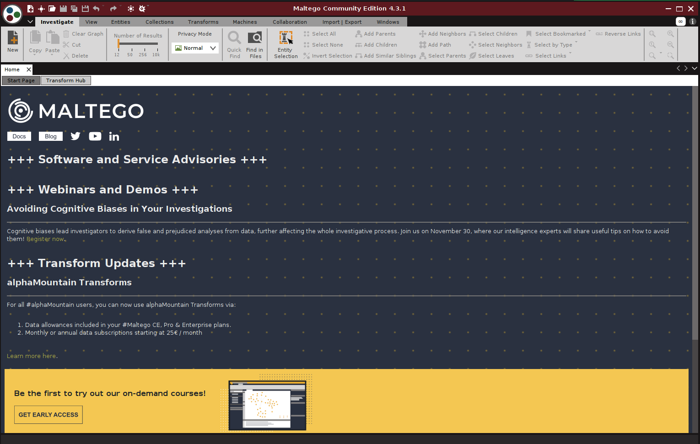
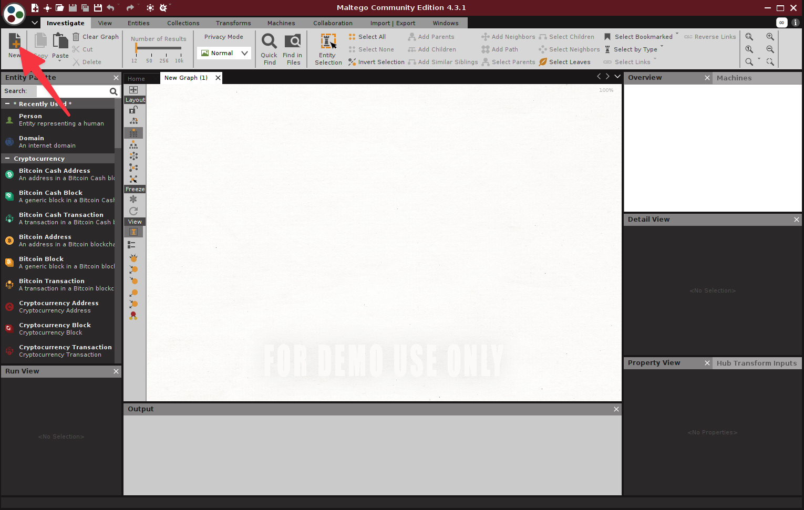
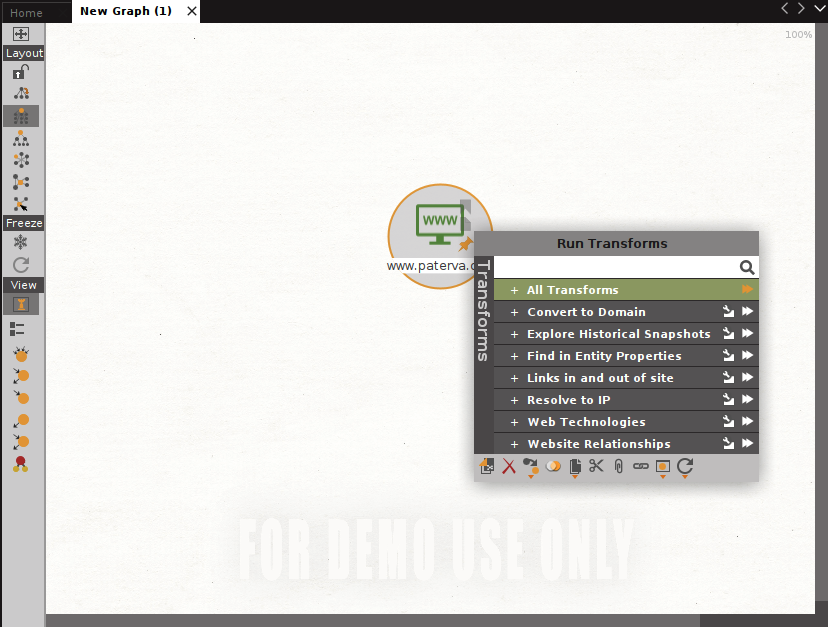
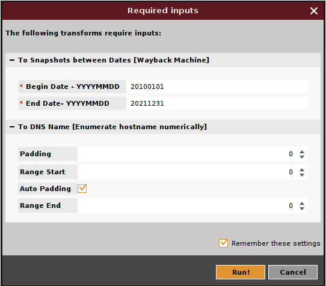
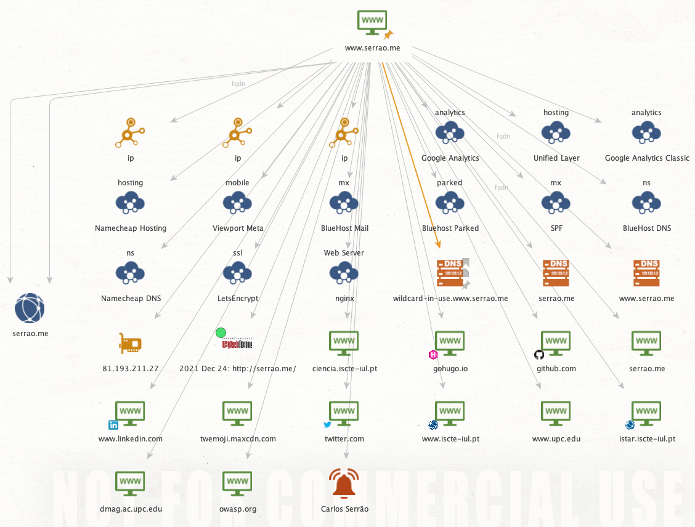
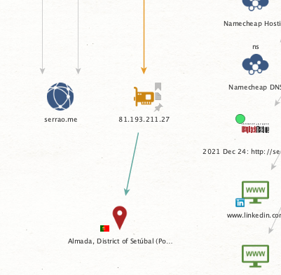

# Maltego 

[Maltego](https://www.maltego.com/) is software used for open-source intelligence and forensics. Maltego permits creating custom entities, allowing it to represent any type of information in addition to the basic entity types which are part of the software.

After opening Maltego, you may need to register a new account to use the Community Edition of Maltego.

After that, you have to create a new project. Click on the "**New**" button on the top left corner.

After that, you may look at the entities palette on the left.

Add a Website entity to the "**New Graph**" area. Then change the address of the website with something else - the domain you want to research.

Then right-click and "**Run Transforms**", then "**All Transforms**".

There might be some other information that needs filling.

From here, Maltego will start to explore the website you've just selected.

We can also be a little more selective and conduct some more precise investigation. For instance, you may select the IP address and try to find the country and city "**Run Transforms -> To Location [city, country]**".

And so much more information is possible to obtain with Maltego.