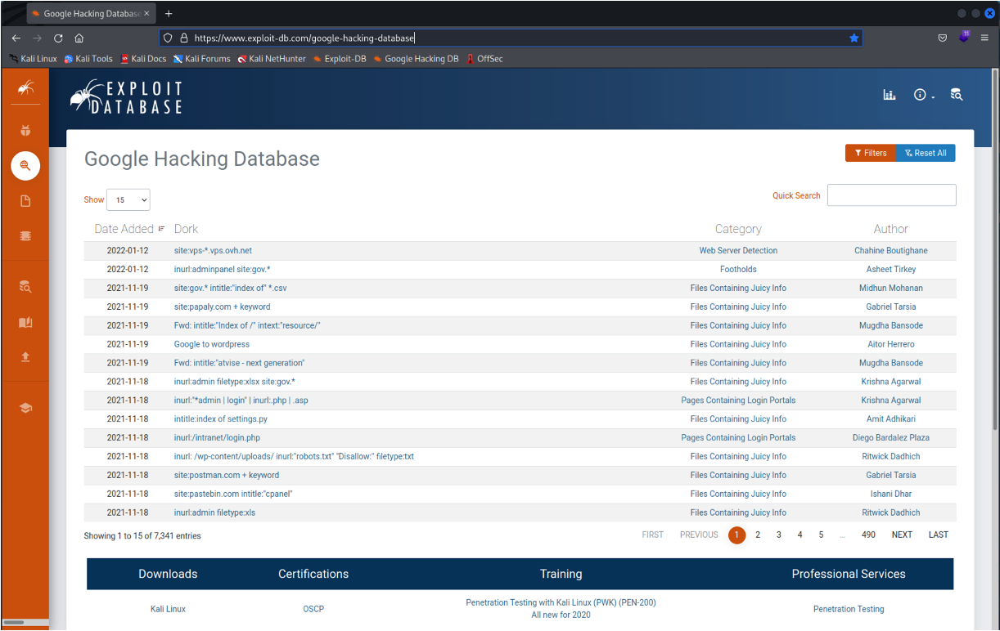
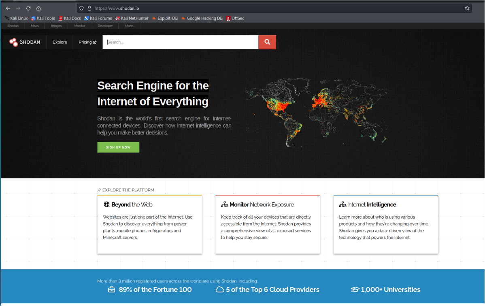

# Open-source intelligence (OSINT)

One of the important ways of gathering information about targets is through the usage of open sources of information. This is often designated as open-source intelligence. It consists on using available open sources of information that can be used to gather information that is publicly available about a target.

## Google Hacking Database (GHDB)

[Google Hacking Database (GHDB)](https://www.exploit-db.com/google-hacking-database) is actually a database with a set of pre-formatted queries that might be used in the Google search engine to search for interesting information.

Here are some "interesting" that you might try, as a way to obtain information from the [Google](https://www.google.com/) search engine:

* [inurl:/intranet/login.php](https://www.google.com/search?q=inurl%3A%2Fintranet%2Flogin.php)
* [site:pastebin.com "admin password"](https://www.google.com/search?q=site%3Apastebin.com+%22admin+password%22) 
* [site:pastebin.com "*@gmail.com password"](https://www.google.com/search?q=site%3Apastebin.com+%22*%40gmail.com+password%22)
* [intitle:"webcamXP" inurl:8080](https://www.google.com/search?q=intitle%3A%22webcamXP%22+inurl%3A8080)
* [db_password filetype:env](https://www.google.com/search?q=db_password+filetype%3Aenv) 
* [inurl:viewer/live/index.html](https://www.google.com/search?q=inurl:viewer/live/index.html)
* [intitle:"Roteador Wireless" inurl:login.asp](https://www.google.com/search?q=intitle:%22Roteador%20Wireless%22%20inurl:login.asp)

You may look and try other queries.

## Shodan

Another important source of open-source intelligence is [Shodan](https://www.shodan.io/). Shodan is a search engine for Internet-connected devices. Shodan gathers information about all devices directly connected to the Internet. If a device is directly hooked up to the Internet then Shodan queries it for various publicly-available information. The types of devices that are indexed can vary tremendously: ranging from small desktops up to nuclear power plants and everything in between.

This search engine is quite interesting and allows you to query for products and services all around the world. As per the description presented above, everything that is connected to the Internet is indexed by Shodan. 

You may try to conduct some queries on the search engine. It is important that you [read the search query fundamentals](https://help.shodan.io/the-basics/search-query-fundamentals) to use it properly.

Here are some interesting queries you might try:

* [Hacked Web Sites](https://www.shodan.io/search?query=http.title%3A%22hacked+by%22)
* [Samsung Smart TV](https://www.shodan.io/search?query=product%3ASamsung)
* [Asus routers in Portugal](https://www.shodan.io/search?query=product%3AASUS+country%3A%22PT%22)

You may also use Shodan from the command line interface. This is already include in Kali Linux.

    shodan

Will display the help of the command.

    Usage: shodan [OPTIONS] COMMAND [ARGS]...

    Options:
    -h, --help  Show this message and exit.

    Commands:
    alert       Manage the network alerts for your account
    convert     Convert the given input data file into a different format.
    count       Returns the number of results for a search
    data        Bulk data access to Shodan
    domain      View all available information for a domain
    download    Download search results and save them in a compressed JSON...
    honeyscore  Check whether the IP is a honeypot or not.
    host        View all available information for an IP address
    info        Shows general information about your account
    init        Initialize the Shodan command-line
    myip        Print your external IP address
    org         Manage your organization's access to Shodan
    parse       Extract information out of compressed JSON files.
    radar       Real-Time Map of some results as Shodan finds them.
    scan        Scan an IP/ netblock using Shodan.
    search      Search the Shodan database
    stats       Provide summary information about a search query
    stream      Stream data in real-time.
    version     Print version of this tool.

Before using this command you need to create a Shodan account and use the provided API key to initialize the tool.

    shodan init <APIKEY>

After that you can start querying Shodan:

    shodan search "Asus"

Which will produce the required results:

    59.15.209.238   21              220 Welcome to ASUS RT-AX88U FTP service.\r\n530 Login incorrect.\r\n530 Please login with USER and PASS.\r\n211-Features:\n EPRT\n EPSV\n MDTM\n PASV\n ICNV\n REST STREAM\n SIZE\n TVFS\n UTF8\n211 End\r\n   
    176.213.162.216 21      176x213x162x216.dynamic.tula.ertelecom.ru       220 Welcome to ASUS RT-N65U FTP service.\r\n530 This FTP server does not allow anonymous logins.\r\n331 Please specify the password.\r\n530 Please login with USER and PASS.\r\n        
    89.78.178.2     21              220 Welcome to ASUS RT-AC68U FTP service.\r\n530 This FTP server does not allow anonymous logins.\r\n331 Please specify the password.\r\n530 Please login with USER and PASS.\r\n       
    73.93.48.206    21      c-73-93-48-206.hsd1.ca.comcast.net      220 Welcome to ASUS RT-AC3200 FTP service.\r\n530 This FTP server does not allow anonymous logins.\r\n331 Please specify the password.\r\n530 Please login with USER and PASS.\r\n      
    211.44.40.126   21              220 Welcome to ASUS RT-AC58U FTP service.\r\n530 Login incorrect.\r\n530 Please login with USER and PASS.\r\n211-Features:\n EPRT\n EPSV\n MDTM\n PASV\n ICNV\n REST STREAM\n SIZE\n TVFS\n UTF8\n211 End\r\n   
    23.91.196.101   21      router.asus.com;23-91-196-23-91-196-101.cpe.sparklight.net      220 Welcome to ASUS RT-AX86U FTP service.\r\n530 Login incorrect.\r\n530 Please login with USER and PASS.\r\n211-Features:\n AUTH TLS\n EPRT\n EPSV\n MDTM\n PASV\n ICNV\n PBSZ\n PROT\n REST STREAM\n SIZE\n TVFS\n UTF8\n211 End\r\n  

Please beware that since we are using free Shodan accounts functionalities and results will be quite limited.