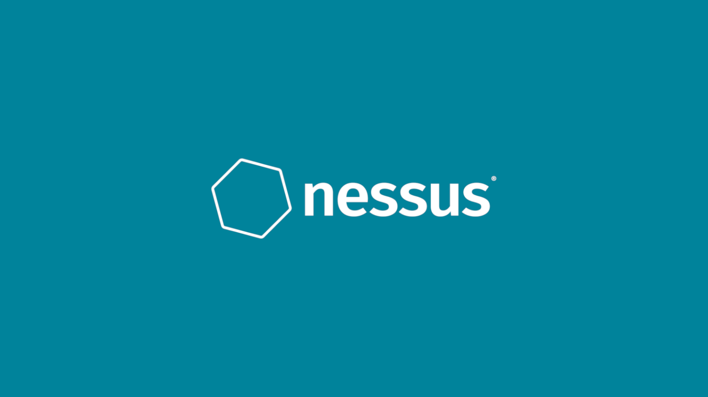
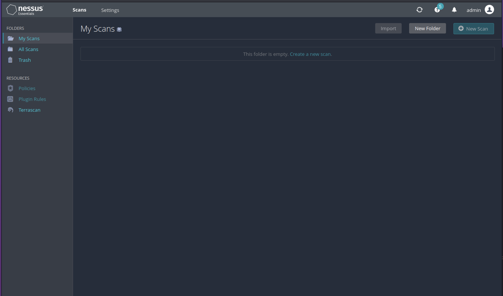
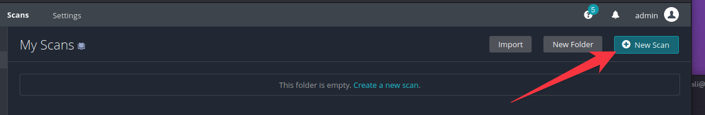
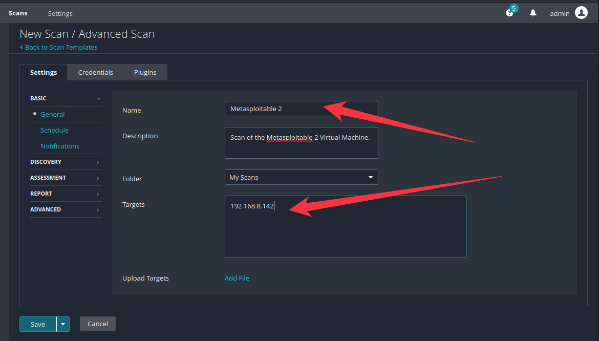
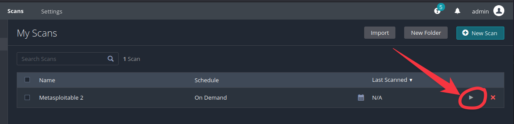
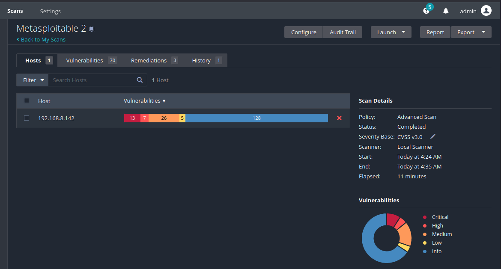
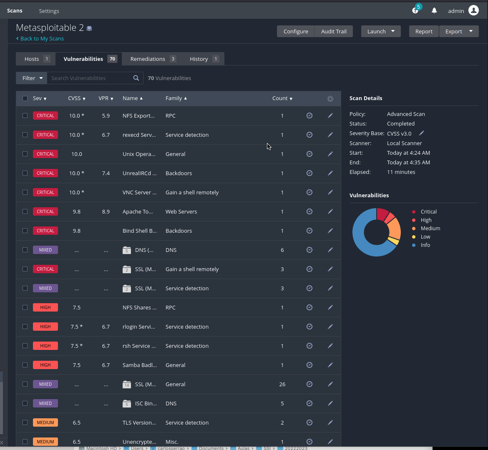
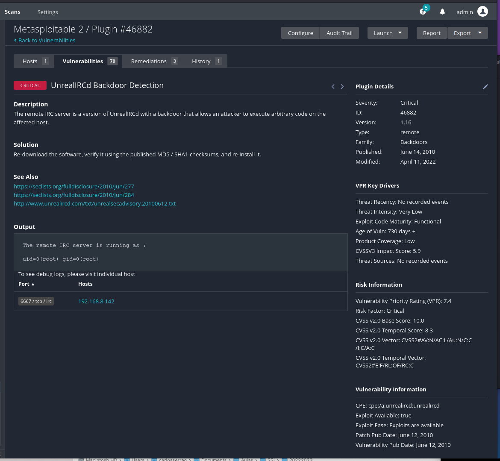

# Nessus

[Nessus](https://www.tenable.com/products/nessus) is a well-known vulnerability scanner that is commonly used in the field of cybersecurity. It is designed to detect and report potential security threats on a network or system.

The software is developed and sold by [Tenable Network Security](https://www.tenable.com/), and it is available in both free and paid versions. The free version, called Nessus Essentials, is limited in terms of functionality and the number of IP addresses that can be scanned. The paid version, Nessus Professional, offers more features and is designed for larger organizations that need to scan multiple systems and networks.

Nessus uses a combination of active and passive scanning techniques to identify vulnerabilities. Active scanning involves sending packets of data to a target system or network and analyzing the responses to determine if any vulnerabilities exist. Passive scanning, on the other hand, involves monitoring network traffic to identify potential security threats.

Nessus is able to detect a wide range of vulnerabilities, including those related to software misconfigurations, weak passwords, and outdated software versions. It also has the ability to scan for compliance with various regulatory standards and frameworks, such as PCI DSS and HIPAA.

In addition to vulnerability scanning, Nessus also offers features such as patch management, policy creation, and reporting. These features allow organizations to take a proactive approach to security by identifying and remediating vulnerabilities before they can be exploited by attackers.

Overall, Nessus is a powerful tool that can help organizations improve their security posture by identifying and addressing potential vulnerabilities.

## Installing Nessus

Nessus is not installed by default in Kali Linux. In order to install Nessus, you have to download it and after that install it locally on Kali. You have to request the free version of Nessus and obtain a license to use it (you can do this while installing Nessus).

The [following guide](https://www.makeuseof.com/how-to-install-nessus-kali-linux/) describes the installation process fairly well.

Nessus can be accessed on the following URL on a web browser (the IP address may not be the same):

`https://127.0.0.1:8834/`

This is a process that might take some time.

## Scanning a target

After Nessus is installed and configured it is time to use it. Nessus is quite similar to OpenVAS in nature.

So, in order to start scanning a target, you need to go to the “Scans” area of the tool (that option is on the top of the web page).

On that web page, simply select the “New Scan” button.

After doing this, you might notice that Nessus already has several scanning templates created. You just to select the appropriate one. Notice that some of those scanning templates are only available on the paid version of Nessus.

Let’s select the “Advanced Scan” for instance.

Now we have to fill some information. The **required** information is the **name we want to give to this scan task** and the **address of the target** to scan. Please feel free to explore the different options of the scanning template.

In this case, we are again going to assume that the IP address of the target is the Metasploitable VM (in my case is **192.168.8.142**, but on your case this **might be different**).

After, simply press the “Save” button.

Now, you have a new scan task configure in Nessus, and you just need to press the “play” button to start it. Do that.

Now, we just sit and wait for the results of the scanning task. Again, depending on the target, this might take some very long time!

## Checking the results

During the execution of the scanning task or after the task completes, you may check the results simply by selecting the scanning task itself. After this you’ll be presented with a page where you can look at the vulnerability scanning results.

If you select the “Vulnerabilities” tab on the top you will get the list of vulnerabilities that were found (notice that the vulnerabilities are ordered by severity).

You may get more details of any detected vulnerability simply by selecting the appropriate vulnerability.

Now, go ahead and look at the different vulnerabilities found and compare the results between OpenVAS and Nessus.