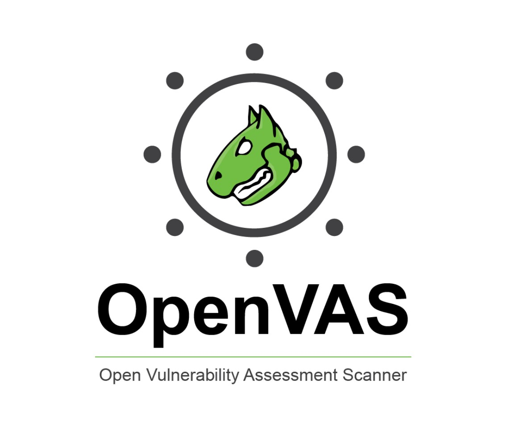

# OpenVAS

[OpenVAS](https://www.openvas.org/) is a full-featured vulnerability scanner. Its capabilities include unauthenticated and authenticated testing, various high-level and low-level internet and industrial protocols, performance tuning for large-scale scans and a powerful internal programming language to implement any type of vulnerability test.

OpenVAS (Open Vulnerability Assessment System, originally known as GNessUs) is the scanner component of [Greenbone Vulnerability Manager](https://www.greenbone.net/en/) (GVM), a software framework of several services and tools offering vulnerability scanning and vulnerability management.

* [OpenVAS Architecture]()
* [Installing OpenVAS on Kali Linux]()
* [Starting and Stopping OpenVAS]()
* [Navigating through OpenVAS]()
* [Scanning a target]()