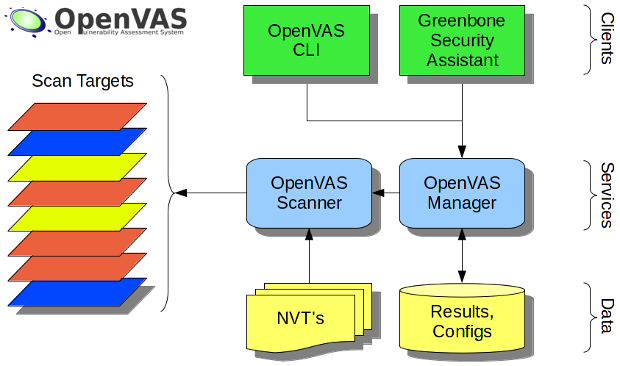

# OpenVAS Architecture

The architecture of OpenVAS is based on a client-server model, where the OpenVAS scanner acts as the server, and the OpenVAS client is used to communicate with the server to perform vulnerability scans.

The OpenVAS architecture consists of the following components:

1. OpenVAS Scanner: This component is responsible for performing the actual vulnerability scans on the target system. It includes various plugins that are used to identify known vulnerabilities in the system.
2. OpenVAS Manager: This component is responsible for managing the OpenVAS Scanner, creating and scheduling scans, and storing scan results. The OpenVAS Manager also communicates with the OpenVAS client to provide scan results and other information.
3. OpenVAS CLI: This is a command-line interface that allows users to interact with the OpenVAS Manager and Scanner.
4. OpenVAS Greenbone Security Assistant (GSA): This is a web-based interface that provides a graphical user interface for managing and configuring the OpenVAS Scanner and Manager. It also allows users to view and manage scan results.
5. OpenVAS Libraries: These are a set of libraries that provide various functions and APIs to interact with the OpenVAS Scanner and Manager.

Overall, the OpenVAS architecture is designed to be modular and extensible, allowing users to customize and configure the scanner to meet their specific needs.

OpenVAS uses Network Vulnerability Tests (NVTs) to identify vulnerabilities in target systems during a vulnerability scan.

NVTs are essentially scripts or plugins that are used by OpenVAS to perform specific tests or checks against a target system. These tests can range from simple checks such as banner grabbing to complex tests such as exploiting vulnerabilities in the target system.

Each NVT is designed to detect a specific vulnerability or weakness in a target system. NVTs are constantly updated to keep up with the latest vulnerabilities and exploits.

OpenVAS includes a large number of NVTs, covering a wide range of platforms and technologies. The NVTs can be configured to perform different types of scans, including authenticated and unauthenticated scans, and can be customized to meet the specific needs of the user.

When OpenVAS performs a scan, it selects the appropriate NVTs based on the target system and the scan configuration. The NVTs are executed by the OpenVAS scanner, and the results are then reported to the user. The user can then take appropriate action to fix the vulnerabilities that were identified by the NVTs.