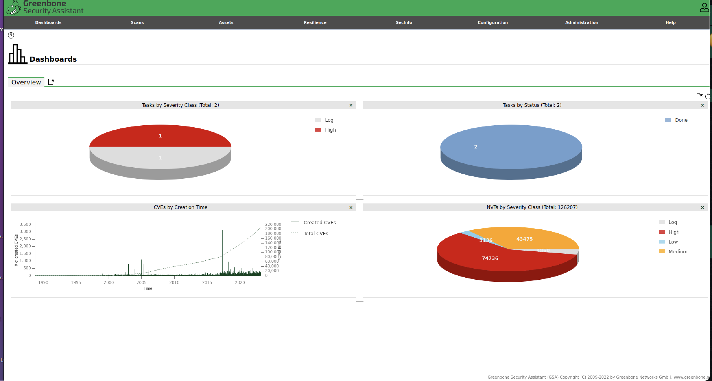
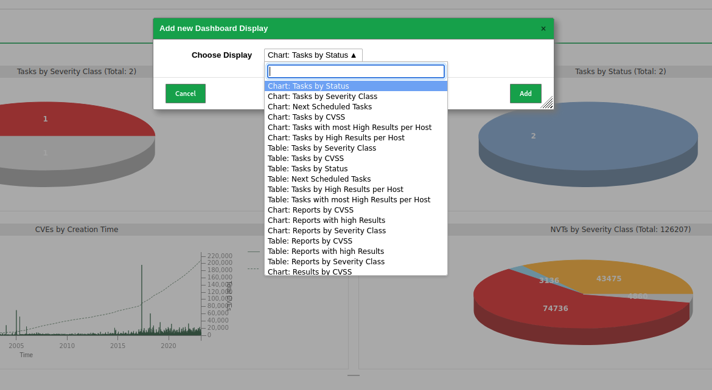
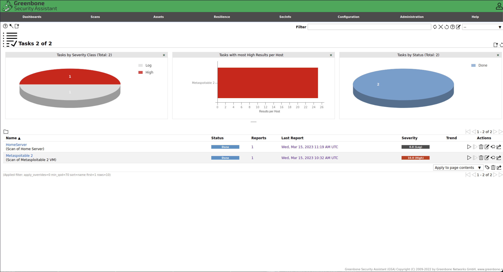
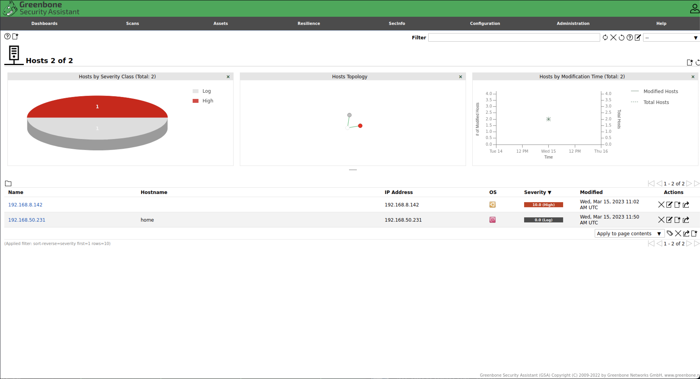
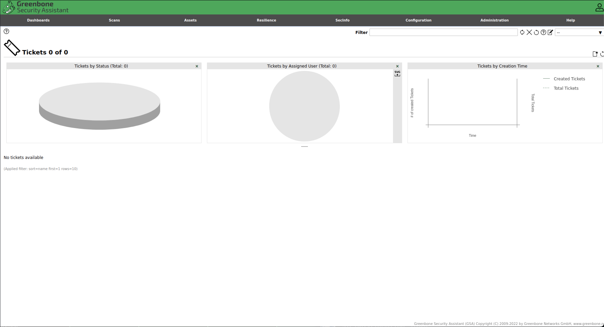
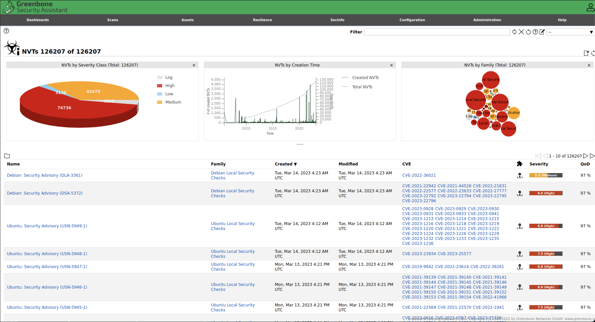
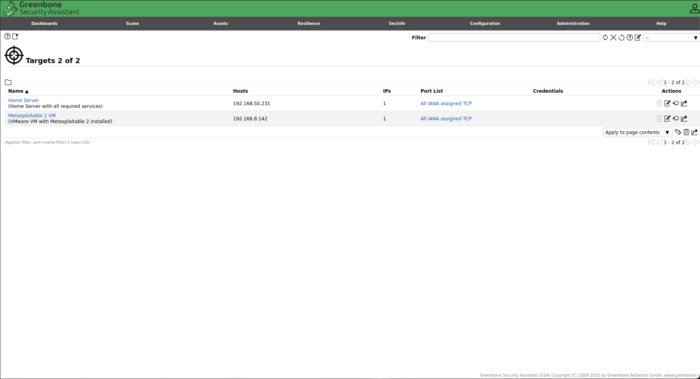
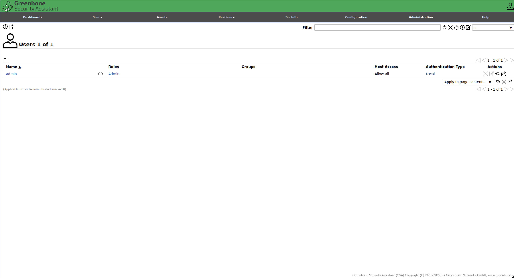

# Navigating through OpenVAS

As you can see, OpenVAS main screen is the Dashboard’s screen. From here you can navigate to different parts of the application.

## Dashboards

This is the main screen of OpenVAS. This screen presents a resumed version of the overall data on OpenVAS.

Among other things, the Dashboard offers information about the different tasks that were executed, the findings that were identified by OpenVAS, the information about the NVTs and much more.

The information contained in the Dashboard can be personalized. It is possible to add more relevant information to this screen. You may even create your ow specific dashboards with the required data.

## Scans

As the name indicates, “Scans” is the page where it is possible to define and configure all the scanning operations of OpenVAS. By the nature of the tool by itself, it is major functional part of OpenVAS.

In this page it is possible to access and manage the following:

- **Tasks**: in this part it is possible to configure new scanning tasks on OpenVAS and also to look at current existing scanning tasks running or finished.
- **Reports**: in this part it is possible to observe the reports generated by completed tasks.
- **Results**: in this part it is possible to visualize and analise the different results obtained by the scanning tasks.
- **Vulnerabilities**: in here you may find all the vulnerabilities that were identified.

## Assets

In this page it is possible to display and manage the different assets that might be the target for vulnerability analysis.

Throughout this page it is possible to manage:

- **Hosts**: are the IP addresses or names of the targets of the vulnerability scanning tasks.
- **Operating Systems**: are the operating systems of the targets that have been analysed.
- **TLS Certificates**: corresponds to the digital certificates that have been collected and analysed on the scanning.

## Resillience

This part of the system is used to identify some compliance issues that need to be addressed during the scanning operations.

## SecInfo

This part of the system is used to manage the different feeds of external information from which the tool depends to operate.

The different sources of information include: NVTs, CVEs, CPEs and CERT.

## Configuration

Allows for the configuration of multiple aspects of the tool.

## Administration

Allows for the administration of multiple aspects of the tool. In this part it is possible to administer the different users which are able to use the tool.

An important part of this “Administration” part is the “Feed Status”. This allows the update of the different feed of information from which the tool depends: NVTs, CVEs, CPEs and CERT.