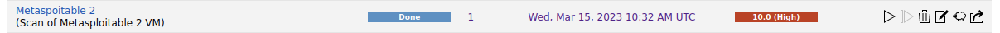

# Scanning a target

In this example we will configure a scanning task to identify vulnerabilities on a given target. This provides a simple example to demonstrated the basic usage of OpenVAS.

## Necessary Requirements

In order to do this, you will need to use the following:

- **Kali Linux**: Kali Linux virtual machine with the OpenVAS tool installed
- **Metasploitable**: Metasploitable 2 virtual machine.

You will need to know the IP address of the target machine. For the sake of this guide, we will assume that the IP address is **192.168.8.142**.

## Starting a new scanning task

In order to accomplish this task, it is necessary to open the OpenVAS and to go to the “**Scans**” tab.

On the top left of the page you find some icons that allow the creation of tasks.

Select “New Task…” and then fill the required information.

You should provide a name for the task and you should select the appropriate target (this depends on your configuration, but I’m assuming it is **192.168.8.142**). 

If this is a new target, the target needs to be created. To do that, select this icon:

This will popup a new window, where you will be able to create a new target. Check this window below, where you should fill all the required information.

So, after filling all the required information on the “New Task” window, you can “Save” this new task.

And a “New” task will appear on the scan task list.

From here, we can start this newly created task. Simply press play button on the right side of the task.

Now, simply sit and wait. Depending on the target, this may take a huge amount of time. You can watch and control the progress of the task and you’ll be notified when it ends.

## Checking results

After the scanning tasks completes, you may look at the details of the scanning conducted on the target. The status of the task is “Done”, and you might check the severity of the vulnerabilities encountered.

If you select the name of the task, you’ll see the details of it, including the duration the task took to complete.

If you press the date of the specific task, you’ll get the results of the selected task.

From here, it is possible to observe the different results of the vulnerability scanning task. You cab look at the specific results list ordered by its severity.

You can select a specific vulnerability to know about its details.

Now try look at the different vulnerabilities that OpenVAS was able to identify.