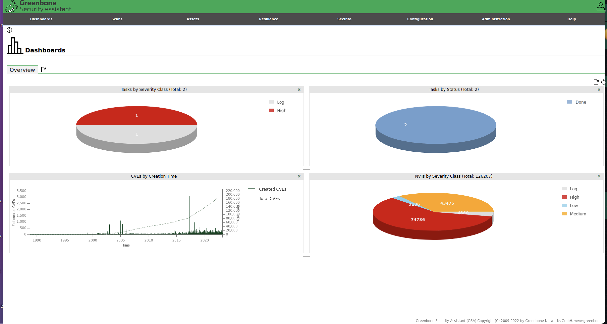

# Starting and Stopping OpenVAS

## Starting OpenVAS

To start OpenVAS on Kali Linux, you can go the console and type:

`sudo gvm-start`

```
[>] Please wait for the GVM services to start.
[>]
[>] You might need to refresh your browser once it opens.
[>]
[>]  Web UI (Greenbone Security Assistant): https://127.0.0.1:9392

● gsad.service - Greenbone Security Assistant daemon (gsad)
     Loaded: loaded (/lib/systemd/system/gsad.service; disabled; preset: disabled)
     Active: active (running) since Tue 2023-03-21 19:15:38 EDT; 32ms ago
       Docs: man:gsad(8)
             https://www.greenbone.net
   Main PID: 3065 (gsad)
      Tasks: 1 (limit: 4599)
     Memory: 1.5M
        CPU: 21ms
     CGroup: /system.slice/gsad.service
             └─3065 /usr/sbin/gsad --foreground --listen 127.0.0.1 --port 9392

Mar 21 19:15:38 kali systemd[1]: Starting gsad.service - Greenbone Security Assistant daemon (gsad)...
Mar 21 19:15:38 kali systemd[1]: Started gsad.service - Greenbone Security Assistant daemon (gsad).

● gvmd.service - Greenbone Vulnerability Manager daemon (gvmd)
     Loaded: loaded (/lib/systemd/system/gvmd.service; disabled; preset: disabled)
     Active: active (running) since Tue 2023-03-21 19:15:33 EDT; 5s ago
       Docs: man:gvmd(8)
    Process: 2974 ExecStart=/usr/sbin/gvmd --osp-vt-update=/run/ospd/ospd.sock --listen-group=_gvm (code=exited, status=0/SUCCESS)
   Main PID: 2975 (gvmd)
      Tasks: 1 (limit: 4599)
     Memory: 166.3M
        CPU: 1.506s
     CGroup: /system.slice/gvmd.service
             └─2975 "gvmd: gvmd: Wa" --osp-vt-update=/run/ospd/ospd.sock --listen-group=_gvm

Mar 21 19:15:29 kali systemd[1]: Starting gvmd.service - Greenbone Vulnerability Manager daemon (gvmd)...
Mar 21 19:15:30 kali systemd[1]: gvmd.service: Can't open PID file /run/gvmd/gvmd.pid (yet?) after start: Operation not permitted
Mar 21 19:15:33 kali systemd[1]: Started gvmd.service - Greenbone Vulnerability Manager daemon (gvmd).

● ospd-openvas.service - OSPd Wrapper for the OpenVAS Scanner (ospd-openvas)
     Loaded: loaded (/lib/systemd/system/ospd-openvas.service; disabled; preset: disabled)
     Active: active (running) since Tue 2023-03-21 19:15:29 EDT; 8s ago
       Docs: man:ospd-openvas(8)
             man:openvas(8)
    Process: 2919 ExecStart=/usr/bin/ospd-openvas --config /etc/gvm/ospd-openvas.conf --log-config /etc/gvm/ospd-logging.conf (code=exited, status=0/SUCCESS)
   Main PID: 2947 (ospd-openvas)
      Tasks: 5 (limit: 4599)
     Memory: 56.5M
        CPU: 1.544s
     CGroup: /system.slice/ospd-openvas.service
             ├─2947 /usr/bin/python3 /usr/bin/ospd-openvas --config /etc/gvm/ospd-openvas.conf --log-config /etc/gvm/ospd-logging.conf
             └─2951 /usr/bin/python3 /usr/bin/ospd-openvas --config /etc/gvm/ospd-openvas.conf --log-config /etc/gvm/ospd-logging.conf

Mar 21 19:15:27 kali systemd[1]: Starting ospd-openvas.service - OSPd Wrapper for the OpenVAS Scanner (ospd-openvas)...
Mar 21 19:15:29 kali systemd[1]: Started ospd-openvas.service - OSPd Wrapper for the OpenVAS Scanner (ospd-openvas).

[>] Opening Web UI (https://127.0.0.1:9392) in: 5... 4... 3... 2... 1...
```

After this the default web browser will open and will open the OpenVAS Greenbone Security Assistant (basically the web interface that allows to control OpenVAS).

Notice the URL:

[`https://127.0.0.1:9392`](https://127.0.0.1:9392/)

You need to authenticate with the password that was created during the installation process.


After successful authentication, you’ll be redirected to the dashboard screen on OpenVAS.



## Stopping OpenVAS

To stop OpenVAS and the associated services, you simply need to execute the following on the terminal.

`sudo gvm-stop`

```
[>] Stopping GVM services
○ gsad.service - Greenbone Security Assistant daemon (gsad)
     Loaded: loaded (/lib/systemd/system/gsad.service; disabled; preset: disabled)
     Active: inactive (dead)
       Docs: man:gsad(8)
             https://www.greenbone.net

Mar 21 19:15:38 kali systemd[1]: Starting gsad.service - Greenbone Security Assistant daemon (gsad)...
Mar 21 19:15:38 kali systemd[1]: Started gsad.service - Greenbone Security Assistant daemon (gsad).
Mar 21 19:31:21 kali systemd[1]: Stopping gsad.service - Greenbone Security Assistant daemon (gsad)...
Mar 21 19:31:21 kali systemd[1]: gsad.service: Deactivated successfully.
Mar 21 19:31:21 kali systemd[1]: Stopped gsad.service - Greenbone Security Assistant daemon (gsad).

○ gvmd.service - Greenbone Vulnerability Manager daemon (gvmd)
     Loaded: loaded (/lib/systemd/system/gvmd.service; disabled; preset: disabled)
     Active: inactive (dead)
       Docs: man:gvmd(8)

Mar 21 19:15:29 kali systemd[1]: Starting gvmd.service - Greenbone Vulnerability Manager daemon (gvmd)...
Mar 21 19:15:30 kali systemd[1]: gvmd.service: Can't open PID file /run/gvmd/gvmd.pid (yet?) after start: Operation not permitted
Mar 21 19:15:33 kali systemd[1]: Started gvmd.service - Greenbone Vulnerability Manager daemon (gvmd).
Mar 21 19:31:21 kali systemd[1]: Stopping gvmd.service - Greenbone Vulnerability Manager daemon (gvmd)...
Mar 21 19:31:21 kali systemd[1]: gvmd.service: Deactivated successfully.
Mar 21 19:31:21 kali systemd[1]: Stopped gvmd.service - Greenbone Vulnerability Manager daemon (gvmd).
Mar 21 19:31:21 kali systemd[1]: gvmd.service: Consumed 3.192s CPU time.

○ ospd-openvas.service - OSPd Wrapper for the OpenVAS Scanner (ospd-openvas)
     Loaded: loaded (/lib/systemd/system/ospd-openvas.service; disabled; preset: disabled)
     Active: inactive (dead)
       Docs: man:ospd-openvas(8)
             man:openvas(8)

Mar 21 19:15:27 kali systemd[1]: Starting ospd-openvas.service - OSPd Wrapper for the OpenVAS Scanner (ospd-openvas)...
Mar 21 19:15:29 kali systemd[1]: Started ospd-openvas.service - OSPd Wrapper for the OpenVAS Scanner (ospd-openvas).
Mar 21 19:31:21 kali systemd[1]: Stopping ospd-openvas.service - OSPd Wrapper for the OpenVAS Scanner (ospd-openvas)...
Mar 21 19:31:21 kali systemd[1]: ospd-openvas.service: Deactivated successfully.
Mar 21 19:31:21 kali systemd[1]: Stopped ospd-openvas.service - OSPd Wrapper for the OpenVAS Scanner (ospd-openvas).
Mar 21 19:31:21 kali systemd[1]: ospd-openvas.service: Consumed 2min 9.633s CPU time.

○ notus-scanner.service - Notus Scanner
     Loaded: loaded (/lib/systemd/system/notus-scanner.service; disabled; preset: disabled)
     Active: inactive (dead)
       Docs: https://github.com/greenbone/notus-scanner

Mar 21 19:15:27 kali systemd[1]: Starting notus-scanner.service - Notus Scanner...
Mar 21 19:15:28 kali systemd[1]: Started notus-scanner.service - Notus Scanner.
Mar 21 19:31:21 kali systemd[1]: Stopping notus-scanner.service - Notus Scanner...
Mar 21 19:31:21 kali systemd[1]: notus-scanner.service: Deactivated successfully.
Mar 21 19:31:21 kali systemd[1]: Stopped notus-scanner.service - Notus Scanner.
Mar 21 19:31:21 kali systemd[1]: notus-scanner.service: Consumed 1.030s CPU time.
```