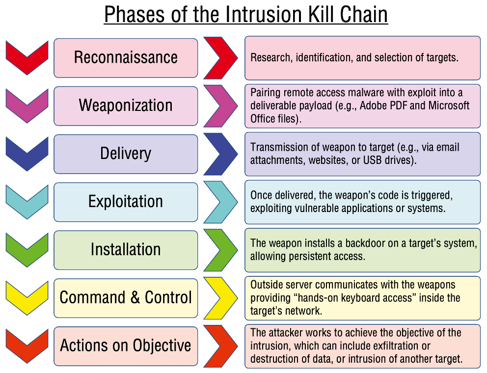
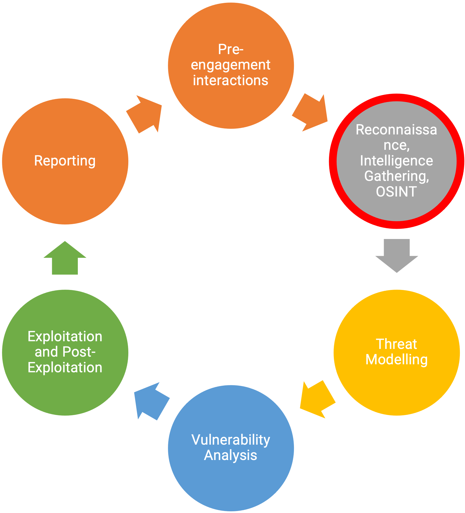

# Introduction to vulnerability testing <!-- omit in toc -->

## Table of Contents  <!-- omit in toc -->

- [Setup](#setup)
- [How an attacker acts](#how-an-attacker-acts)
- [Methodologies for vulnerabilities identification](#methodologies-for-vulnerabilities-identification)
- [Important references to consider](#important-references-to-consider)

## Setup

Throughout this lab you will need to use the following material:

- a web browser
- the Kali Linux virtual machine
- some vulnerable virtual machines - in this case, we are going to use the Metasploitable 2 and Windows 7 virtual machines.

## How an attacker acts

An attacker conducts several activities from selecting target/objective until the compromise of such target. One of the frameworks that helps understand what happens during an attack is provided by the [Cyber Kill Chain](https://www.lockheedmartin.com/en-us/capabilities/cyber/cyber-kill-chain.html). This was developed by [Lockheed Martin](https://www.lockheedmartin.com/) and represents a model for identification and prevention of cyber intrusions activity. The model identifies what the adversaries must complete in order to achieve their objective.

The seven steps of the framework enhance visibility into an attack and enrich an analyst’s understanding of an adversary’s tactics, techniques and procedures. The **seven** steps are:

1. **Reconnaissance**: research, identification and selection of possible targets;
2. **Weaponization**: pairing remote access malware with exploit into a deliverable payload. Creating some malicious file that can be used to exploit a vulnerability and compromise a victim;
3. **Delivery**: the transmission of the weapon created on the previous step to the target. How the weapon is delivered to the target;
4. **Exploitation**: once delivered the weapon code is triggered and the vulnerable systems or applications are exploited;
5. **Installation**: the weapon may install a backdoor on the target system, allowing persistent access to an attacker;
6. **Command & Control**: outside server communication with the weapons previously delivered allowing an attacker to remotely control and command the compromised targets;
7. **Actions on Objective**: the attacker will work to achieve the objective of the intrusion, and possibly escalate the intrusion to other systems.

Another important referential is the [MITRE ATT&CK](https://attack.mitre.org/) framework. According to [MITRE](https://www.mitre.org/), this framework is globally-accessible knowledge base of adversary tactics and techniques based on real-world observations. The ATT&CK knowledge base is used as a foundation for the development of specific threat models and methodologies in the private sector, in government, and in the cybersecurity product and service community.

The framework identifies a set of adversary tactics that we should be aware and a group of techniques to implement those tactics:

* Reconnaissance
* Resource Development
* Initial Access
* Execution
* Persistence
* Privilege Escalation
* Defense Evasion
* Credential Access
* Discovery
* Lateral Movement
* Collection
* Command and Control
* Exfiltration
* Impact.

## Methodologies for vulnerabilities identification

Most of the times it is important to use the proper methodology to conduct the analysis and identification of vulnerabilities. There are plenty of choices to consider, and one of the most relevant one is the [Penetration Execution Standard (PTES)](http://www.pentest-standard.org/index.php/Main_Page) that defines a set of stages for conducting vulnerabilities assessment.

**PTES** identifies the following stages:

- Pre-engagement interactions 
- Intelligence gathering
- Threat modelling
- Vulnerability analysis
- Exploitation
- Post Exploitation
- Reporting

This can be represented generically in the following image:

In this lab we are only going to address the **Reconnaissance** (Pre-engagement interactions) and **Vulnerability Analysis** phases. **Exploitation and Post-Exploitation** will be addressed [in the following lab](../vulnexploit/README.md).

## Important references to consider

There are some important references to consider that are important in this field. Consider looking of information about the following:

* [SCAP - Security Content Automation Protocol](https://scap.nist.gov), NIST leaded initiative to standardize vulnerability management between the different vulnerability identification and management software;
* Languages:
  * [OVAL - Open Vulnerability and Assessment Language](https://oval.cisecurity.org) 
* Identification schemes:
  * [CPE - Common Platform Enumeration](https://cpe.mitre.org)
  * CWE - Common Weakness Enumeration
  * [CVE - Common Vulnerabilities and Exposures](https://cve.mitre.org)
* Metrics
  * [CVSS - Common Vulnerability Scoring System](https://nvd.nist.gov/vuln-metrics/cvss)
